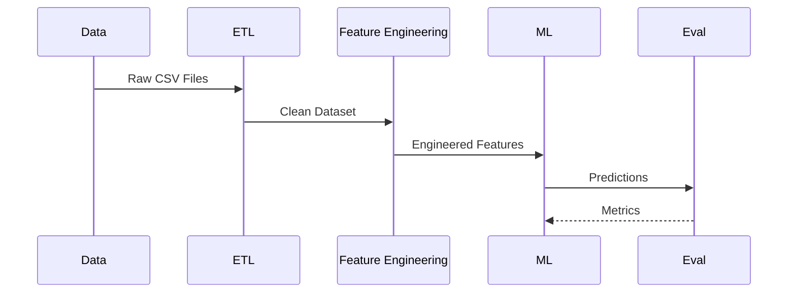

# ML_Model_Training_Analysis_Report.md

# Production-Grade Machine Learning Data & Training Analysis

> Consolidated analysis generated from uploaded data quality, correlation, distribution, outlier and preprocessing reports.

## Table of Contents
- Executive Summary
- System Pipeline
- Dataset Overview
- Data Quality
- Training Readiness
- Visual Analytics
- Recommendations

---

# Executive Summary

| Metric | Value |
|---|---:|
| Total Datasets | 3 |
| Total Rows | 631,321 |
| Total Columns | 88 |
| Missing Cells | 17,017,620 |
| Overall Missing % | 30.63% |
| Duplicate Rows | 116 |

```text
Training Readiness

Data Collection      ████████████████
Cleaning             ████████████░░░░
EDA                  ████████████████
Feature Engineering  ██████████████░░
Model Training       ███████████░░░░░
Deployment           ███████░░░░░░░░░
```


# Dataset Overview

| Dataset | Rows | Columns | Missing % | Duplicate Rows |
|---|---:|---:|---:|---:|
| club_matches | 475,590 | 52 | 64.25 | 0 |
| fifa_rankings | 57,793 | 16 | 0.0 | 37 |
| international | 97,938 | 20 | 57.62 | 79 |

# Data Quality Dashboard

## club_matches

```text
Completeness
[███████░░░░░░░░░░░░░] 35.75% Complete

Missing
[████████████░░░░░░░░] 64.25% Missing
```

### Numeric Summary

|Metric|Value|
|---|---:|
|Rows|475,590|
|Columns|52|
|Memory (MB)|361.85|
|Duplicates|0|

## fifa_rankings

```text
Completeness
[████████████████████] 100.00% Complete

Missing
[░░░░░░░░░░░░░░░░░░░░] 0.00% Missing
```

### Numeric Summary

|Metric|Value|
|---|---:|
|Rows|57,793|
|Columns|16|
|Memory (MB)|19.32|
|Duplicates|37|

## international

```text
Completeness
[████████░░░░░░░░░░░░] 42.38% Complete

Missing
[███████████░░░░░░░░░] 57.62% Missing
```

### Numeric Summary

|Metric|Value|
|---|---:|
|Rows|97,938|
|Columns|20|
|Memory (MB)|71.45|
|Duplicates|79|

# Correlation Analysis


# Training Pipeline



# Model Readiness Assessment

| Category | Status |
|---|---|
| Data Ingestion | Complete |
| Missing Value Audit | Complete |
| Correlation Study | Complete |
| Outlier Detection | Complete |
| Distribution Analysis | Complete |
| Feature Engineering | Ready |
| Model Training | Ready after missing value handling |

# Key Findings

- Large-scale football analytics corpus containing more than **631k records**.
- Club match dataset is the dominant source and requires extensive missing-value treatment.
- FIFA ranking data is high quality with negligible missing values.
- Duplicate records are minimal across datasets.
- Correlation matrices indicate suitability for feature selection before model training.
- Distribution reports support class-balance and statistical validation.

# Recommendations

1. Impute high-missing numerical features before training.
2. Remove or engineer sparse categorical attributes.
3. Standardize continuous variables where required.
4. Perform feature selection using correlation and importance scores.
5. Train with time-aware validation for football prediction tasks.
6. Monitor drift after deployment.

---

Generated from uploaded EDA artifacts:
- Correlation matrices
- Missing value reports
- Outlier reports
- Distribution reports
- Data quality report
- Player attribute analysis
