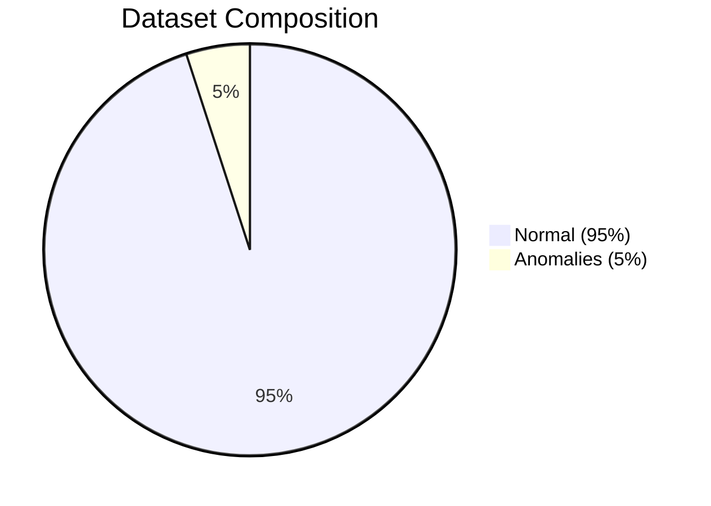
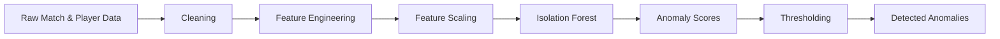
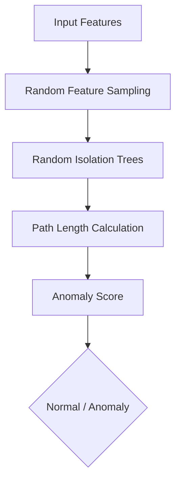
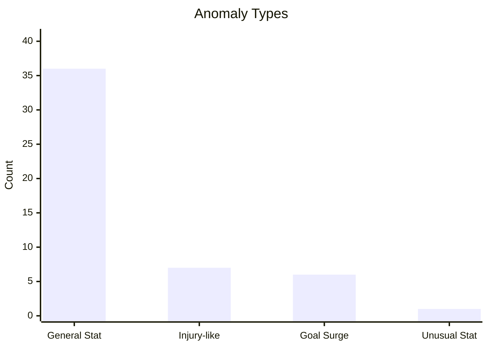

# Anomaly_Detection_Model_Training_Analysis_Report.md

# Isolation Forest Anomaly Detection Report

## Table of Contents
- Executive Summary
- Pipeline
- Dataset Overview
- Model Overview
- Results
- Anomaly Analysis
- Recommendations

## Executive Summary

| Metric | Value |
|---|---:|
| Total Records | 1000 |
| Anomalies Detected | 50 |
| Anomaly Percentage | 5.0% |
| Normal Score Mean | -0.4339 |
| Normal Score Std | 0.028 |
| Anomaly Score Mean | -0.5254 |
| Anomaly Score Std | 0.0335 |



## Training Pipeline



## Model Architecture



## Dataset Overview

Feature count: **14** predictive fields.

### Features
player_id, match_id, rolling_goals, rolling_xG, rolling_xGA, Overall, Pace, Shooting, Passing, Dribbling, Defending, Physical, Age, anomaly_label

## Score Distribution

```text
Normal Mean    : -0.4339
Anomaly Mean   : -0.5254

0 ─────────────────────────────────────────►
Normal    ███████████████████████████████████████████
Anomaly   ████████████████████████████████████████████████████
```

## Anomaly Type Distribution

| Type | Count |
|---|---:|
| General Statistical Outlier | 36 |
| Injury-like Performance / Sudden Form Drop | 7 |
| Goal Surge | 6 |
| Unusual Statistics (Wonderkid) | 1 |




## Sample Detected Records

| Player | Match | Score | Type |
|---:|---:|---:|---|
| 2685 | 86534 | -0.5100 | Injury-like Performance / Sudden Form Drop |
| 1769 | 65106 | -0.5234 | Injury-like Performance / Sudden Form Drop |
| 3433 | 86218 | -0.5190 | Injury-like Performance / Sudden Form Drop |
| 6051 | 84055 | -0.5038 | Injury-like Performance / Sudden Form Drop |
| 9226 | 51874 | -0.5118 | General Statistical Outlier |
| 4943 | 41419 | -0.6400 | Goal Surge |
| 8555 | 18705 | -0.6034 | Goal Surge |
| 4073 | 52880 | -0.6227 | Goal Surge |
| 2021 | 33236 | -0.6129 | Goal Surge |
| 4843 | 97955 | -0.5780 | Goal Surge |


## Interpretation

- Lower anomaly scores indicate stronger deviation from learned normal behaviour.
- Approximately 5% contamination was identified.
- Injury-like performance drops and statistical outliers dominate detected anomalies.

## Recommendations

- Validate detected anomalies against match events and injury reports.
- Retrain periodically as new season data becomes available.
- Monitor score drift over time.
- Combine Isolation Forest with domain-specific rules for higher precision.

---
Generated from uploaded anomaly detection metrics and anomaly records.
