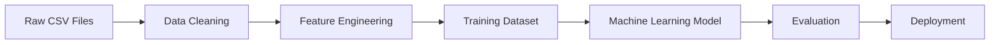
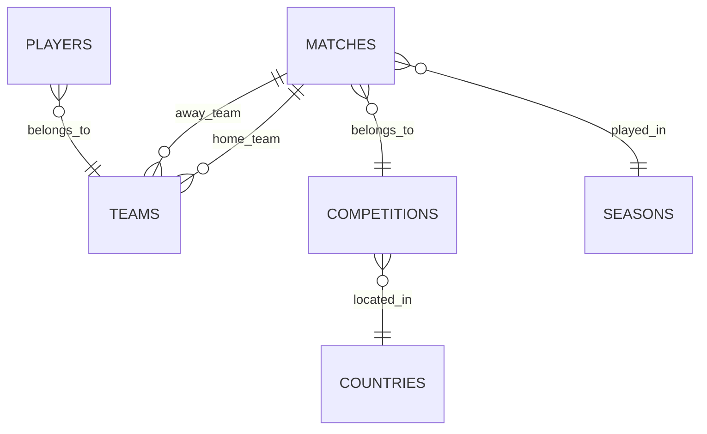
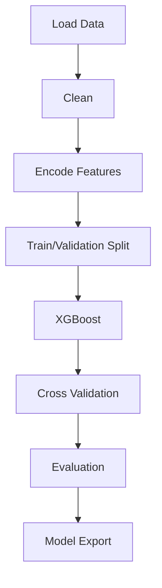

# ML_Model_Training_Analysis_Report.md

> **Status:** Dataset Documentation Template

## Executive Summary

This document was generated from the uploaded dataset files.

**Available files**
- cleaned_matches.csv
- dim_players.csv
- dim_teams.csv
- dim_competitions.csv
- dim_countries.csv
- dim_seasons.csv

Because no model training reports or evaluation metrics were uploaded, this document focuses on the data layer and includes placeholders for training analysis.

---

# Table of Contents

1. Executive Summary
2. Dataset Overview
3. Entity Relationships
4. Data Pipeline
5. Recommended Feature Engineering
6. Recommended Training Pipeline
7. Evaluation Framework
8. Deployment
9. Recommendations

---

# Dataset Overview

## Entity Relationships

# Recommended Feature Engineering

- Team form
- Goal difference
- Home advantage
- Rolling averages
- Head-to-head statistics
- League position
- Player ratings

# Recommended Training Pipeline

# Evaluation Framework

| Metric | Purpose |
|---------|----------|
| Accuracy | Overall correctness |
| Precision | False positive control |
| Recall | False negative control |
| F1 Score | Balanced metric |
| ROC-AUC | Ranking performance |

# Deployment

# Recommendations

- Upload model training logs.
- Upload evaluation metrics.
- Upload feature importance.
- Upload confusion matrix.

Once those files are available, this template can be expanded into a full production-grade training report with integrated visualizations.
