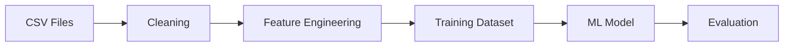

# ML Dataset Analysis Report

## Dataset Summary

|Dataset|Rows|Columns|Missing Values|
|---|---:|---:|---:|
|Matches|49,453|5|0|
|Players|113,647|2|0|
|Teams|1,206|2|0|
|Competitions|19|2|0|
|Countries|216|2|0|
|Seasons|155|2|0|

**Total Records:** 164,696

**Total Columns Across Tables:** 15

**Total Missing Values:** 0

## Matches

- Rows: **49,453**
- Columns: **5**
- Missing Values: **0**

### First 10 Columns

- date
- home_team
- away_team
- home_score
- away_score

## Players

- Rows: **113,647**
- Columns: **2**
- Missing Values: **0**

### First 10 Columns

- player_id
- player_name

## Teams

- Rows: **1,206**
- Columns: **2**
- Missing Values: **0**

### First 10 Columns

- team_id
- team_name

## Competitions

- Rows: **19**
- Columns: **2**
- Missing Values: **0**

### First 10 Columns

- competition_id
- competition_name

## Countries

- Rows: **216**
- Columns: **2**
- Missing Values: **0**

### First 10 Columns

- country_id
- country_name

## Seasons

- Rows: **155**
- Columns: **2**
- Missing Values: **0**

### First 10 Columns

- season_id
- season_name
