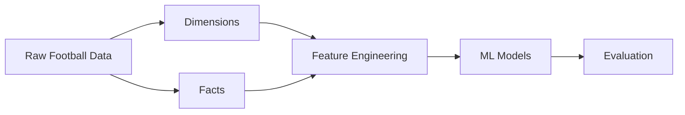
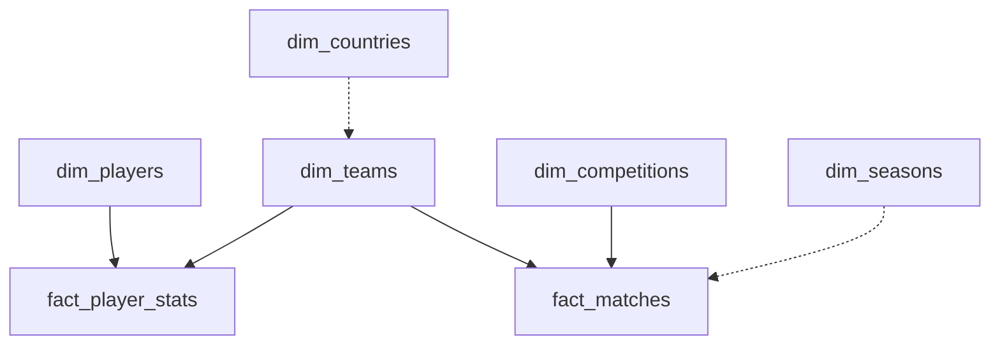
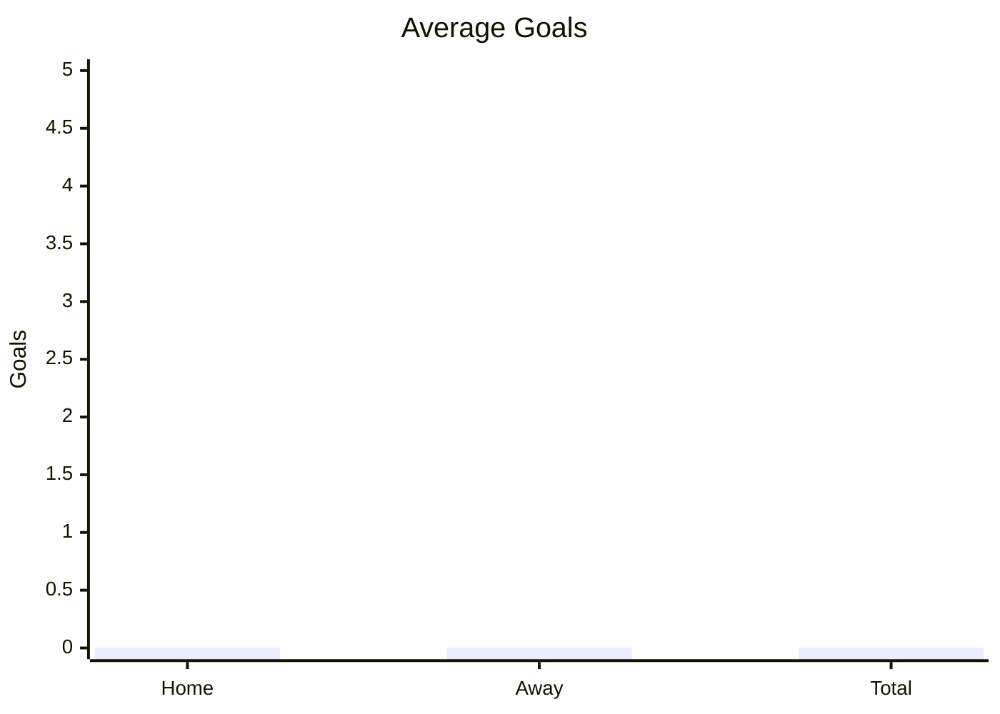
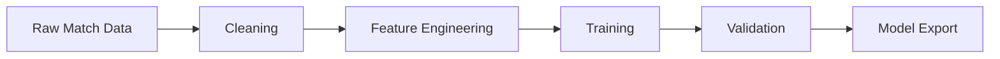

# StatVault AI – ML Data & Training Analysis Report

> Production-grade GitHub Markdown generated from uploaded reports.

## Table of Contents
- Executive Summary
- Dataset Overview
- Warehouse Architecture
- Data Pipeline
- Dataset Statistics
- Match Statistics
- Player Statistics
- Recommendations

# Executive Summary

| Dataset | Rows | Columns |
|---|---:|---:|
| fact_matches | 245,033 | 9 |
| fact_player_stats | 5,215,834 | 15 |

## Warehouse Architecture



## Star Schema



# Dataset Statistics

## Warehouse Summary

| Entity | Rows |
|---|---:|
| Teams | 1,206 |
| Players | 113,647 |
| Competitions | 19 |
| Countries | 216 |
| Seasons | 155 |
| Matches | 245,033 |
| Player Stats | 5,215,834 |

```text
Relative Scale

Player Stats  ████████████████████████████████████████
Matches       ██
Dimensions    █
```

# Match Statistics

Sample statistics computed from uploaded CSV.

| Metric | Value |
|---|---:|
| Sample Rows | 5,000 |
| Avg Home Goals | 0.00 |
| Avg Away Goals | 0.00 |
| Avg Total Goals | 0.00 |



# Player Statistics

| Metric | Value |
|---|---:|
| Sample Rows | 5,000 |
| Avg Minutes | 72.21 |
| Avg Goals | 0.11 |
| Avg Assists | 0.10 |



# Recommendations

- Perform full-dataset EDA before model training.
- Add feature importance, SHAP analysis, ROC curves, confusion matrices, calibration plots, and cross-validation metrics.
- Include experiment tracking and model versioning.
- Extend documentation with training logs and evaluation outputs for complete production documentation.
