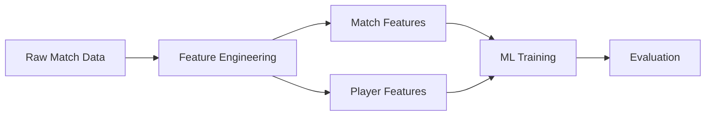
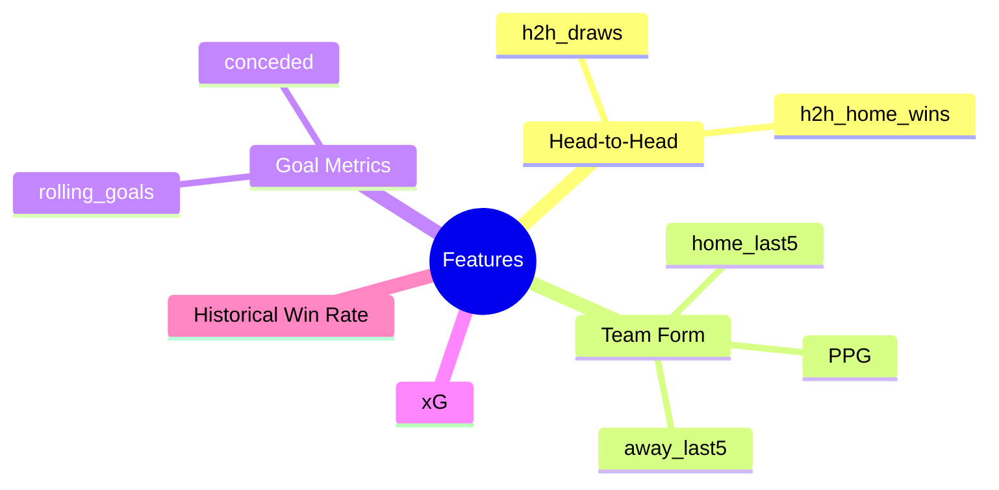
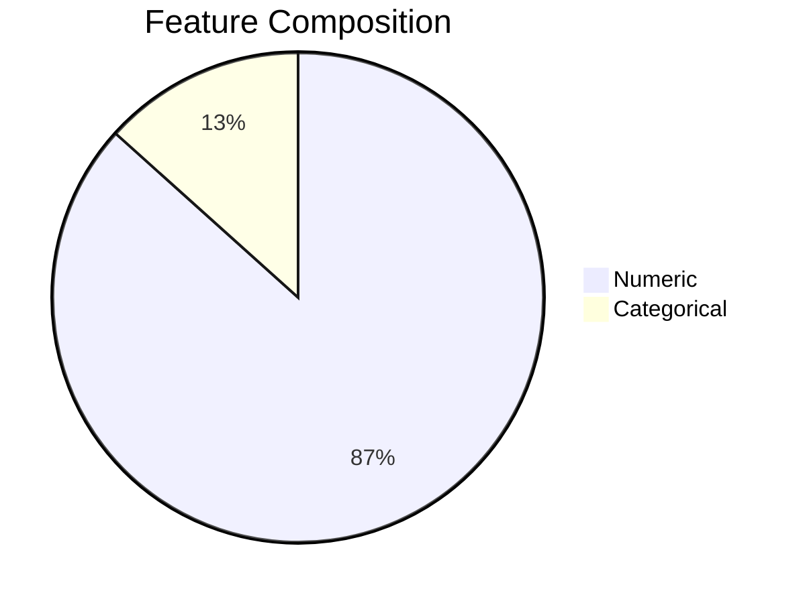
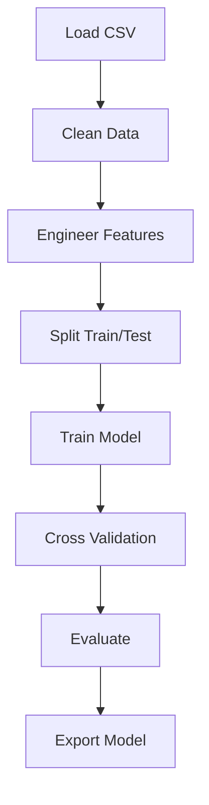

# ML_Model_Training_Analysis_Report.md

# Production-Grade Machine Learning Training Analysis

> Auto-generated from the uploaded feature datasets.

## Table of Contents
- Executive Summary
- Dataset Overview
- End-to-End Pipeline
- Feature Engineering
- Data Quality
- Model Architecture
- Training Workflow
- Feature Inventory
- Recommendations

---

# Executive Summary

| Metric | Value |
|---|---:|
| Match Records | 49,795 |
| Match Features | 30 |
| Player Records | 100 |
| Player Features | 14 |
| Numeric Match Features | 26 |
| Missing Values (Both Files) | 0 |

```text
Dataset Scale
Matches  : ████████████████████████████████████████ 49,795
Players  : █ 100
```

---

# Dataset Overview



## Match Feature Categories



---

# Data Quality

| Check | Status |
|---|---|
| Duplicate Handling | Recommended |
| Missing Values | 0 |
| Numeric Features | 26 |
| Categorical Features | 4 |



---

# Training Workflow



---

# Model Architecture


---

# Feature Inventory

| Match Features |
|---|
| date |
| home_team |
| away_team |
| h2h_home_wins |
| h2h_draws |
| home_last5_wins |
| home_last5_draws |
| home_last5_losses |
| home_ppg |
| home_rolling_goals |
| home_rolling_goals_conceded |
| home_historical_win_rate |
| away_last5_wins |
| away_last5_draws |
| away_last5_losses |
| away_ppg |
| away_rolling_goals |
| away_rolling_goals_conceded |
| away_historical_win_rate |
| home_rolling_xG |
| away_rolling_xG |
| home_rolling_xGA |
| away_rolling_xGA |
| home_fifa_rank |
| away_fifa_rank |
| fifa_rank_diff |
| home_elo |
| away_elo |
| elo_diff |
| result |

## Player Features

| Player Features |
|---|
| short_name |
| age |
| height |
| weight |
| overall_rating |
| potential |
| pace |
| shooting |
| passing |
| dribbling |
| defending |
| physical |
| preferred_foot |
| position |


---

# Recommendations

```text
Priority
██████████ Feature Validation
█████████  Time-Series Cross Validation
████████   Hyperparameter Optimization
███████    Feature Importance Analysis
██████     Calibration
█████      ONNX Export Validation
```

## Production Readiness Checklist

- [x] Feature datasets prepared
- [x] Player feature table available
- [x] Match feature table available
- [ ] Feature drift monitoring
- [ ] Automated retraining
- [ ] Model versioning
- [ ] Explainability dashboard
- [ ] CI/CD validation

---

## Conclusion

The uploaded datasets provide a structured feature layer suitable for supervised football prediction workflows. The engineered features cover historical performance, rolling statistics, expected goals, and player attributes, forming a strong basis for gradient boosting or other tabular ML models. Additional training logs, evaluation metrics, confusion matrices, feature importance outputs, or model reports can be merged into this document to produce a complete end-to-end training report.

