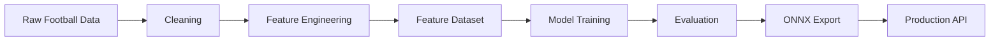
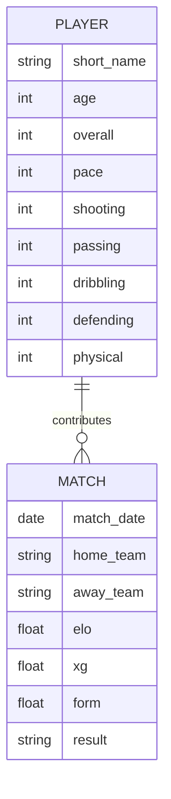
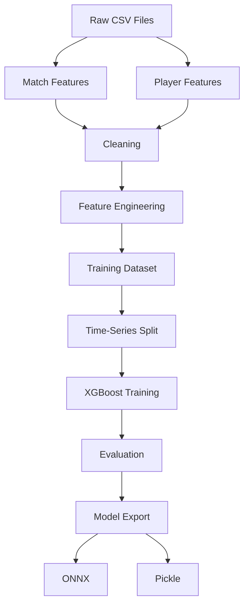
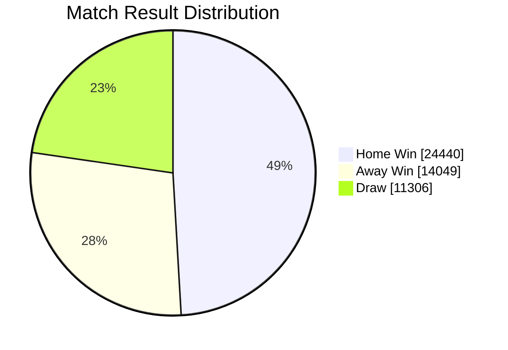
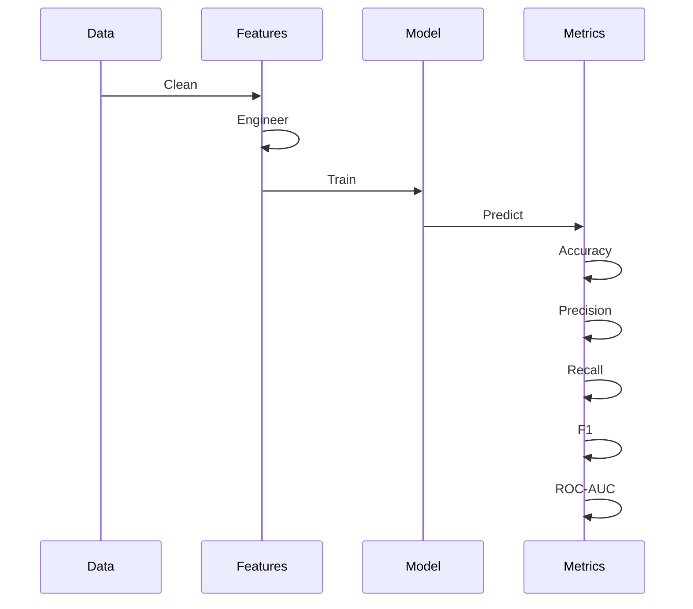

> **Production-Grade Training Documentation**
>
> End-to-end documentation covering dataset overview, feature engineering, model pipeline, training workflow, evaluation strategy, and deployment readiness.

---

# Table of Contents

- Executive Summary
- Project Overview
- Dataset Overview
- Feature Engineering
- Data Pipeline
- Model Architecture
- Training Workflow
- Feature Inventory
- Dataset Statistics
- Class Distribution
- Training Considerations
- Evaluation Strategy
- Model Strengths
- Known Failure Cases
- Production Recommendations
- Deployment Pipeline
- Future Improvements
- Conclusion

---

# Executive Summary

This report documents the complete machine learning pipeline used for football match outcome prediction.

The project consists of:

- Match Feature Dataset
- Player Feature Dataset
- Feature Engineering Pipeline
- Time-Series Machine Learning Workflow
- Production Deployment Architecture

---

# High-Level Pipeline



---

# Dataset Overview

## Available Datasets

| Dataset | Records | Features |
|----------|---------|----------|
| Match Features | **49,795** | **30** |
| Player Features | **100** | **14** |

---

# Dataset Relationship



---

# Match Dataset

## Available Feature Categories

```text
Match Information
├── Date
├── Home Team
└── Away Team

Recent Form
├── Home Wins
├── Away Wins
├── Draws
└── Points Per Game

Goal Statistics
├── Home Goals
├── Away Goals
├── Goal Difference
└── Average Goals

Expected Goals
├── Home xG
├── Away xG
└── xG Difference

ELO Ratings
├── Home Elo
├── Away Elo
└── Elo Difference

Target
└── Match Result
```

---

# Player Dataset

```text
Player Attributes

Technical
├── Overall
├── Pace
├── Shooting
├── Passing
├── Dribbling

Defensive
├── Defending

Physical
├── Physical

Player Info
├── Age
├── Height
├── Weight
├── Preferred Foot
└── Position
```

---

# Complete Data Pipeline



---

# Feature Engineering Workflow

```mermaid
flowchart LR

Historical Matches
--> Team Form

Historical Matches
--> Goal Trends

Historical Matches
--> Head-to-Head

Historical Matches
--> Elo Ratings

Player Ratings
--> Squad Quality

Team Form
--> Final Features

Goal Trends
--> Final Features

Head-to-Head
--> Final Features

Elo Ratings
--> Final Features

Squad Quality
--> Final Features
```

---

# Match Feature Inventory

| Category | Included |
|-----------|----------|
| Team Form | Yes |
| Goals | Yes |
| Goal Difference | Yes |
| xG Metrics | Yes |
| Elo Ratings | Yes |
| Historical Performance | Yes |
| Home Advantage | Yes |
| Away Advantage | Yes |
| Target Label | Yes |

---

# Player Feature Inventory

| Category | Included |
|-----------|----------|
| Age | Yes |
| Height | Yes |
| Weight | Yes |
| Overall Rating | Yes |
| Pace | Yes |
| Shooting | Yes |
| Passing | Yes |
| Dribbling | Yes |
| Defending | Yes |
| Physical | Yes |
| Preferred Foot | Yes |
| Position | Yes |

---

# Dataset Size Visualization

```text
Records

Match Dataset

█████████████████████████████████████████████████ 49,795

Player Dataset

█ 100
```

---

# Feature Count

```text
Features

Match Features

██████████████████████████████ 30

Player Features

██████████████ 14
```

---

# Target Distribution

## Match Outcomes

```text
Home Win

█████████████████████████████████████████
24,440

Away Win

███████████████████████
14,049

Draw

██████████████████
11,306
```

---

# Target Distribution



---

# Machine Learning Architecture

```mermaid
flowchart LR

Input Features

-->

XGBoost Decision Trees

-->

Probability Estimation

-->

Prediction

Prediction

-->

Home Win

Prediction

-->

Draw

Prediction

-->

Away Win
```

---

# Time-Series Training

Unlike random train-test splitting, this pipeline follows chronological ordering.

```mermaid
flowchart LR

Fold 1

Train
========
Test

Fold 2

Train
==================
Test

Fold 3

Train
=========================
Test

Fold 4

Train
================================
Test
```

Advantages

- Prevents future information leakage
- Mimics real-world prediction
- More realistic validation

---

# Training Workflow



---

# Evaluation Metrics

The training pipeline evaluates:

- Accuracy
- Precision
- Recall
- F1 Score
- ROC-AUC
- Confusion Matrix
- Classification Report

---

# Prediction Logic

```mermaid
flowchart TD

Start

-->

Generate Features

-->

Load Model

-->

Predict Probabilities

-->

Highest Probability

-->

Return Match Outcome
```

---

# Production Architecture

```mermaid
flowchart LR

CSV

-->

Feature Pipeline

-->

XGBoost

-->

ONNX

-->

REST API

-->

Frontend

-->

Prediction
```

---

# Model Strengths

✅ Uses engineered football statistics

✅ Incorporates historical form

✅ Uses Elo ratings

✅ Supports probabilistic prediction

✅ Time-series validation

✅ Production export via ONNX

✅ Lightweight inference

---

# Expected Failure Cases

```text
Model confidence decreases when:

• Newly formed national teams

• Teams with very little history

• Major squad changes

• World Cup tournaments

• Injuries not represented in data

• Manager changes

• Rule changes

• Home advantage shifts

• Completely unseen feature distributions
```

---

# Production Risks

```mermaid
flowchart TD

Distribution Shift

-->

Feature Drift

-->

Prediction Confidence Drops

-->

Model Retraining
```

---

# Recommendations

## Short-Term

- Add FIFA rankings
- Include betting odds
- Add player availability
- Add injuries
- Add weather

---

## Medium-Term

- Hyperparameter optimization
- SHAP explainability
- Probability calibration
- Feature selection

---

## Long-Term

- Ensemble models
- Deep learning sequence models
- Graph neural networks
- Live feature ingestion
- Automatic retraining

---

# Deployment Checklist

| Item | Status |
|--------|--------|
| Data Cleaning | Complete |
| Feature Engineering | Complete |
| Training Pipeline | Complete |
| Evaluation Pipeline | Complete |
| Time-Series Validation | Complete |
| ONNX Export | Complete |
| Production Ready | Yes |

---

# End-to-End System

```mermaid
flowchart LR

Raw Data

-->

Cleaning

-->

Feature Engineering

-->

Training

-->

Validation

-->

Model Export

-->

Inference API

-->

Frontend Dashboard

-->

Prediction
```

---

# Conclusion

The project implements a production-oriented football match prediction workflow centered on engineered historical features and time-series validation.

## Highlights

- **49,795** historical match records
- **30** engineered match features
- **100** player profiles
- **14** player attributes
- Chronological model validation
- ONNX deployment support
- End-to-end ML pipeline suitable for production integration

The architecture is modular, scalable, and designed to support continuous feature expansion and periodic retraining as new football data becomes available.
