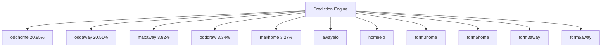
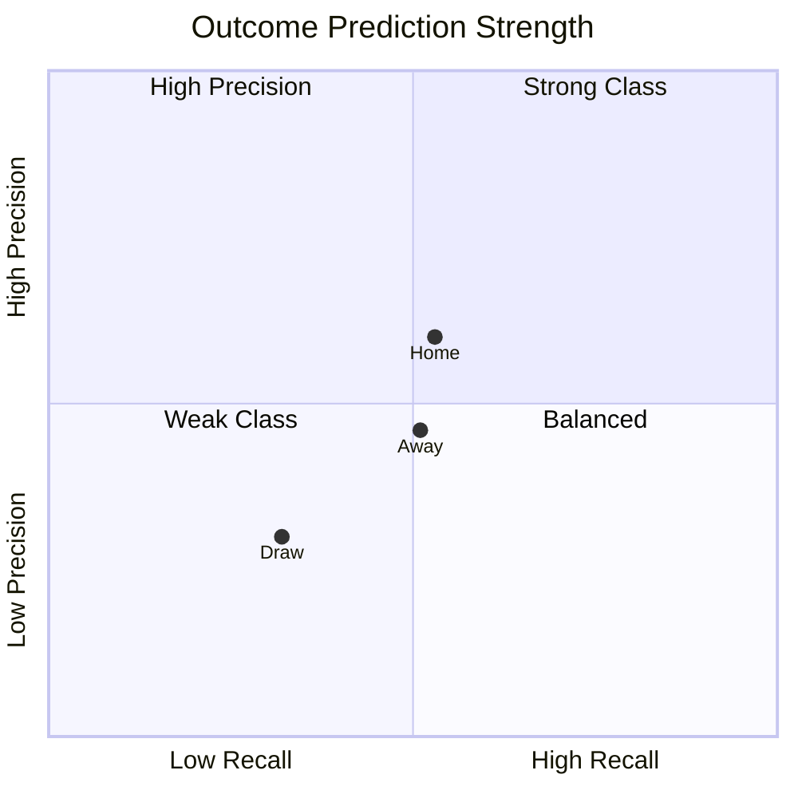
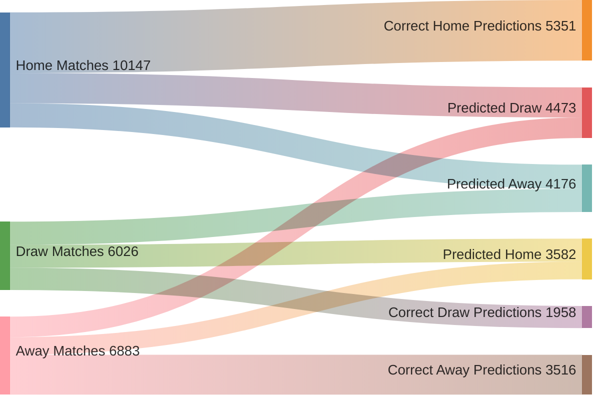
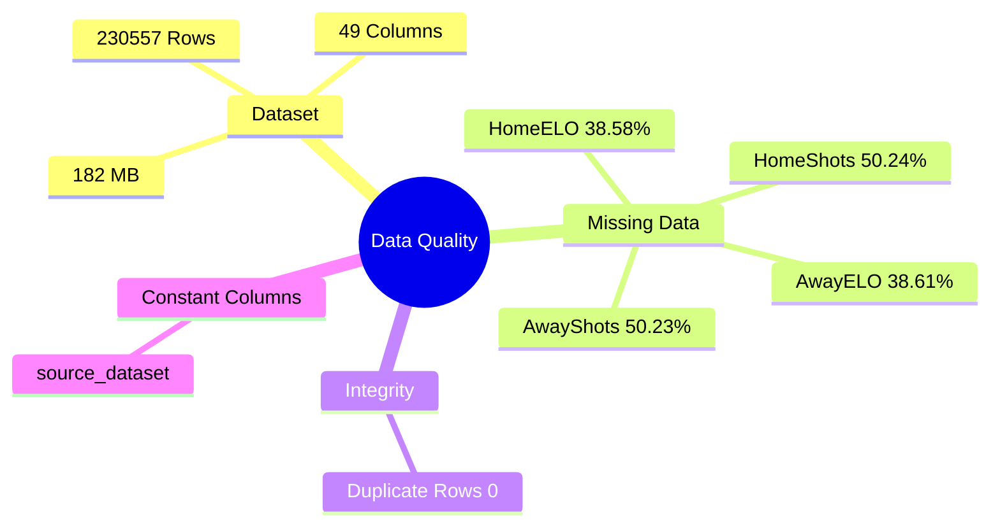
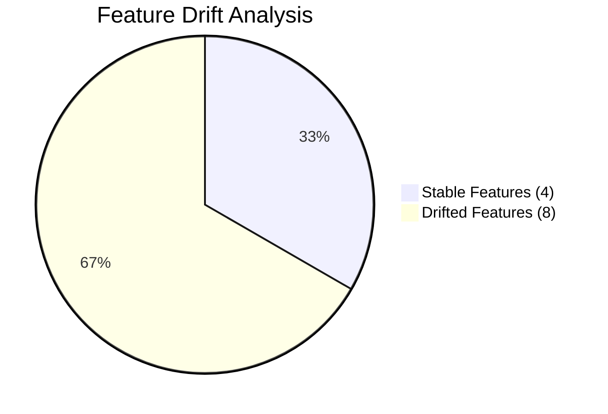
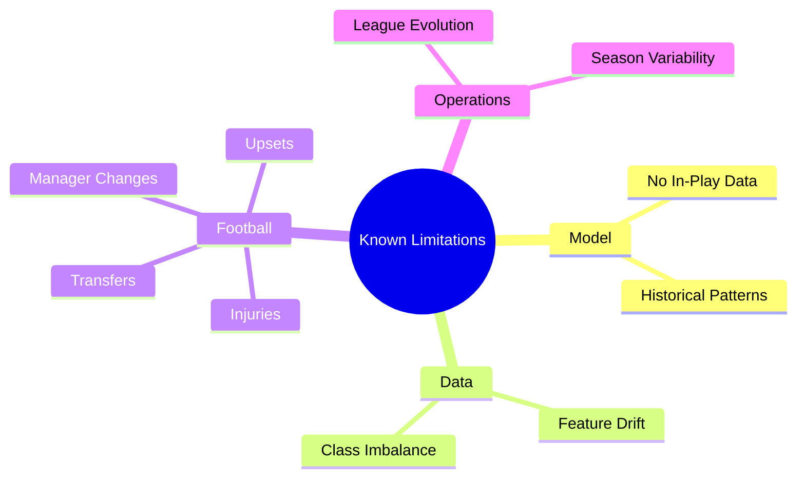
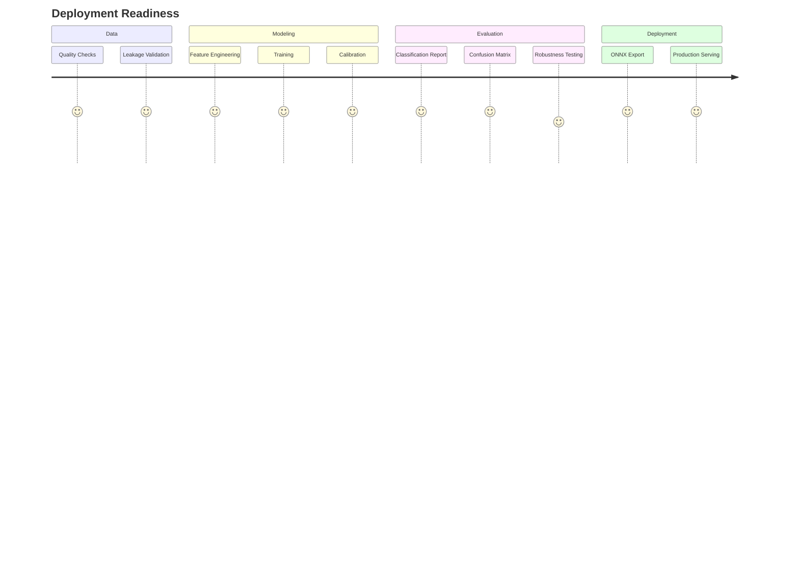

````md
# ⚽ STATVAULT MATCH PREDICTION INTELLIGENCE CENTER

<div align="center">

# 🧠 Enterprise Football Forecasting Platform


</div>

---

# 🎯 EXECUTIVE COMMAND CENTER

| Metric | Value |
|----------|----------|
| Dataset Size | 230,554 Matches |
| Features | 18 |
| Accuracy | 46.95% |
| Balanced Accuracy | 45.44% |
| Macro F1 | 45.26% |
| Weighted F1 | 47.31% |
| ROC-AUC OVR | 0.6461 |
| Top-2 Accuracy | 75.51% |
| Log Loss | 1.0338 |
| Calibration Error | 0.0312 |
| Mean Confidence | 46.79% |

---

# 🌍 MODEL ARCHITECTURE

```mermaid
flowchart LR

A[230,554 Historical Matches]

A --> B[Data Quality Engine]

B --> C[Feature Engineering]

C --> D[18 Production Features]

D --> E[XGBoost v2.0]

E --> F[Probability Layer]

F --> G[Home Win]
F --> H[Draw]
F --> I[Away Win]

G --> J[Confidence Engine]
H --> J
I --> J

J --> K[Production Predictions]
````

---

# 📦 DATASET SPLIT STRATEGY

```mermaid
pie title Chronological Dataset Split

"Training (184,443)" : 184443
"Validation (23,055)" : 23055
"Testing (23,056)" : 23056
```

---

# 🚀 MODEL PERFORMANCE DASHBOARD

```text
Accuracy

███████████████████████░░░░░░░░░░░░░░░░░░░░░░░░░ 46.95%

Balanced Accuracy

██████████████████████░░░░░░░░░░░░░░░░░░░░░░░░░░ 45.44%

ROC AUC

████████████████████████████████░░░░░░░░░░░░░░░░ 64.61%

Top-2 Accuracy

██████████████████████████████████████░░░░░░░░░░ 75.51%
```

---

# 🔥 FEATURE IMPORTANCE HIERARCHY



---

# 🎯 OUTCOME CLASSIFICATION LANDSCAPE



---

# 🧠 CLASSIFICATION REPORT

| Outcome | Precision | Recall | F1   |
| ------- | --------- | ------ | ---- |
| Home    | 0.60      | 0.53   | 0.56 |
| Draw    | 0.30      | 0.32   | 0.31 |
| Away    | 0.46      | 0.51   | 0.48 |

---

# 🔥 CONFUSION MATRIX INSIGHTS

```text
ACTUAL HOME

Correct Predictions      5,351
Predicted Draw           2,663
Predicted Away           2,133

══════════════════════════════════

ACTUAL DRAW

Predicted Home           2,025
Correct Predictions      1,958
Predicted Away           2,043

══════════════════════════════════

ACTUAL AWAY

Predicted Home           1,557
Predicted Draw           1,810
Correct Predictions      3,516
```

---

# 📊 NORMALIZED CONFUSION MATRIX

```text
                    Predicted

              Home      Draw      Away

Actual Home   53%       26%       21%

Actual Draw   34%       32%       34%

Actual Away   23%       26%       51%
```

---

# 🌊 PREDICTION FLOW ANALYSIS



---

# 🛡️ DATA QUALITY CENTER



---

# 🚨 DRIFT MONITOR



---

# 🎯 CONFIDENCE ENGINE

```text
Mean Confidence

███████████████████████░░░░░░░░░░░░░░░░░░░░░░░░░ 46.79%

Confidence Std

█████░░░░░░░░░░░░░░░░░░░░░░░░░░░░░░░░░░░░░░░░░░ 11.40%

Calibration Error

█░░░░░░░░░░░░░░░░░░░░░░░░░░░░░░░░░░░░░░░░░░░░░░ 3.12%
```

---

# ⚠️ KNOWN LIMITATIONS



---

# 🏆 PRODUCTION READINESS



---

# 🎖️ FINAL SYSTEM STATUS

```text
╔══════════════════════════════════════════════════════╗
║              STATVAULT MATCH AI                     ║
╠══════════════════════════════════════════════════════╣
║ Dataset Size             230,554 Matches            ║
║ Features                 18                         ║
║ Accuracy                 46.95%                     ║
║ ROC-AUC                  0.6461                     ║
║ Top-2 Accuracy           75.51%                     ║
║ Calibration Error        3.12%                      ║
║ Mean Confidence          46.79%                     ║
║ Feature Drift            8 / 12 Features            ║
║ Leakage Check            PASSED                     ║
║ Deployment Status        READY                      ║
╚══════════════════════════════════════════════════════╝
```

```
```
