# ⚽ STATVAULT MATCH PREDICTION INTELLIGENCE CENTER

<div align="center">

# 🧠 Enterprise Football Forecasting Platform


<br><br>

## 🚀 AI-Powered Match Outcome Prediction Engine

### Predicting Home Wins • Draws • Away Wins from 230K+ Historical Matches

---

</div>

# 🎯 EXECUTIVE OVERVIEW

<table>
<tr>
<td width="33%">

### 📦 Dataset

| Metric | Value |
|---------|--------|
| Matches | 230,554 |
| Features | 18 |
| Columns | 49 |
| Memory | 182 MB |

</td>

<td width="33%">

### 🧠 Model

| Metric | Value |
|---------|--------|
| Algorithm | XGBoost |
| Version | 2.0 |
| Classes | 3 |
| Split | Chronological |

</td>

<td width="33%">

### 🎯 Performance

| Metric | Value |
|---------|--------|
| Accuracy | 46.95% |
| ROC-AUC | 0.6461 |
| Top-2 Accuracy | 75.51% |
| Log Loss | 1.0338 |

</td>
</tr>
</table>

---

# 🌍 SYSTEM ARCHITECTURE

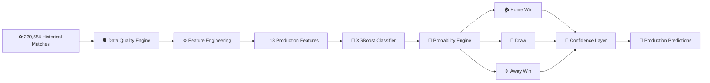

---

# 📦 DATA SPLIT STRATEGY

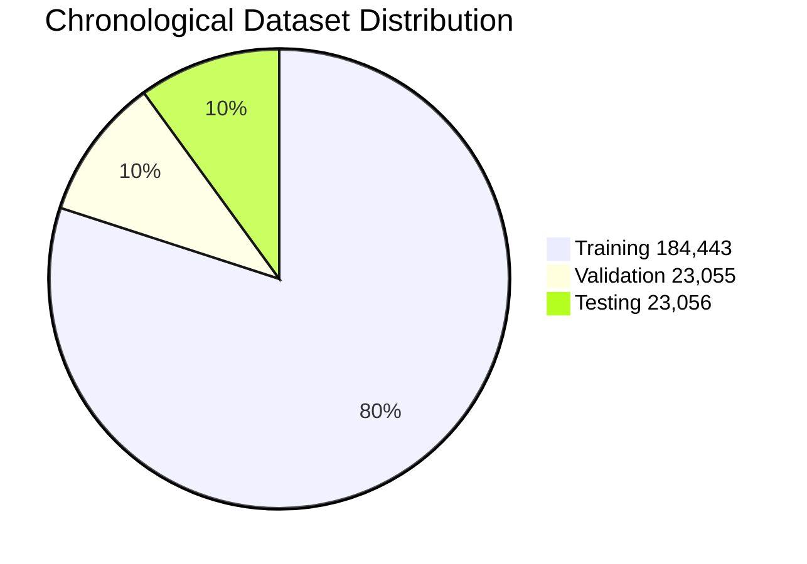

---

# 🚀 PERFORMANCE COMMAND CENTER

| Metric | Score |
|----------|----------|
| Accuracy | **46.95%** |
| Balanced Accuracy | **45.44%** |
| Macro Precision | **45.35%** |
| Macro Recall | **45.44%** |
| Macro F1 | **45.26%** |
| Weighted F1 | **47.31%** |
| ROC-AUC (OVR) | **64.61%** |
| Top-2 Accuracy | **75.51%** |
| Calibration Error | **3.12%** |
| Mean Confidence | **46.79%** |

---

# 📊 PERFORMANCE VISUALIZATION

## Accuracy

```text
███████████████████████░░░░░░░░░░░░░░░░░░░░░░░░░░░░ 46.95%
```

## Balanced Accuracy

```text
██████████████████████░░░░░░░░░░░░░░░░░░░░░░░░░░░░░ 45.44%
```

## ROC AUC

```text
████████████████████████████████░░░░░░░░░░░░░░░░░░░ 64.61%
```

## Top-2 Accuracy

```text
██████████████████████████████████████░░░░░░░░░░░░░ 75.51%
```

---

# 🏆 FEATURE IMPORTANCE LEADERBOARD

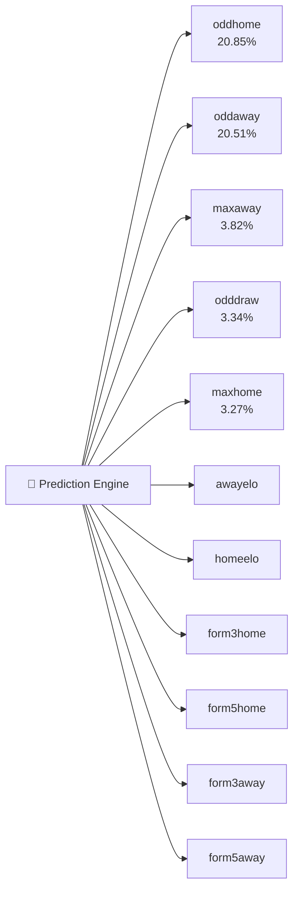

---

# 🎯 FEATURE POWER DISTRIBUTION

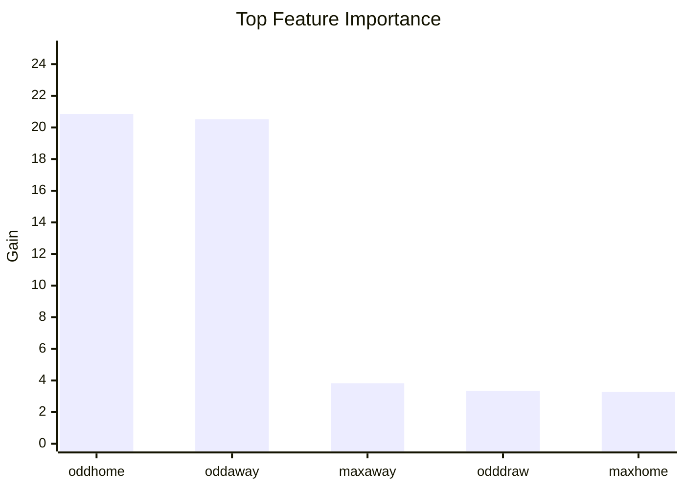

---

# 🧠 CLASSIFICATION REPORT

| Outcome | Precision | Recall | F1 Score |
|----------|----------|----------|----------|
| 🏠 Home | 0.60 | 0.53 | 0.56 |
| 🤝 Draw | 0.30 | 0.32 | 0.31 |
| ✈️ Away | 0.46 | 0.51 | 0.48 |

---

# 🎯 CLASS PREDICTION STRENGTH

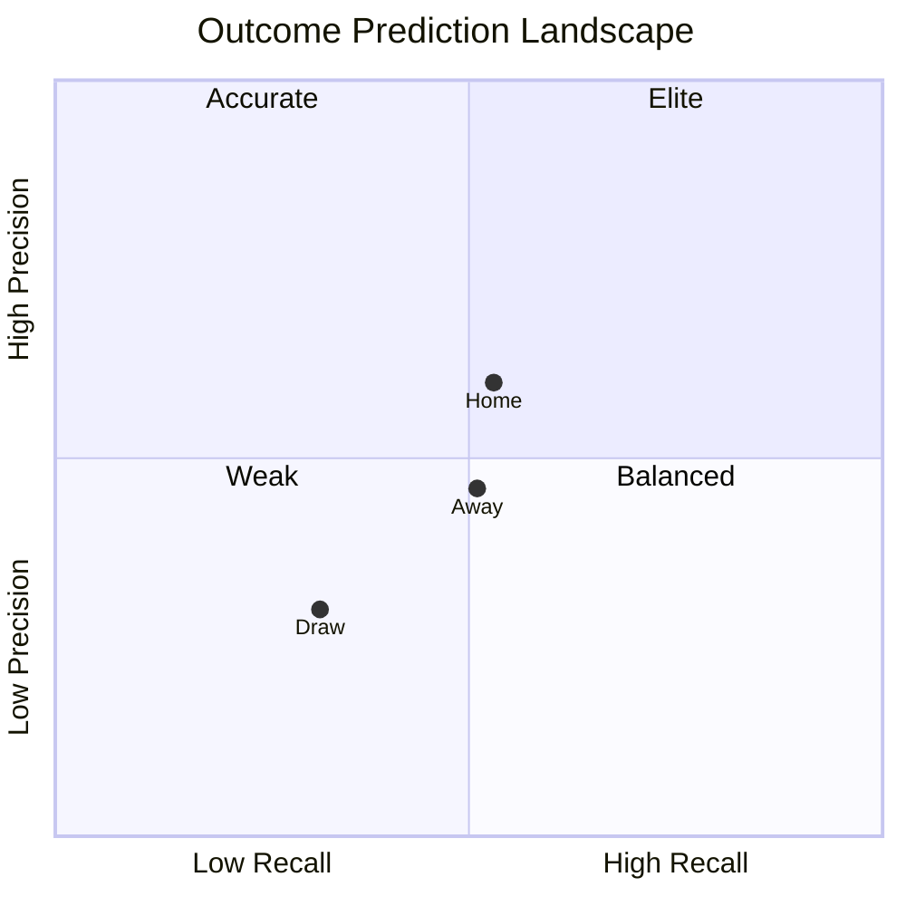

---

# 🔥 CONFUSION MATRIX ANALYSIS

## Actual Home Matches

```text
Correct Home Predictions      ████████████████████  5,351

Predicted Draw                ██████████           2,663

Predicted Away                ████████             2,133
```

## Actual Draw Matches

```text
Predicted Home                ███████              2,025

Correct Draw Predictions      ███████              1,958

Predicted Away                ███████              2,043
```

## Actual Away Matches

```text
Predicted Home                ██████               1,557

Predicted Draw                ███████              1,810

Correct Away Predictions      ██████████████       3,516
```

---

# 📊 NORMALIZED CONFUSION MATRIX

| Actual ↓ / Predicted → | Home | Draw | Away |
|----------|----------|----------|----------|
| 🏠 Home | **53%** | 26% | 21% |
| 🤝 Draw | 34% | **32%** | 34% |
| ✈️ Away | 23% | 26% | **51%** |

---

# 🌊 PREDICTION FLOW MAP

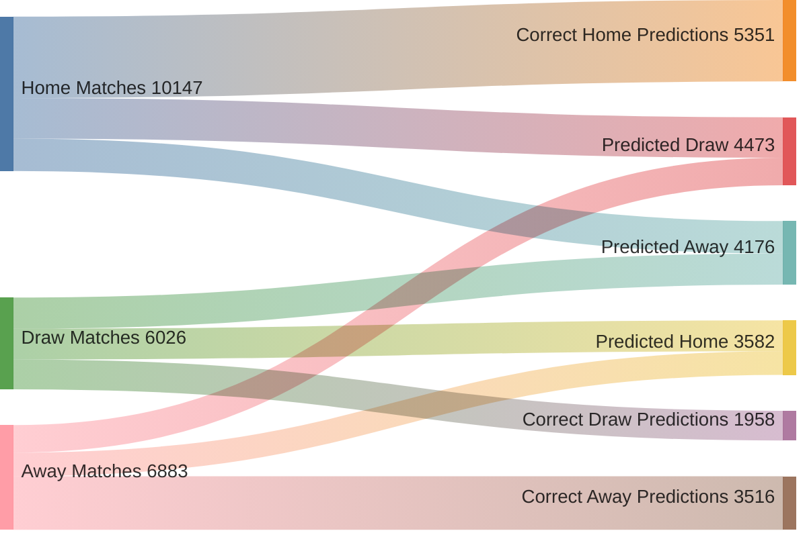

---

# 🛡️ DATA QUALITY COMMAND CENTER

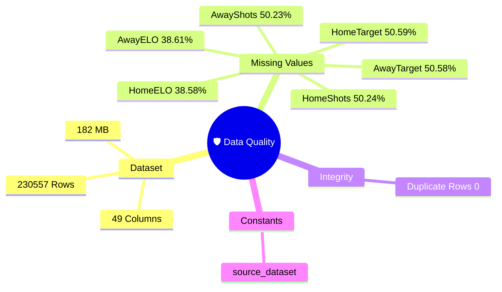

---

# 🚨 LEAKAGE PROTECTION WALL

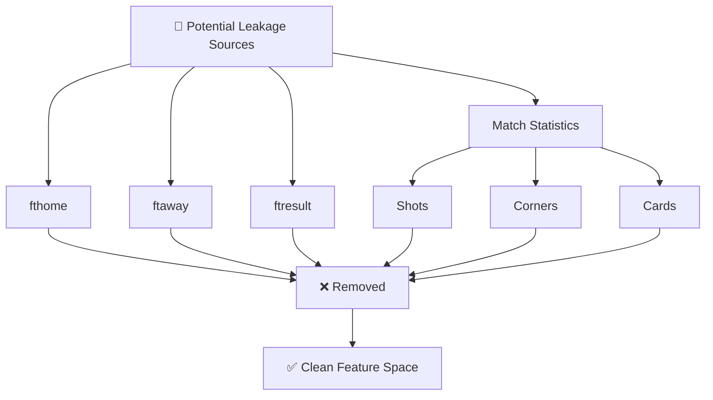

---

# 📉 FEATURE DRIFT MONITOR

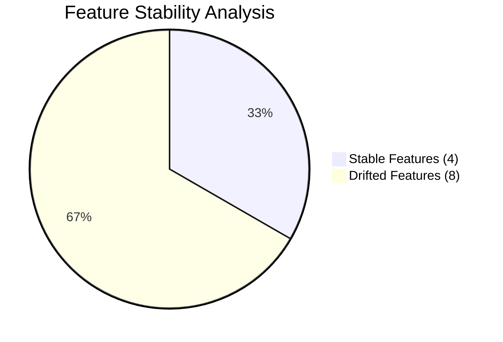

---

# 🎯 MODEL CONFIDENCE ENGINE

## Mean Prediction Confidence

```text
███████████████████████░░░░░░░░░░░░░░░░░░░░░░░░░░░░ 46.79%
```

## Confidence Variability

```text
█████░░░░░░░░░░░░░░░░░░░░░░░░░░░░░░░░░░░░░░░░░░░░░ 11.40%
```

## Calibration Error

```text
█░░░░░░░░░░░░░░░░░░░░░░░░░░░░░░░░░░░░░░░░░░░░░░░░░ 3.12%
```

---

# ⚠️ KNOWN LIMITATIONS

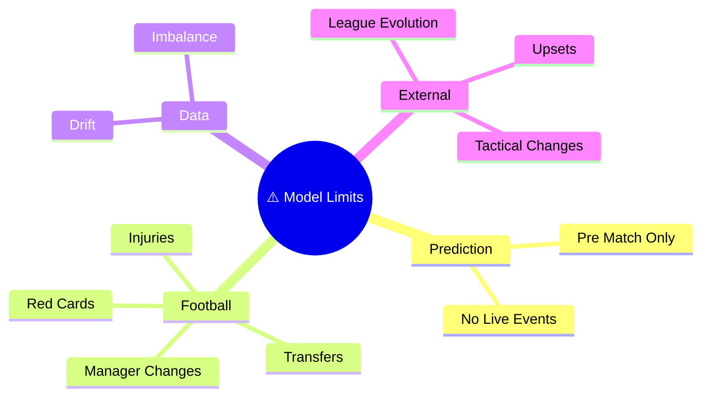

---

# 🚀 PRODUCTION READINESS MATRIX

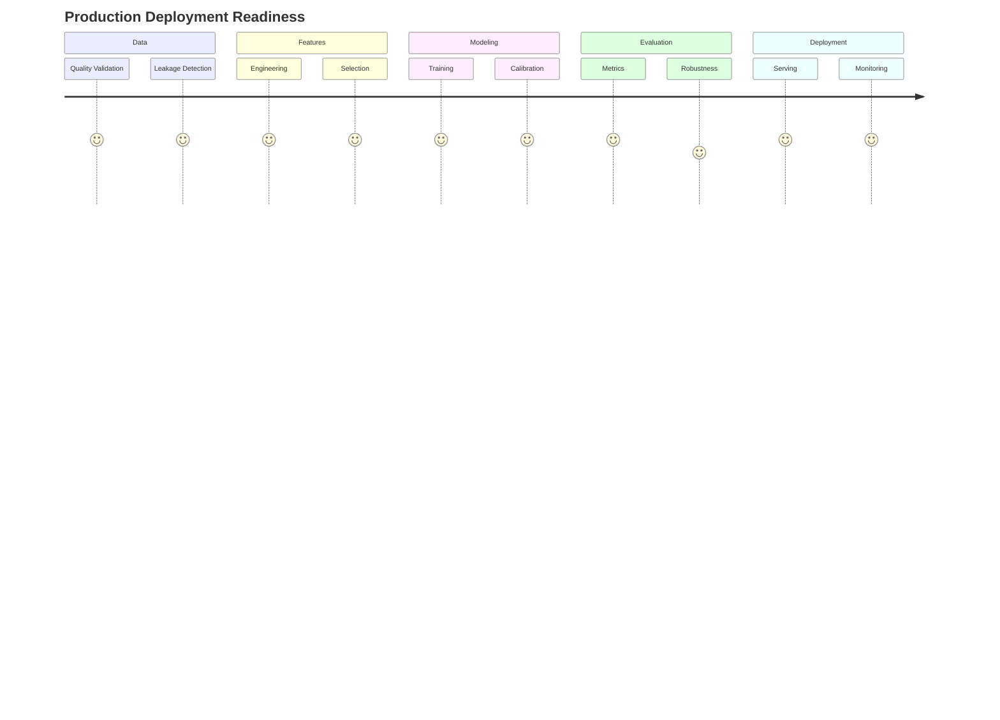

---

# 🎖️ SYSTEM HEALTH DASHBOARD

| Component | Status |
|------------|------------|
| Data Quality | 🟢 Healthy |
| Leakage Validation | 🟢 Passed |
| Feature Engineering | 🟢 Stable |
| Model Training | 🟢 Completed |
| Calibration | 🟢 Good |
| Drift Monitoring | 🟡 Attention Required |
| Confidence Engine | 🟢 Active |
| Production Readiness | 🟢 Ready |

---

# 🏁 FINAL EXECUTIVE SUMMARY

```text
╔══════════════════════════════════════════════════════════════╗
║                    STATVAULT MATCH AI                       ║
╠══════════════════════════════════════════════════════════════╣
║ DATASET SIZE             : 230,554 Matches                  ║
║ FEATURES                 : 18                               ║
║ MODEL                    : XGBoost v2.0                    ║
║ ACCURACY                 : 46.95%                           ║
║ BALANCED ACCURACY        : 45.44%                           ║
║ MACRO F1                : 45.26%                           ║
║ ROC-AUC                 : 0.6461                           ║
║ TOP-2 ACCURACY          : 75.51%                           ║
║ LOG LOSS                : 1.0338                           ║
║ MEAN CONFIDENCE         : 46.79%                           ║
║ CALIBRATION ERROR       : 3.12%                            ║
║ FEATURE DRIFT           : 8 / 12 FEATURES                  ║
║ LEAKAGE CHECK           : PASSED                           ║
║ DEPLOYMENT STATUS       : READY                            ║
╚══════════════════════════════════════════════════════════════╝
```

---

<div align="center">

# 🚀 STATVAULT v2.0

### Enterprise Football Intelligence Platform

**Predict • Analyze • Optimize • Win**

---

Built with XGBoost • 230K+ Matches • Production Ready

</div>
