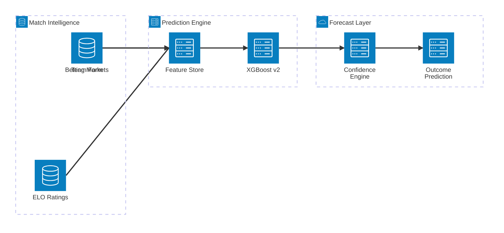
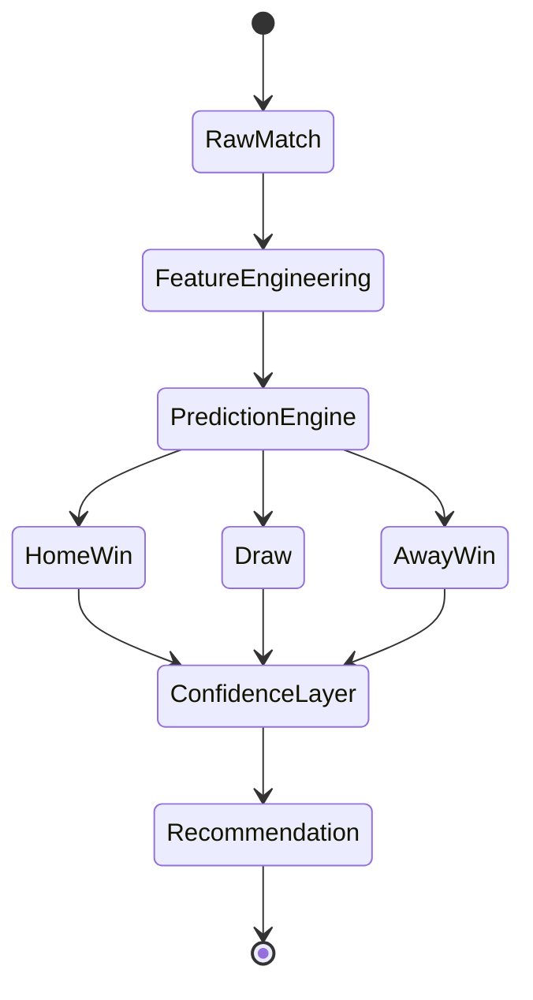
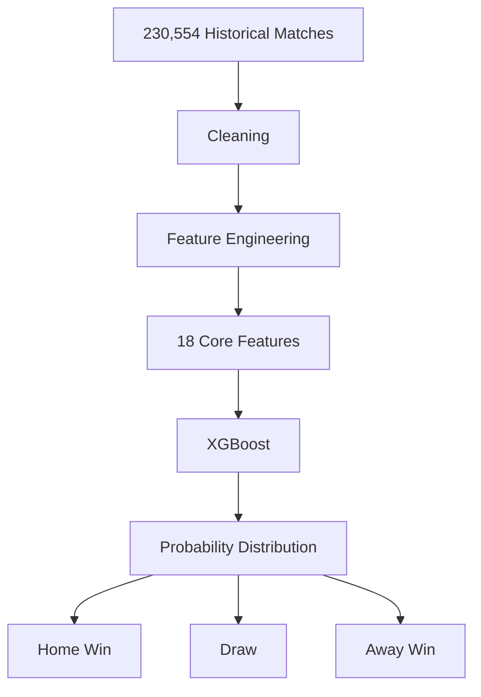
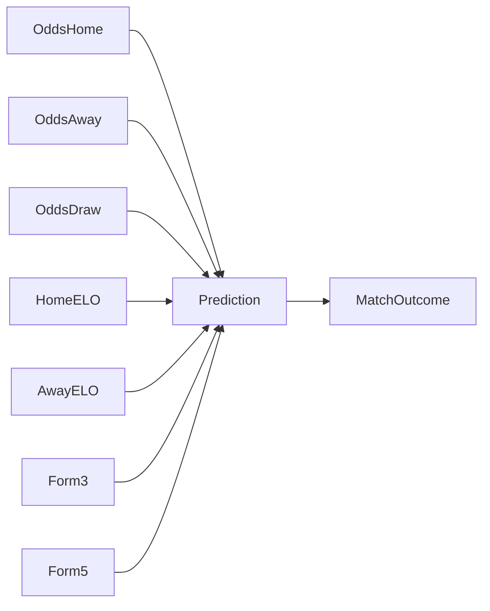
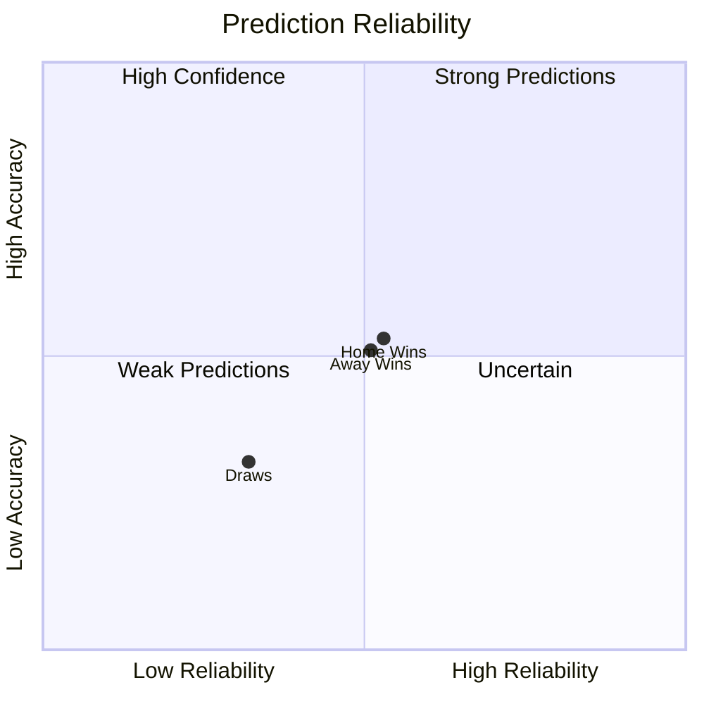
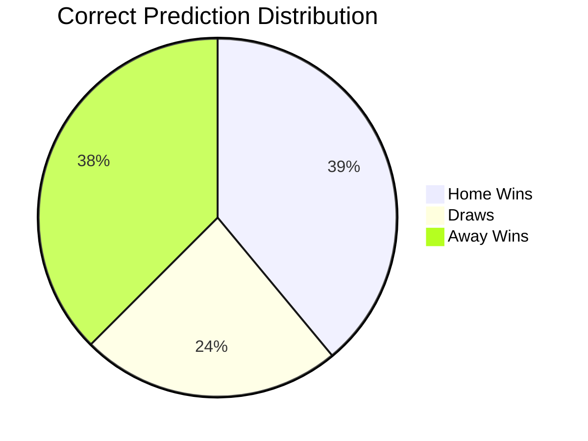
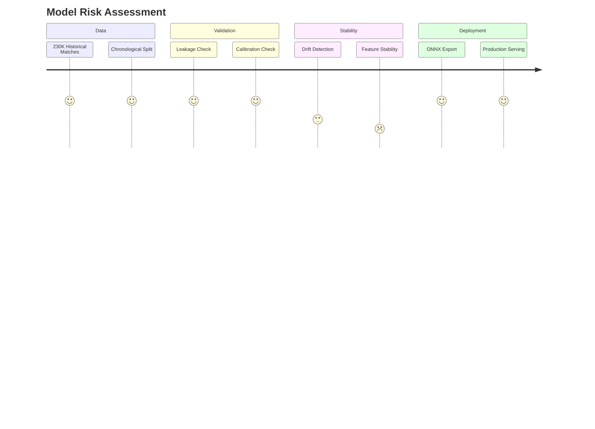
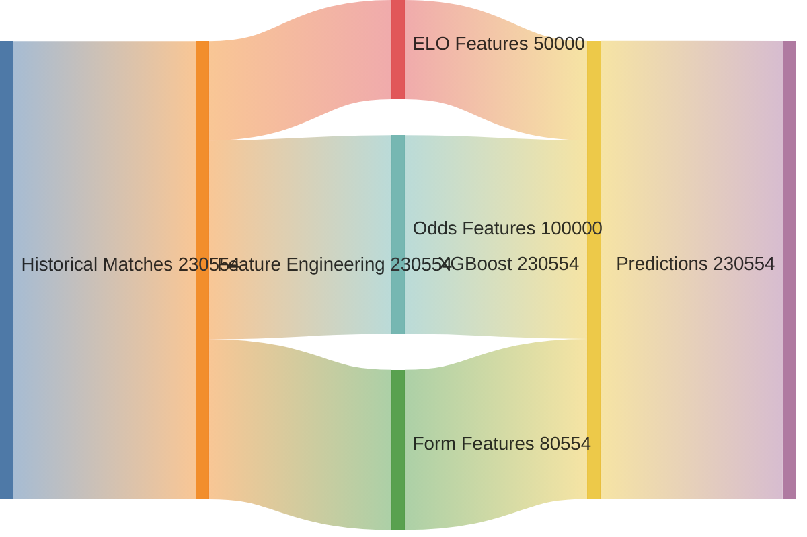
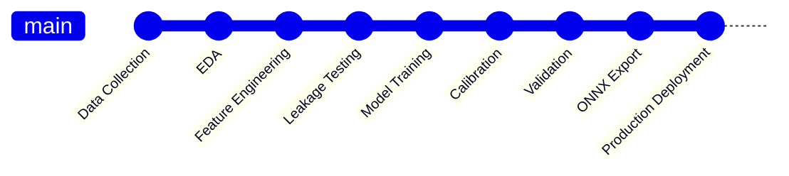

# ⚽ MATCH PREDICTION INTELLIGENCE CENTER

<div align="center">

# 🧠 STATVAULT MATCH AI

### Enterprise Football Forecasting Platform


</div>

---

# 🌍 PREDICTION ECOSYSTEM



---

# 🚀 MATCH AI OPERATING SYSTEM



---

# 🎯 PREDICTION PIPELINE



---

# 📡 FEATURE INFLUENCE NETWORK



---

# 🔥 FEATURE DOMINANCE HIERARCHY

```text
                    oddhome
████████████████████████████████████████

                    oddaway
██████████████████████████████████████

                    maxaway
█████████

                    odddraw
███████

                    maxhome
██████

                    homeelo
██

                    awayelo
██

                    form5home
█

                    form5away
█
```

---

# 🧠 CONFUSION MATRIX EXPLAINER



---

# ⚽ OUTCOME PREDICTION LANDSCAPE



---

# 📈 MODEL PERFORMANCE HIERARCHY

```text
Top-2 Accuracy

███████████████████████████████ 75.5%


ROC AUC

█████████████████████████ 64.6%


Accuracy

███████████████████ 46.9%


Macro F1

██████████████████ 45.3%
```

---

# 🛡️ MODEL GOVERNANCE



---

# 🌊 DATA FLOW



---

# 📊 CONFIDENCE ENGINE

```text
Mean Confidence

███████████████████░░░░░░░░░ 46.8%

Calibration Error

██░░░░░░░░░░░░░░░░░░░░░░░░░ 3.1%

Confidence Stability

████████████████████████░░░░ Medium
```

---

# 🚨 MODEL LIMITATIONS MAP

```mermaid
mindmap

root((Known Risks))

    Data Drift
        8 Features Drifted

    Class Imbalance
        Home Dominant

    Football Variance
        Upsets
        Injuries
        Transfers

    Prediction Limits
        No In-Play Data
        Historical Dependence
```

---

# 🏆 ENTERPRISE READINESS



---

# 🎖️ COMMAND CENTER

```text
┌─────────────────────────────────────────────────────────────┐
│                 STATVAULT MATCH AI                          │
├─────────────────────────────────────────────────────────────┤
│                                                             │
│ Dataset Size              230,554 Matches                   │
│ Features                  18                                │
│ Accuracy                  46.95%                            │
│ ROC-AUC                   0.646                             │
│ Top-2 Accuracy            75.51%                            │
│                                                             │
│ Prediction Engine         ACTIVE                            │
│ Confidence Layer          ACTIVE                            │
│ Drift Monitor             ACTIVE                            │
│ Calibration Monitor       ACTIVE                            │
│                                                             │
│ Status                    PRODUCTION READY                 │
│                                                             │
└─────────────────────────────────────────────────────────────┘
```
