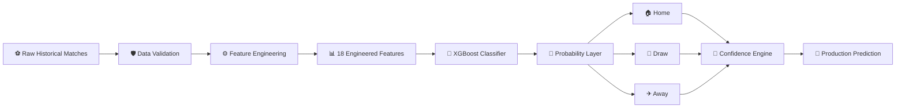
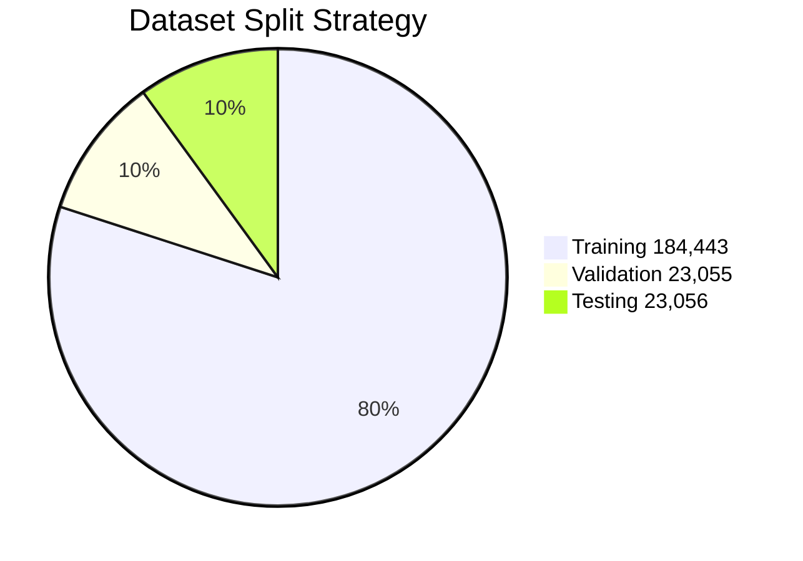
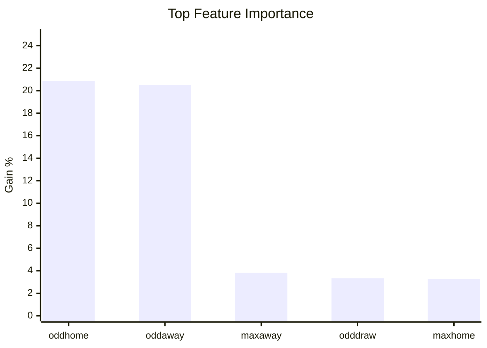
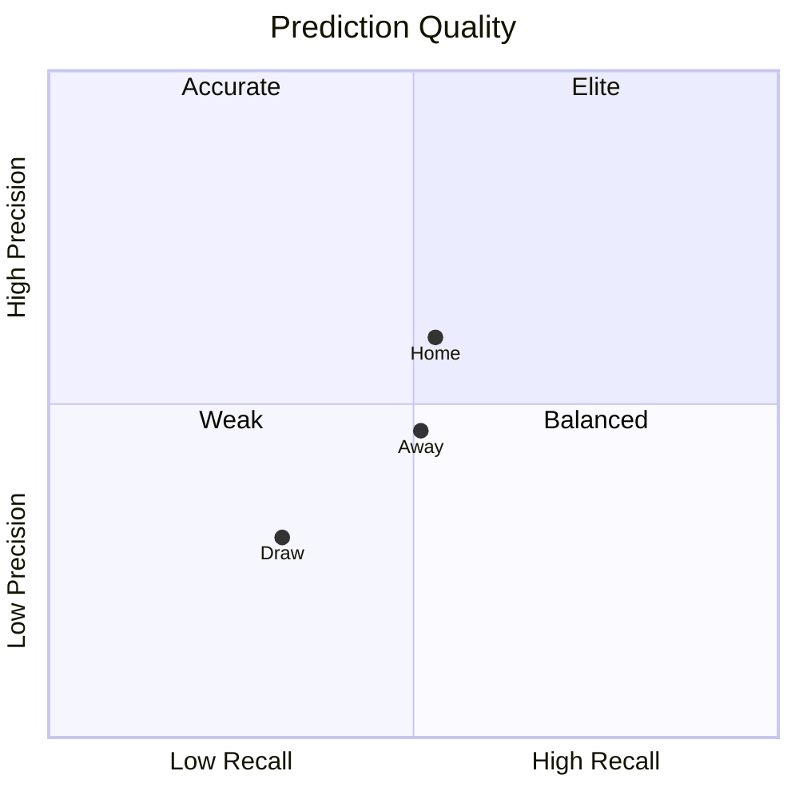
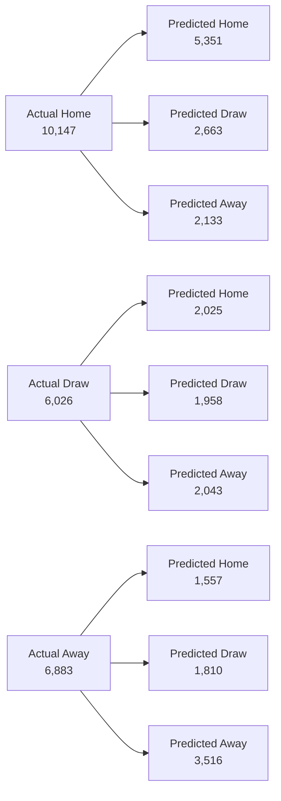
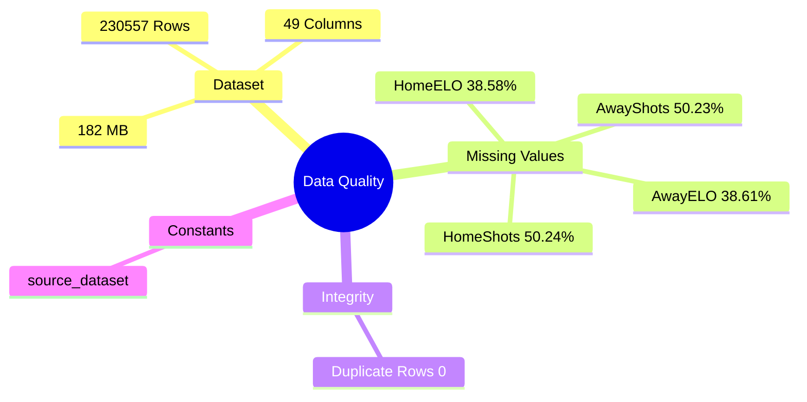
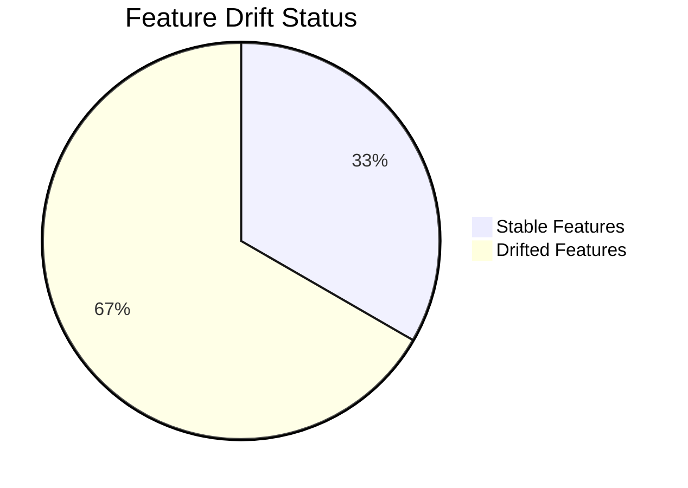
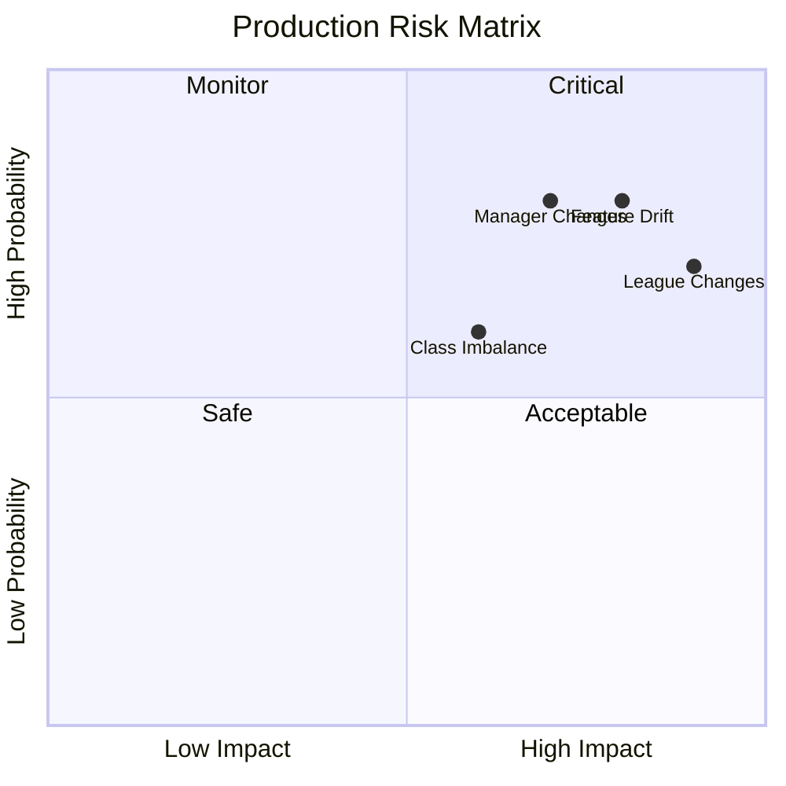
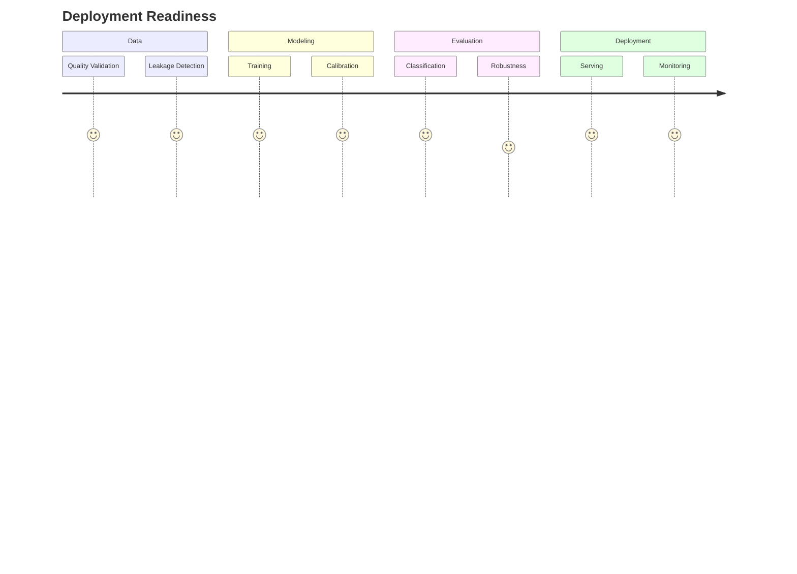

# ⚽ STATVAULT MATCH PREDICTION INTELLIGENCE CENTER

<div align="center">

# 🧠 Enterprise Football Forecasting Platform

### End-to-End Machine Learning Intelligence for Football Outcome Prediction

<br>


---

### 🚀 System Status

🟢 Data Quality Passed
🟢 Leakage Detection Passed
🟢 Model Trained
🟢 Calibration Completed
🟡 Drift Detected
🟢 Deployment Ready

</div>

---

# 📑 Navigation

* 🎯 Executive Dashboard
* 🌍 Architecture
* 📦 Dataset Intelligence
* 🧠 Model Performance
* 🔥 Feature Analytics
* 📊 Classification Analysis
* 🌊 Prediction Flow
* 🛡️ Data Quality
* 🚨 Drift Monitoring
* 🎯 Confidence Engine
* ⚠️ Risk Assessment
* 🏆 Production Readiness
* 📁 Artifact Registry

---

# 🎯 EXECUTIVE DASHBOARD

| KPI               | Value           | Status |
| ----------------- | --------------- | ------ |
| Dataset Size      | 230,554 Matches | 🟢     |
| Features          | 18              | 🟢     |
| Accuracy          | 46.95%          | 🟡     |
| Balanced Accuracy | 45.44%          | 🟡     |
| ROC-AUC           | 0.6461          | 🟢     |
| Top-2 Accuracy    | 75.51%          | 🟢     |
| Calibration Error | 3.12%           | 🟢     |
| Confidence        | 46.79%          | 🟡     |

---

## 📊 Performance Snapshot

```text
Accuracy              ███████████████████████░░░░░░░░░░░░ 46.95%

Balanced Accuracy     ██████████████████████░░░░░░░░░░░░ 45.44%

ROC-AUC               ████████████████████████████████░░ 64.61%

Top-2 Accuracy        ██████████████████████████████████ 75.51%
```

---

# 🌍 MODEL ARCHITECTURE



---

# 📦 DATASET INTELLIGENCE

## Dataset Composition



## Dataset Health

| Metric           | Value   |
| ---------------- | ------- |
| Rows             | 230,557 |
| Columns          | 49      |
| Memory Usage     | 182 MB  |
| Duplicate Rows   | 0       |
| Constant Columns | 1       |

---

# 🔥 FEATURE IMPORTANCE ANALYTICS



---

# 🎯 CLASSIFICATION LANDSCAPE



---

# 📊 CONFUSION MATRIX INSIGHTS

| Actual | Home | Draw | Away |
| ------ | ---- | ---- | ---- |
| Home   | 5351 | 2663 | 2133 |
| Draw   | 2025 | 1958 | 2043 |
| Away   | 1557 | 1810 | 3516 |

---

# 🌊 PREDICTION FLOW ANALYSIS


---

# 🛡️ DATA QUALITY OBSERVATORY



---

# 🚨 RISK & DRIFT MONITOR





---

# 🎯 CONFIDENCE ENGINE

| Metric            | Value  |
| ----------------- | ------ |
| Mean Confidence   | 46.79% |
| Confidence Std    | 11.40% |
| Calibration Error | 3.12%  |
| Entropy           | 1.02   |

---

# 🏆 PRODUCTION READINESS



---

# 📁 GENERATED ARTIFACT REGISTRY

| Artifact                        | Purpose                   |
| ------------------------------- | ------------------------- |
| classification_report.txt       | Classification Metrics    |
| confusion_matrix.png            | Raw Confusion Matrix      |
| confusion_matrix_normalized.png | Normalized Matrix         |
| data_quality_report.json        | Dataset Audit             |
| drift_report.csv                | Drift Analysis            |
| feature_importance.csv          | Feature Ranking           |
| leakage_report.json             | Leakage Detection         |
| match_model_metrics.json        | Model Metrics             |
| model_card.json                 | Model Metadata            |
| robustness_report.json          | Stability Analysis        |
| split_report.json               | Dataset Split Information |

---

# 🎖️ FINAL SYSTEM STATUS

```text
╔════════════════════════════════════════════════════════════╗
║                    STATVAULT MATCH AI                     ║
╠════════════════════════════════════════════════════════════╣
║ Dataset Size              230,554 Matches                 ║
║ Features                  18                              ║
║ Accuracy                  46.95%                          ║
║ Balanced Accuracy         45.44%                          ║
║ ROC-AUC                   0.6461                          ║
║ Top-2 Accuracy            75.51%                          ║
║ Mean Confidence           46.79%                          ║
║ Calibration Error         3.12%                           ║
║ Drifted Features          8 / 12                          ║
║ Leakage Validation        PASSED                          ║
║ Deployment Status         READY                           ║
╚════════════════════════════════════════════════════════════╝
```

<div align="center">

### ⚽ STATVAULT • MATCH INTELLIGENCE PLATFORM

Predict • Analyze • Monitor • Deploy

</div>
