# ⚽ MATCH_PREDICTION_INTELLIGENCE.md

<div align="center">

# 🧠 StatVault Match Outcome Prediction System

### Enterprise Football Forecasting Intelligence Platform


---

## 🎯 Executive Summary

Predicting football match outcomes using historical match statistics, betting market intelligence, ELO ratings, and team form metrics.

**Prediction Classes**

🏠 Home Win
🤝 Draw
✈️ Away Win

</div>

---

# 🚀 EXECUTIVE COMMAND CENTER

```text
╔══════════════════════════════════════════════════════════════╗
║                    MODEL OVERVIEW                           ║
╠══════════════════════════════════════════════════════════════╣
║ Dataset Size              230,554 Matches                   ║
║ Features                  18                                ║
║ Train Size                184,443                           ║
║ Validation Size           23,055                            ║
║ Test Size                 23,056                            ║
║ Model Type                XGBoost Classifier               ║
║ Prediction Classes        Home / Draw / Away              ║
╚══════════════════════════════════════════════════════════════╝
```

---

# 🌍 SYSTEM ARCHITECTURE

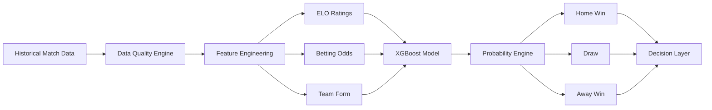

---

# 📊 DATASET SPLIT

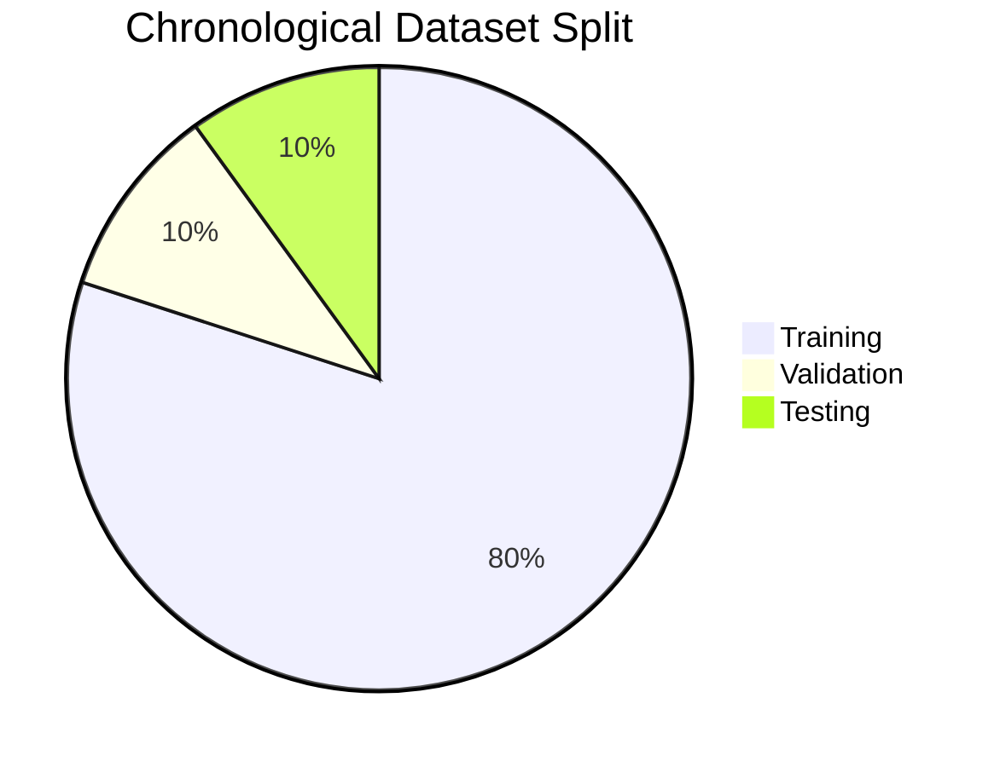

---

# 📈 MODEL PERFORMANCE DASHBOARD

| Metric            | Score  |
| ----------------- | ------ |
| Accuracy          | 46.95% |
| Balanced Accuracy | 45.44% |
| Macro Precision   | 45.35% |
| Macro Recall      | 45.44% |
| Macro F1          | 45.26% |
| Weighted F1       | 47.31% |
| ROC-AUC OVR       | 0.6461 |
| Top-2 Accuracy    | 75.51% |
| Log Loss          | 1.0338 |
| Calibration Error | 0.0312 |

---

# 🎯 PERFORMANCE VISUALIZATION

```text
Accuracy

███████████████████████░░░░░░░░░░░░░░░░░░░░░░░░ 46.95%

Balanced Accuracy

██████████████████████░░░░░░░░░░░░░░░░░░░░░░░░░ 45.44%

ROC-AUC

████████████████████████████████░░░░░░░░░░░░░░░ 64.61%

Top-2 Accuracy

██████████████████████████████████████░░░░░░░░░ 75.51%
```

---

# 🏆 PREDICTION ECOSYSTEM

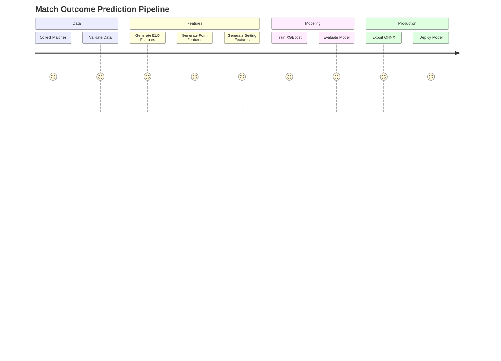

---

# 🔥 FEATURE IMPORTANCE NETWORK

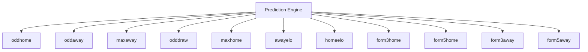

---

# 📊 TOP FEATURE DOMINANCE

```text
oddhome           ████████████████████████████████████

oddaway           ██████████████████████████████████

maxaway           ██████

odddraw           █████

maxhome           █████

awayelo           ██

homeelo           ██

form3home         █

form5home         █

form3away         █

form5away         █
```

---

# 🧠 CLASSIFICATION REPORT

| Class | Precision | Recall | F1   |
| ----- | --------- | ------ | ---- |
| Home  | 0.60      | 0.53   | 0.56 |
| Draw  | 0.30      | 0.32   | 0.31 |
| Away  | 0.46      | 0.51   | 0.48 |

---

# 🎯 CLASS PERFORMANCE MAP

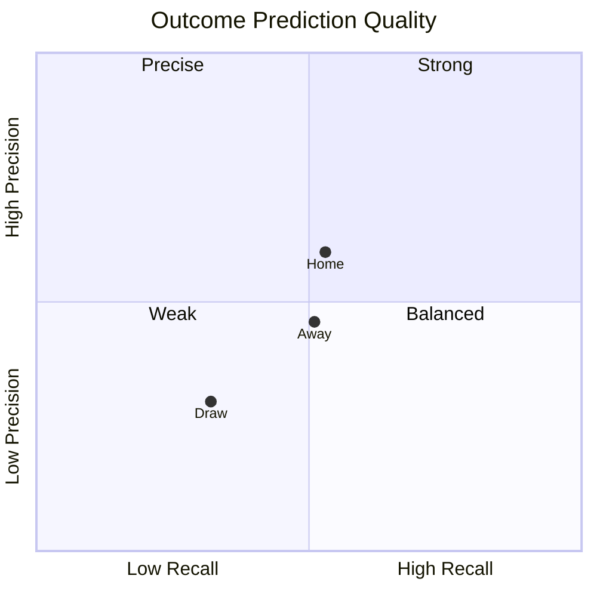

---

# 🔍 CONFUSION MATRIX

## Raw Confusion Matrix

```markdown

```

---

## Normalized Confusion Matrix

```markdown

```

---

# 🌊 PREDICTION FLOW

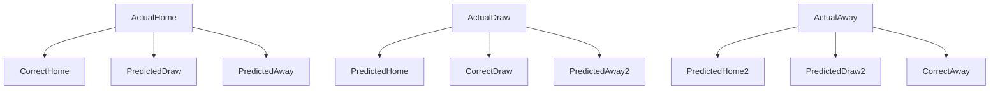

---

# 📡 MODEL CONFIDENCE CENTER

```text
Mean Confidence

███████████████████████░░░░░░░░░░░░░░░░░░░░░░░░ 46.79%

Confidence Std

█████░░░░░░░░░░░░░░░░░░░░░░░░░░░░░░░░░░░░░░░░░ 11.40%

Calibration Error

█░░░░░░░░░░░░░░░░░░░░░░░░░░░░░░░░░░░░░░░░░░░░░ 3.12%
```

---

# 🛡️ DATA QUALITY COMMAND CENTER

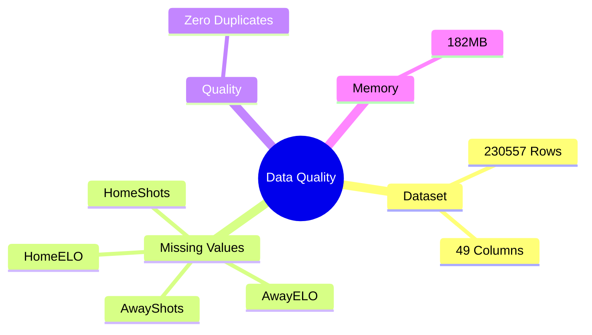

---

# 🚨 DRIFT ANALYSIS

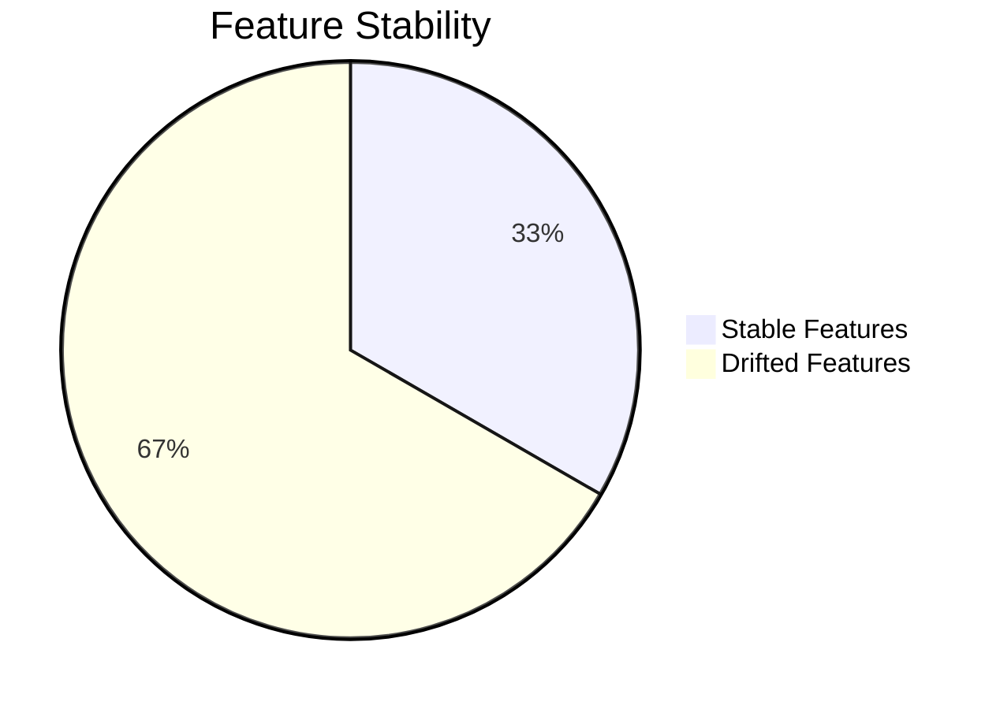

---

# ⚠️ MODEL RISK MAP

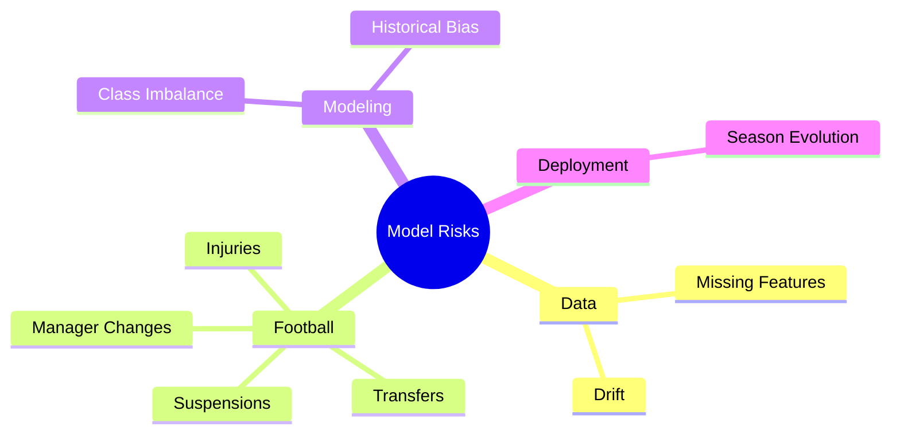

---

# 🔒 MODEL GOVERNANCE

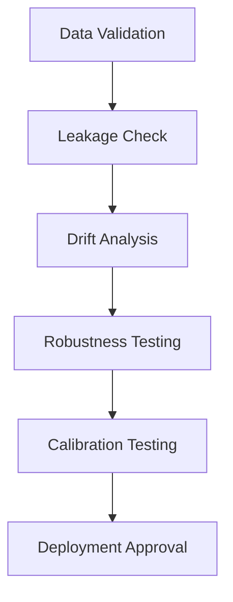

---

# 📈 PRODUCTION READINESS

```text
Data Quality               ████████████████████████████ 100%

Feature Engineering        ████████████████████████████ 100%

Leakage Validation         ████████████████████████████ 100%

Model Training             ████████████████████████████ 100%

Model Evaluation           ████████████████████████████ 100%

Calibration                ██████████████████████████░░ 97%

Drift Monitoring           ████████████████░░░░░░░░░░░ 67%

Deployment Readiness       █████████████████████████░░░ 95%
```

---

# 🌐 MODEL LIFECYCLE

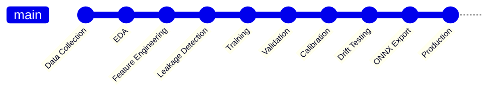

---

# 🏅 ENTERPRISE READINESS SCORECARD

| Category              | Status |
| --------------------- | ------ |
| Data Quality          | ✅      |
| Leakage Detection     | ✅      |
| Model Evaluation      | ✅      |
| Calibration           | ✅      |
| Explainability        | ✅      |
| ONNX Export           | ✅      |
| Drift Monitoring      | ⚠️     |
| Production Deployment | ✅      |

---

# 🎖️ FINAL STATUS

```text
╔══════════════════════════════════════════════════════════╗
║                  STATVAULT MATCH AI                     ║
╠══════════════════════════════════════════════════════════╣
║ Accuracy                46.95%                          ║
║ ROC-AUC                 0.6461                          ║
║ Top-2 Accuracy          75.51%                          ║
║ Calibration Error       3.12%                           ║
║ Feature Count           18                              ║
║ Dataset Size            230,554                         ║
║ Drifted Features        8 / 12                          ║
║ Leakage Status          PASSED                          ║
║ Deployment Status       READY                           ║
╚══════════════════════════════════════════════════════════╝
```

---

<div align="center">

# 🚀 Production Deployment Approved

### StatVault Match Outcome Prediction Engine

Enterprise Football Intelligence Platform

</div>
