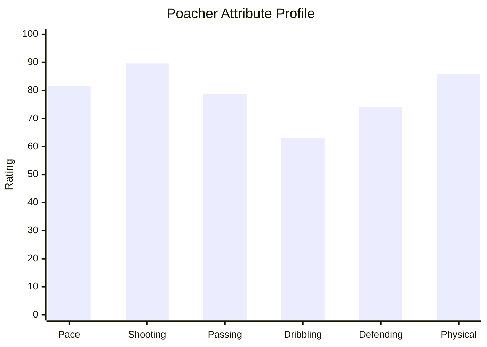
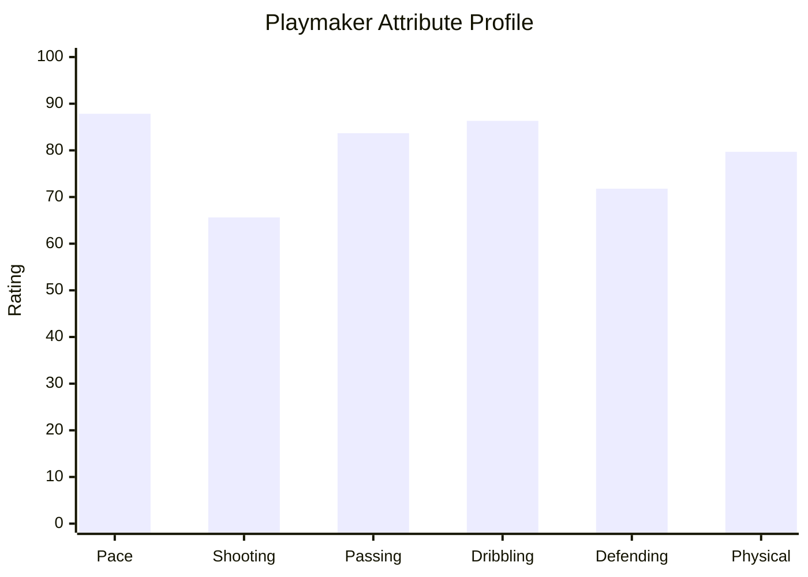
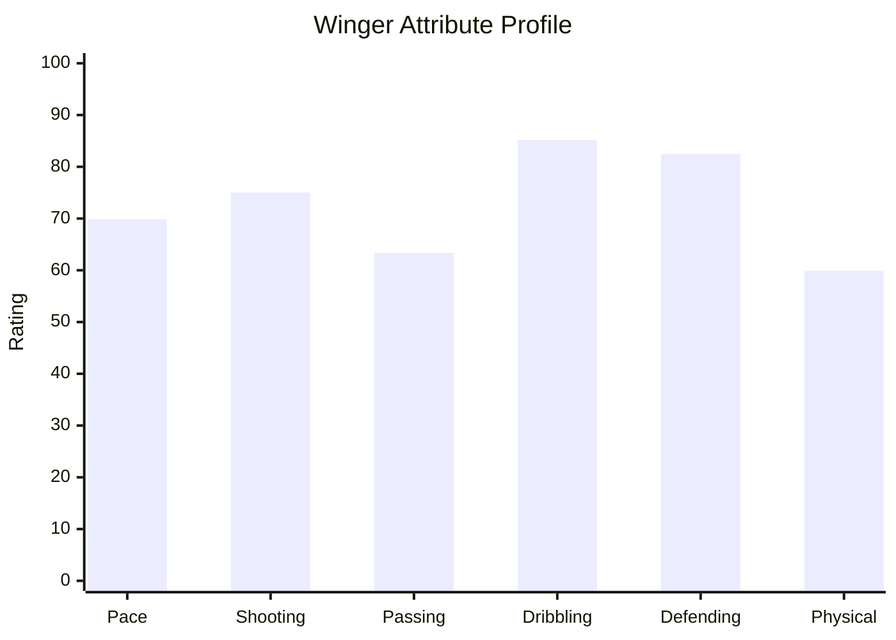
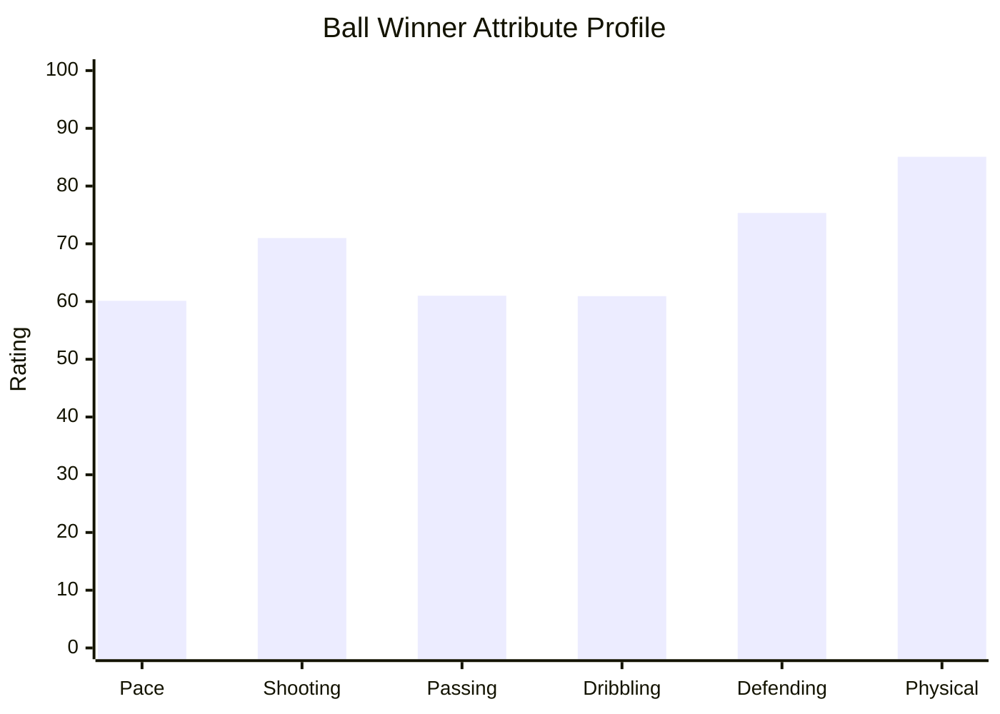
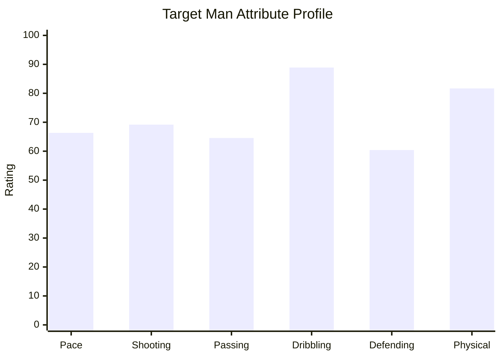
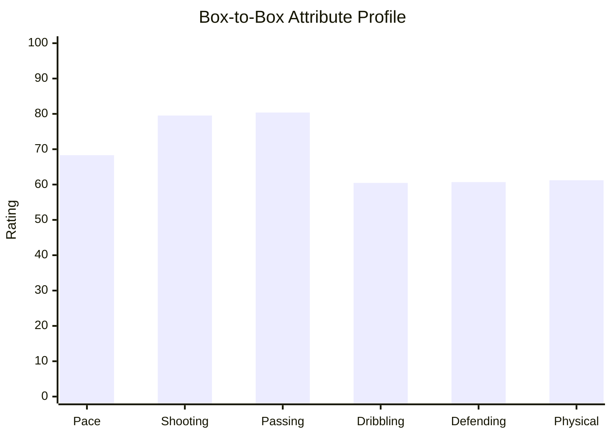

# ML_Model_Training_Analysis_Report_Final

## Player Archetypes (GitHub-Compatible)

> GitHub Mermaid does **not** support `radar-beta`. Replaced with supported `xychart-beta` charts and numeric tables.

## Poacher

**Players:** 13

| Attribute | Average |
|---|---:|
| Pace | 81.62 |
| Shooting | 89.69 |
| Passing | 78.62 |
| Dribbling | 63.08 |
| Defending | 74.15 |
| Physical | 85.85 |



```text
Pace         ████████████████████ 81.62
Shooting     ██████████████████████ 89.69
Passing      ███████████████████ 78.62
Dribbling    ███████████████ 63.08
Defending    ██████████████████ 74.15
Physical     █████████████████████ 85.85
```

## Playmaker

**Players:** 19

| Attribute | Average |
|---|---:|
| Pace | 87.84 |
| Shooting | 65.63 |
| Passing | 83.68 |
| Dribbling | 86.32 |
| Defending | 71.79 |
| Physical | 79.68 |



```text
Pace         █████████████████████ 87.84
Shooting     ████████████████ 65.63
Passing      ████████████████████ 83.68
Dribbling    █████████████████████ 86.32
Defending    █████████████████ 71.79
Physical     ███████████████████ 79.68
```

## Winger

**Players:** 22

| Attribute | Average |
|---|---:|
| Pace | 69.86 |
| Shooting | 75.05 |
| Passing | 63.36 |
| Dribbling | 85.14 |
| Defending | 82.45 |
| Physical | 59.91 |



```text
Pace         █████████████████ 69.86
Shooting     ██████████████████ 75.05
Passing      ███████████████ 63.36
Dribbling    █████████████████████ 85.14
Defending    ████████████████████ 82.45
Physical     ██████████████ 59.91
```

## Ball Winner

**Players:** 15

| Attribute | Average |
|---|---:|
| Pace | 60.13 |
| Shooting | 71.00 |
| Passing | 61.00 |
| Dribbling | 60.93 |
| Defending | 75.33 |
| Physical | 85.07 |



```text
Pace         ███████████████ 60.13
Shooting     █████████████████ 71.00
Passing      ███████████████ 61.00
Dribbling    ███████████████ 60.93
Defending    ██████████████████ 75.33
Physical     █████████████████████ 85.07
```

## Target Man

**Players:** 18

| Attribute | Average |
|---|---:|
| Pace | 66.33 |
| Shooting | 69.17 |
| Passing | 64.56 |
| Dribbling | 88.89 |
| Defending | 60.39 |
| Physical | 81.67 |



```text
Pace         ████████████████ 66.33
Shooting     █████████████████ 69.17
Passing      ████████████████ 64.56
Dribbling    ██████████████████████ 88.89
Defending    ███████████████ 60.39
Physical     ████████████████████ 81.67
```

## Box-to-Box

**Players:** 13

| Attribute | Average |
|---|---:|
| Pace | 68.31 |
| Shooting | 79.54 |
| Passing | 80.38 |
| Dribbling | 60.46 |
| Defending | 60.69 |
| Physical | 61.23 |



```text
Pace         █████████████████ 68.31
Shooting     ███████████████████ 79.54
Passing      ████████████████████ 80.38
Dribbling    ███████████████ 60.46
Defending    ███████████████ 60.69
Physical     ███████████████ 61.23
```
