# ML_Model_Training_Analysis_Report_Final

# ML_Model_Training_Analysis_Report_Complete

> Production-grade GitHub documentation with numeric tables and Mermaid visualizations.

## Table of Contents
- Executive Summary
- Metrics Dashboard
- Pipeline
- Architecture
- Match Predictor
- Clustering
- Player Profiles
- Similarity
- Data Quality
- Recommendations

## Executive Summary

| Metric | Value |
|---|---:|
| Accuracy | 0.677419 |
| Precision | 0.672359 |
| Recall | 0.677419 |
| F1 Score | 0.651613 |
| Roc Auc | 0.811290 |
| Clusters | 6 |
| Players Indexed | 100 |
| Anomalies Detected | 50 |

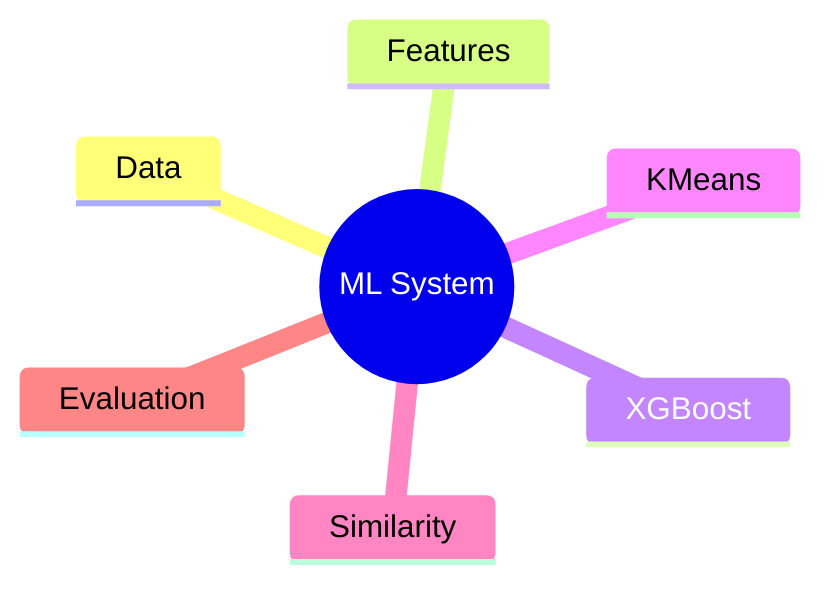


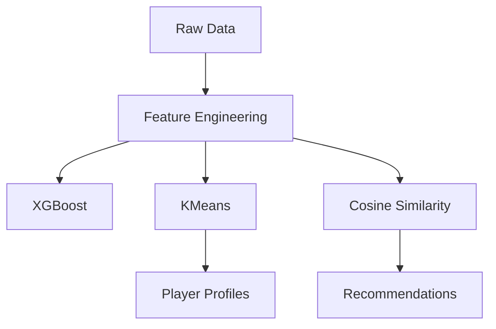

## Match Predictor

| Metric | Score |
|---|---:|
| accuracy | 0.677419 |
| precision | 0.672359 |
| recall | 0.677419 |
| f1_score | 0.651613 |
| roc_auc | 0.811290 |

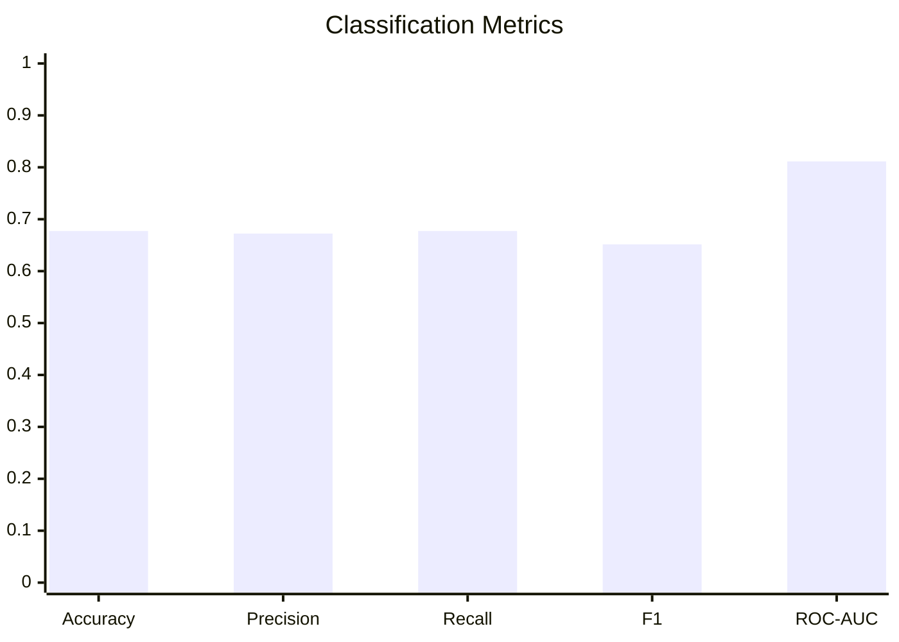

## Clustering Evaluation

| Metric | Value |
|---|---:|
| model | KMeans Player Clustering |
| n_clusters | 6 |
| inertia | 317.98987350396925 |
| silhouette_score | 0.17391594293833473 |
| calinski_harabasz_score | 17.138661577123692 |
| davies_bouldin_score | 1.5181368019402102 |

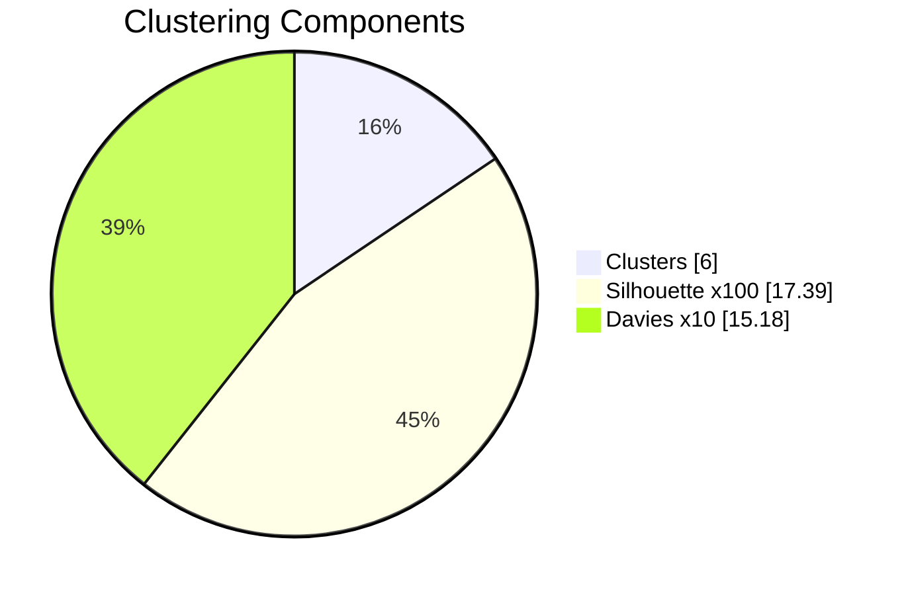

## Player Archetype Statistics

### Poacher

**Players:** 13

| Attribute | Average |
|---|---:|
| Pace | 81.62 |
| Shooting | 89.69 |
| Passing | 78.62 |
| Dribbling | 63.08 |
| Defending | 74.15 |
| Physical | 85.85 |
```text
pace         ████████████████ 81.62
shooting     █████████████████ 89.69
passing      ███████████████ 78.62
dribbling    ████████████ 63.08
defending    ██████████████ 74.15
physical     █████████████████ 85.85
```

### Playmaker

**Players:** 19

| Attribute | Average |
|---|---:|
| Pace | 87.84 |
| Shooting | 65.63 |
| Passing | 83.68 |
| Dribbling | 86.32 |
| Defending | 71.79 |
| Physical | 79.68 |
```text
pace         █████████████████ 87.84
shooting     █████████████ 65.63
passing      ████████████████ 83.68
dribbling    █████████████████ 86.32
defending    ██████████████ 71.79
physical     ███████████████ 79.68
```

### Winger

**Players:** 22

| Attribute | Average |
|---|---:|
| Pace | 69.86 |
| Shooting | 75.05 |
| Passing | 63.36 |
| Dribbling | 85.14 |
| Defending | 82.45 |
| Physical | 59.91 |
```text
pace         █████████████ 69.86
shooting     ███████████████ 75.05
passing      ████████████ 63.36
dribbling    █████████████████ 85.14
defending    ████████████████ 82.45
physical     ███████████ 59.91
```

### Ball Winner

**Players:** 15

| Attribute | Average |
|---|---:|
| Pace | 60.13 |
| Shooting | 71.00 |
| Passing | 61.00 |
| Dribbling | 60.93 |
| Defending | 75.33 |
| Physical | 85.07 |
```text
pace         ████████████ 60.13
shooting     ██████████████ 71.00
passing      ████████████ 61.00
dribbling    ████████████ 60.93
defending    ███████████████ 75.33
physical     █████████████████ 85.07
```

### Target Man

**Players:** 18

| Attribute | Average |
|---|---:|
| Pace | 66.33 |
| Shooting | 69.17 |
| Passing | 64.56 |
| Dribbling | 88.89 |
| Defending | 60.39 |
| Physical | 81.67 |
```text
pace         █████████████ 66.33
shooting     █████████████ 69.17
passing      ████████████ 64.56
dribbling    █████████████████ 88.89
defending    ████████████ 60.39
physical     ████████████████ 81.67
```

### Box-to-Box

**Players:** 13

| Attribute | Average |
|---|---:|
| Pace | 68.31 |
| Shooting | 79.54 |
| Passing | 80.38 |
| Dribbling | 60.46 |
| Defending | 60.69 |
| Physical | 61.23 |
```text
pace         █████████████ 68.31
shooting     ███████████████ 79.54
passing      ████████████████ 80.38
dribbling    ████████████ 60.46
defending    ████████████ 60.69
physical     ████████████ 61.23
```

## Similarity Engine

| Metric | Value |
|---|---:|
| model | Cosine Similarity Player Search |
| total_players_indexed | 100 |
| similarity_matrix_shape | [100, 100] |
| mean_similarity | -0.0099 |
| median_similarity | -0.0105 |
| std_similarity | 0.2988 |
| max_similarity | 0.9026 |
| avg_top_5_similarity | 0.5845 |
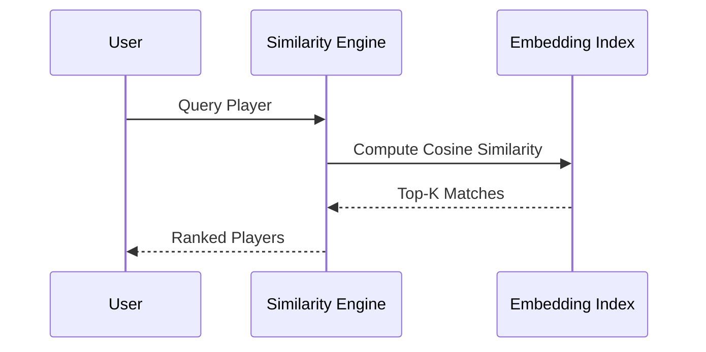

## Data Quality

Total anomaly rows: **50**

### First 20 Anomalies

|   player_id |   match_id |   rolling_goals |   rolling_xG |   rolling_xGA |   Overall |    Pace |   Shooting |   Passing |   Dribbling |   Defending |   Physical |   Age |   anomaly_label |   anomaly_score | anomaly_type                               |
|------------:|-----------:|----------------:|-------------:|--------------:|----------:|--------:|-----------:|----------:|------------:|------------:|-----------:|------:|----------------:|----------------:|:-------------------------------------------|
|        2685 |      86534 |               0 |     0.783349 |      0.168737 |   74.5093 | 40      |    60.6778 |   70.5498 |     71.3258 |     63.8838 |    45      |    18 |              -1 |       -0.510012 | Injury-like Performance / Sudden Form Drop |
|        1769 |      65106 |               0 |     0.461454 |      0.851254 |   76.1046 | 40      |    54.9105 |   60.3388 |     76.1104 |     63.9472 |    45      |    31 |              -1 |       -0.523444 | Injury-like Performance / Sudden Form Drop |
|        3433 |      86218 |               0 |     0.102288 |      0.384188 |   73.3085 | 40      |    58.7922 |   64.0029 |     60.6643 |     67.9556 |    45      |    25 |              -1 |       -0.518965 | Injury-like Performance / Sudden Form Drop |
|        6051 |      84055 |               0 |     0.449431 |      0.623255 |   71.8325 | 40      |    62.7671 |   70.2848 |     65.2051 |     86.4018 |    45      |    33 |              -1 |       -0.50379  | Injury-like Performance / Sudden Form Drop |
|        9226 |      51874 |               1 |     0.853584 |      0.688897 |   88.3705 | 62.4353 |    63.5279 |   62.1178 |     82.752  |     78.727  |    59.2695 |    37 |              -1 |       -0.511834 | General Statistical Outlier                |
|        4943 |      41419 |               8 |     5.5      |      0.245706 |   83.4315 | 61.6276 |    63.8555 |   94.7049 |     42.7052 |     71.5575 |    72.1387 |    35 |              -1 |       -0.639982 | Goal Surge                                 |
|        8555 |      18705 |               8 |     5.5      |      0.679392 |   73.281  | 64.7759 |    88.4317 |   72.5383 |     67.9612 |     60.1765 |    70.6464 |    18 |              -1 |       -0.603421 | Goal Surge                                 |
|        4073 |      52880 |               8 |     5.5      |      0.247964 |   75.8052 | 54.8323 |    55.2577 |   82.4981 |     64.5867 |     52.6197 |    68.0879 |    28 |              -1 |       -0.622691 | Goal Surge                                 |
|        2021 |      33236 |               8 |     5.5      |      0.407701 |   81.0864 | 57.4666 |    84.7667 |   61.8256 |     71.3229 |     55.0609 |    61.4872 |    20 |              -1 |       -0.612917 | Goal Surge                                 |
|        4843 |      97955 |               8 |     5.5      |      0.461224 |   74.2324 | 73.876  |    64.6519 |   75.6105 |     67.4014 |     71.1379 |    61.5796 |    25 |              -1 |       -0.577978 | Goal Surge                                 |
|        8989 |      95514 |               8 |     5.5      |      0.55686  |   73.7947 | 61.7314 |    69.2229 |   68.4039 |     71.5567 |     61.4703 |    72.3906 |    22 |              -1 |       -0.580753 | Goal Surge                                 |
|        7873 |      25358 |               1 |     0.72314  |      0.793695 |   68.638  | 88.0428 |    83.4978 |   90.6663 |     65.8347 |     61.2712 |    59.9087 |    37 |              -1 |       -0.502955 | General Statistical Outlier                |
|        9996 |      88411 |               0 |     0.354846 |      0.277735 |   74.3341 | 91.1719 |    63.8753 |   70.0846 |     42.5659 |     34.256  |    55.2891 |    21 |              -1 |       -0.499097 | General Statistical Outlier                |
|        6056 |      50809 |               1 |     0.592199 |      0.22211  |   99      | 71.6561 |    73.9962 |   72.5675 |     64.3282 |     62.9871 |    99      |    19 |              -1 |       -0.514352 | Unusual Statistics (Wonderkid)             |
|        2757 |      21555 |               2 |     0.707463 |      0.512047 |   81.4937 | 56.0719 |    75.4171 |   41.9853 |     70.6318 |     59.2476 |    49.9753 |    33 |              -1 |       -0.514509 | Injury-like Performance / Sudden Form Drop |
|        4510 |      31520 |               2 |     0.887087 |      0.430897 |   82.9027 | 84.5412 |    56.9725 |   91.0216 |     69.7107 |     76.1661 |    54.3453 |    32 |              -1 |       -0.506769 | General Statistical Outlier                |
|        2930 |      21344 |               0 |     0.529635 |      0.576609 |   76.3431 | 96.5099 |    47.0751 |   54.1183 |     60.5964 |     45.865  |    84.753  |    25 |              -1 |       -0.507332 | General Statistical Outlier                |
|        2986 |      87454 |               1 |     0.928107 |      0.181177 |   73.3825 | 73.7724 |    49.4751 |   98.0471 |     61.6825 |     81.4593 |    65.6592 |    30 |              -1 |       -0.507786 | General Statistical Outlier                |
|        2184 |      45400 |               2 |     0.601167 |      0.623033 |   65.8522 | 75.4157 |    65.321  |   72.8724 |     94.052  |     30.4509 |    66.6586 |    27 |              -1 |       -0.505709 | General Statistical Outlier                |
|        7966 |      75160 |               1 |     0.900114 |      0.776616 |   73.3508 | 64.9157 |    45.9493 |   62.8219 |     76.6102 |     40.56   |    53.0351 |    26 |              -1 |       -0.502709 | General Statistical Outlier                |


## Recommendations

1. Increase training data and temporal features.
2. Perform hyperparameter optimization.
3. Use Optuna/Bayesian optimization.
4. Evaluate class imbalance.
5. Improve clustering with feature scaling and PCA.
6. Add SHAP explainability.
7. Monitor concept drift.
8. Retrain periodically.

## Player Archetypes (GitHub-Compatible)

> GitHub Mermaid does **not** support `radar-beta`. Replaced with supported `xychart-beta` charts and numeric tables.

## Poacher

**Players:** 13

| Attribute | Average |
|---|---:|
| Pace | 81.62 |
| Shooting | 89.69 |
| Passing | 78.62 |
| Dribbling | 63.08 |
| Defending | 74.15 |
| Physical | 85.85 |

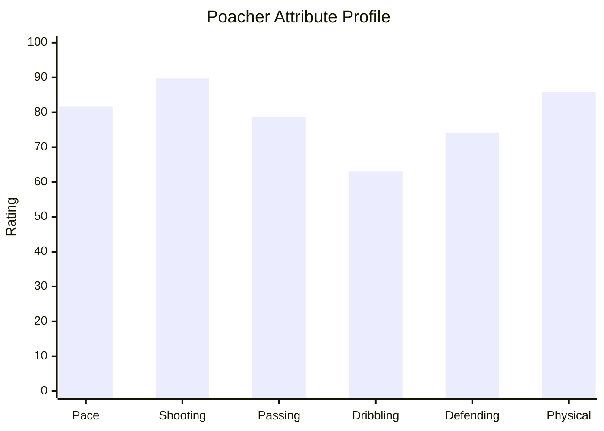

```text
Pace         ████████████████████ 81.62
Shooting     ██████████████████████ 89.69
Passing      ███████████████████ 78.62
Dribbling    ███████████████ 63.08
Defending    ██████████████████ 74.15
Physical     █████████████████████ 85.85
```

## Playmaker

**Players:** 19

| Attribute | Average |
|---|---:|
| Pace | 87.84 |
| Shooting | 65.63 |
| Passing | 83.68 |
| Dribbling | 86.32 |
| Defending | 71.79 |
| Physical | 79.68 |

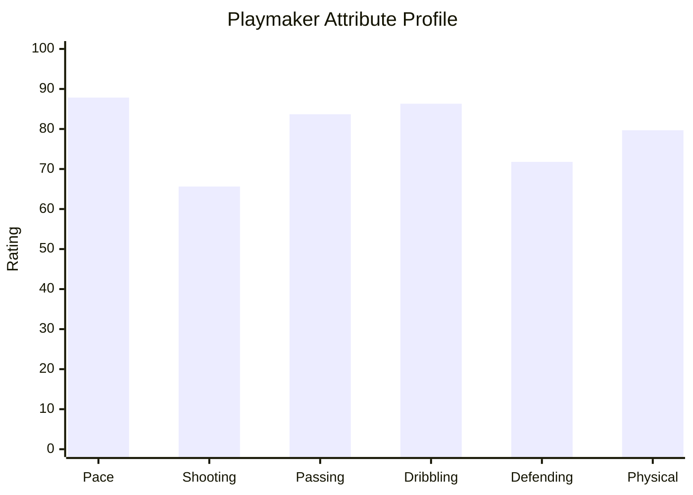

```text
Pace         █████████████████████ 87.84
Shooting     ████████████████ 65.63
Passing      ████████████████████ 83.68
Dribbling    █████████████████████ 86.32
Defending    █████████████████ 71.79
Physical     ███████████████████ 79.68
```

## Winger

**Players:** 22

| Attribute | Average |
|---|---:|
| Pace | 69.86 |
| Shooting | 75.05 |
| Passing | 63.36 |
| Dribbling | 85.14 |
| Defending | 82.45 |
| Physical | 59.91 |

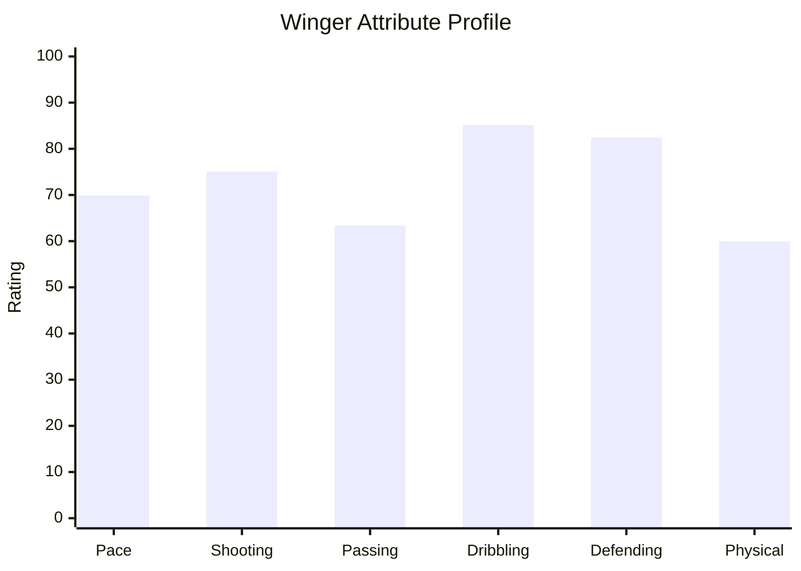

```text
Pace         █████████████████ 69.86
Shooting     ██████████████████ 75.05
Passing      ███████████████ 63.36
Dribbling    █████████████████████ 85.14
Defending    ████████████████████ 82.45
Physical     ██████████████ 59.91
```

## Ball Winner

**Players:** 15

| Attribute | Average |
|---|---:|
| Pace | 60.13 |
| Shooting | 71.00 |
| Passing | 61.00 |
| Dribbling | 60.93 |
| Defending | 75.33 |
| Physical | 85.07 |

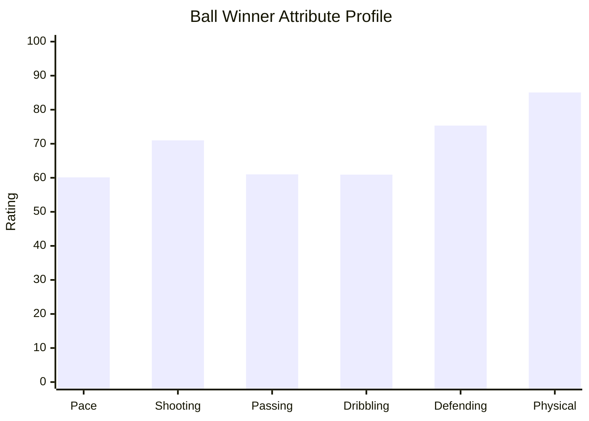

```text
Pace         ███████████████ 60.13
Shooting     █████████████████ 71.00
Passing      ███████████████ 61.00
Dribbling    ███████████████ 60.93
Defending    ██████████████████ 75.33
Physical     █████████████████████ 85.07
```

## Target Man

**Players:** 18

| Attribute | Average |
|---|---:|
| Pace | 66.33 |
| Shooting | 69.17 |
| Passing | 64.56 |
| Dribbling | 88.89 |
| Defending | 60.39 |
| Physical | 81.67 |

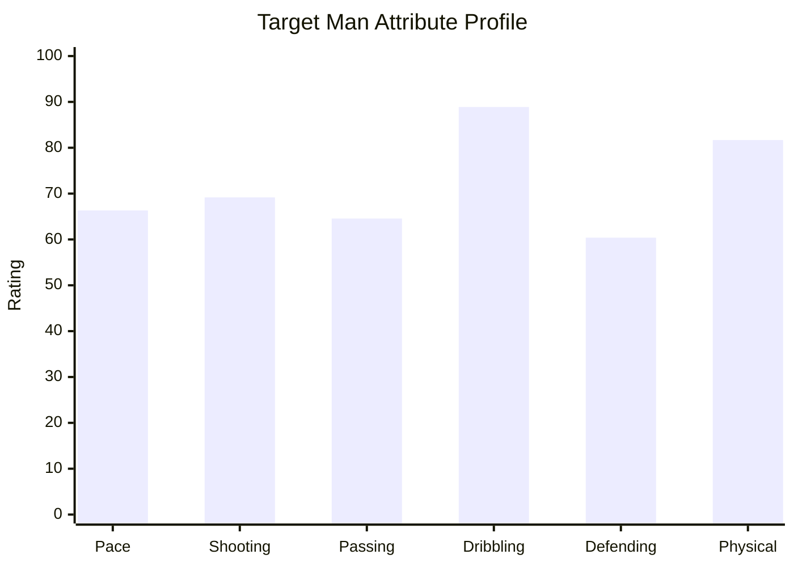

```text
Pace         ████████████████ 66.33
Shooting     █████████████████ 69.17
Passing      ████████████████ 64.56
Dribbling    ██████████████████████ 88.89
Defending    ███████████████ 60.39
Physical     ████████████████████ 81.67
```

## Box-to-Box

**Players:** 13

| Attribute | Average |
|---|---:|
| Pace | 68.31 |
| Shooting | 79.54 |
| Passing | 80.38 |
| Dribbling | 60.46 |
| Defending | 60.69 |
| Physical | 61.23 |

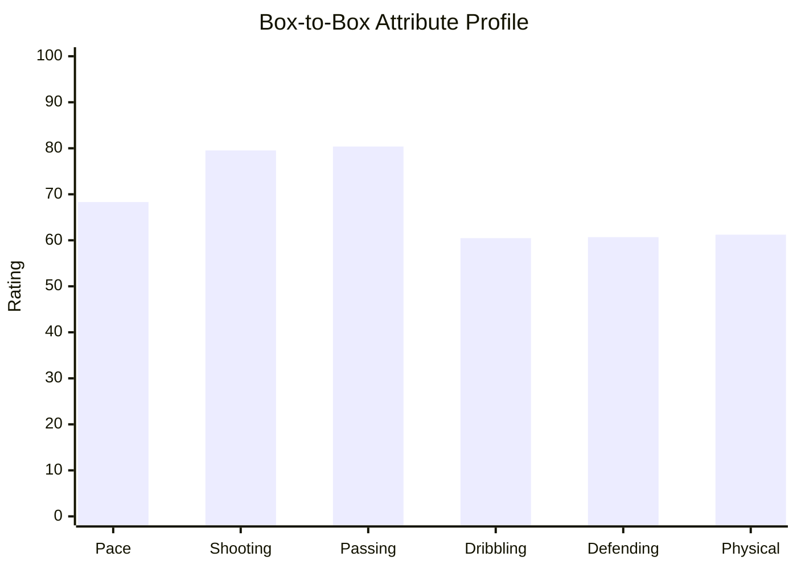

```text
Pace         █████████████████ 68.31
Shooting     ███████████████████ 79.54
Passing      ████████████████████ 80.38
Dribbling    ███████████████ 60.46
Defending    ███████████████ 60.69
Physical     ███████████████ 61.23
```
