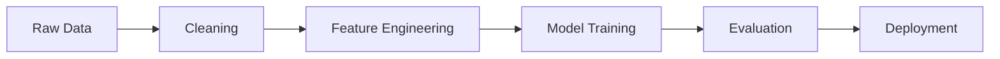
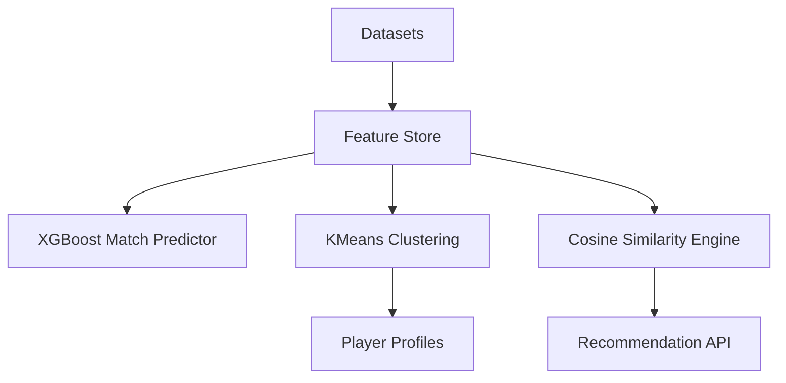
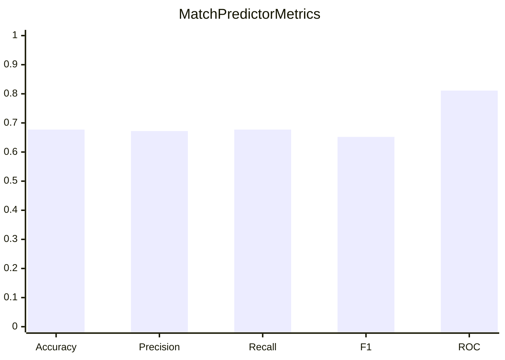
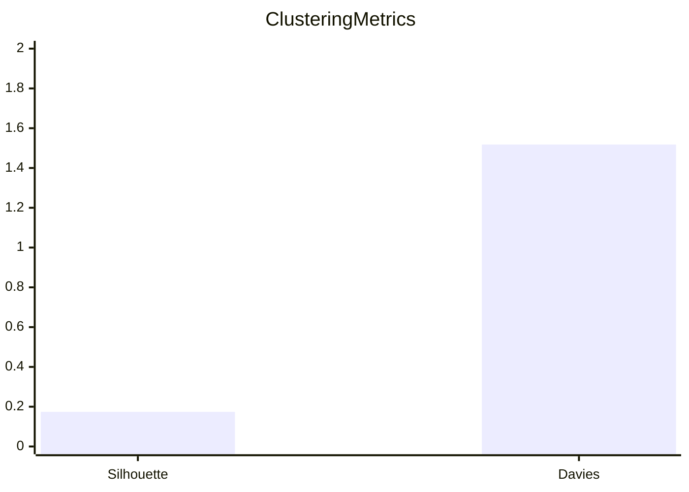
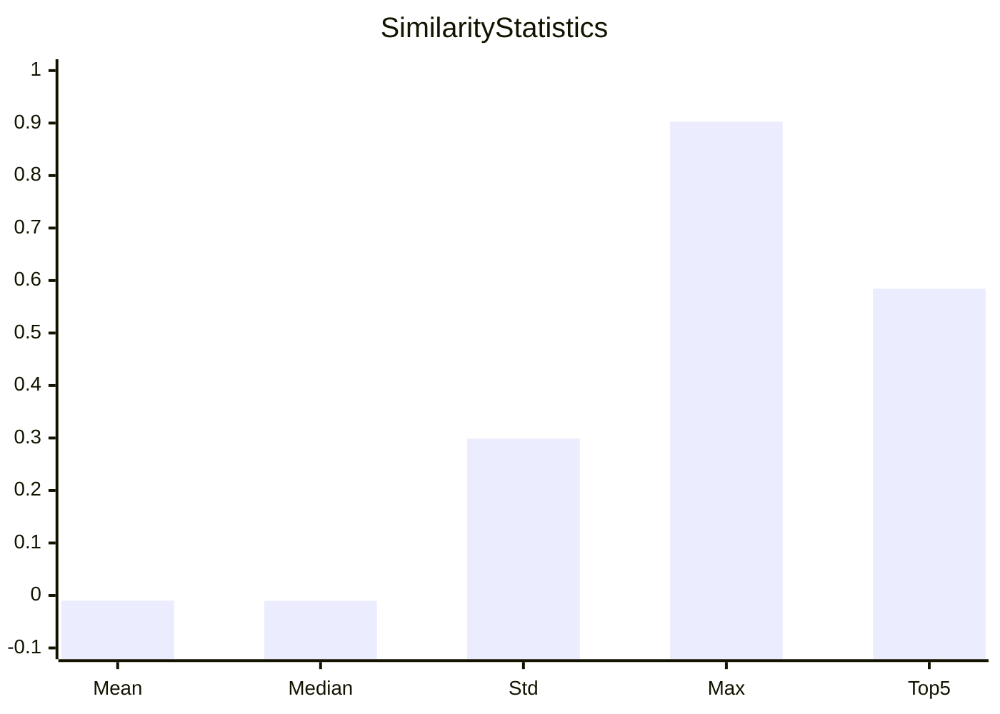

# ML_Model_Training_Analysis_Report.md

# Production-Grade Machine Learning Analysis Report

## Table of Contents
- Executive Summary
- System Architecture
- Training Pipeline
- Match Prediction
- Player Clustering
- Player Similarity
- Player Profiles
- Data Quality
- Recommendations

---

# Executive Summary

| Component | Status |
|---|---:|
| Match Prediction Accuracy | 0.677 |
| ROC-AUC | 0.811 |
| Clusters | 6 |
| Players Indexed | 100 |

```text
Performance
Accuracy   [#############       ] 67.74%
ROC-AUC    [################    ] 81.13%
F1 Score   [#############       ] 65.16%
```



# System Architecture



# Match Prediction

|Metric|Value|
|---|---:|
|Accuracy|0.6774|
|Precision|0.6724|
|Recall|0.6774|
|F1|0.6516|
|ROC-AUC|0.8113|



# Player Clustering

|Metric|Value|
|---|---:|
|Clusters|6|
|Silhouette|0.174|
|Calinski-Harabasz|17.139|
|Davies-Bouldin|1.518|
|Inertia|317.990|



# Player Profiles

## Poacher
Players: **13**

|Attribute|Avg|
|---|---:|
|Pace|81.62|
|Shooting|89.69|
|Passing|78.62|
|Dribbling|63.08|
|Defending|74.15|
|Physical|85.85|


## Playmaker
Players: **19**

|Attribute|Avg|
|---|---:|
|Pace|87.84|
|Shooting|65.63|
|Passing|83.68|
|Dribbling|86.32|
|Defending|71.79|
|Physical|79.68|


## Winger
Players: **22**

|Attribute|Avg|
|---|---:|
|Pace|69.86|
|Shooting|75.05|
|Passing|63.36|
|Dribbling|85.14|
|Defending|82.45|
|Physical|59.91|


## Ball Winner
Players: **15**

|Attribute|Avg|
|---|---:|
|Pace|60.13|
|Shooting|71.0|
|Passing|61.0|
|Dribbling|60.93|
|Defending|75.33|
|Physical|85.07|


## Target Man
Players: **18**

|Attribute|Avg|
|---|---:|
|Pace|66.33|
|Shooting|69.17|
|Passing|64.56|
|Dribbling|88.89|
|Defending|60.39|
|Physical|81.67|


## Box-to-Box
Players: **13**

|Attribute|Avg|
|---|---:|
|Pace|68.31|
|Shooting|79.54|
|Passing|80.38|
|Dribbling|60.46|
|Defending|60.69|
|Physical|61.23|


# Player Similarity

|Metric|Value|
|---|---:|
|Indexed Players|100|
|Max Similarity|0.9026|
|Average Top-5 Similarity|0.5845|



# Data Quality

Detected anomalies: **50**


# Recommendations

- Improve recall using richer temporal and contextual features.
- Tune XGBoost hyperparameters.
- Optimize K selection using silhouette analysis.
- Expand player embeddings beyond handcrafted attributes.
- Investigate all flagged anomalies before retraining.

