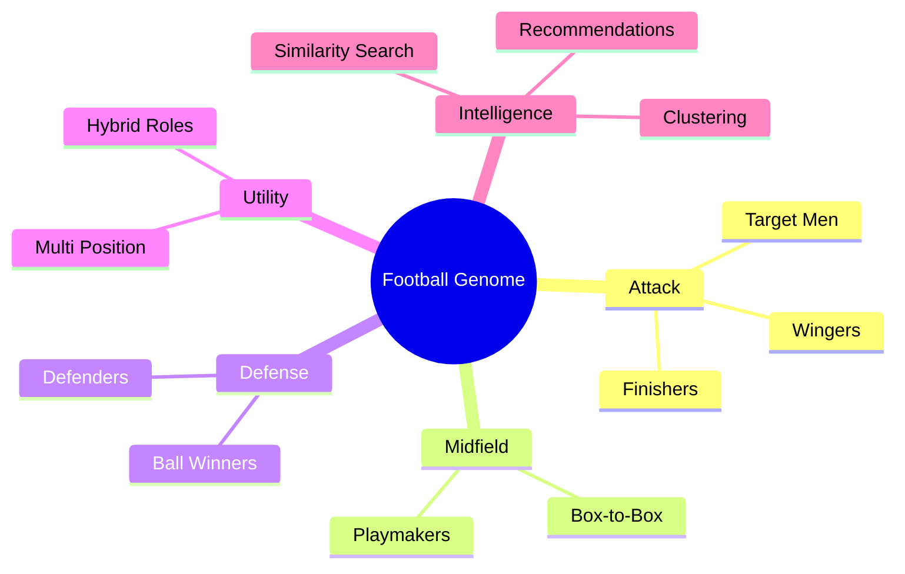
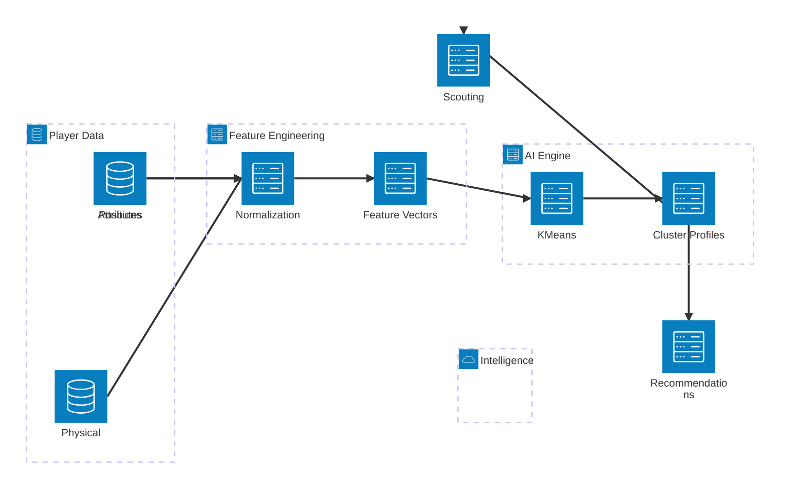
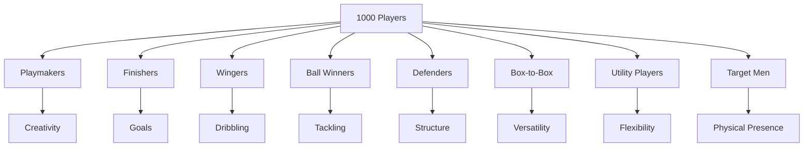
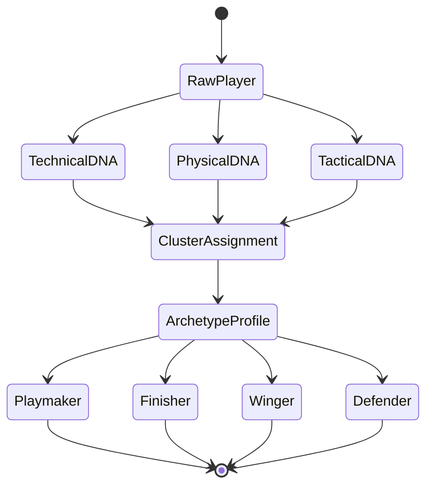
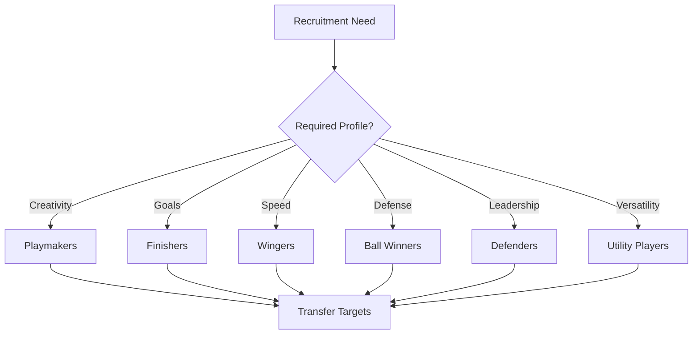
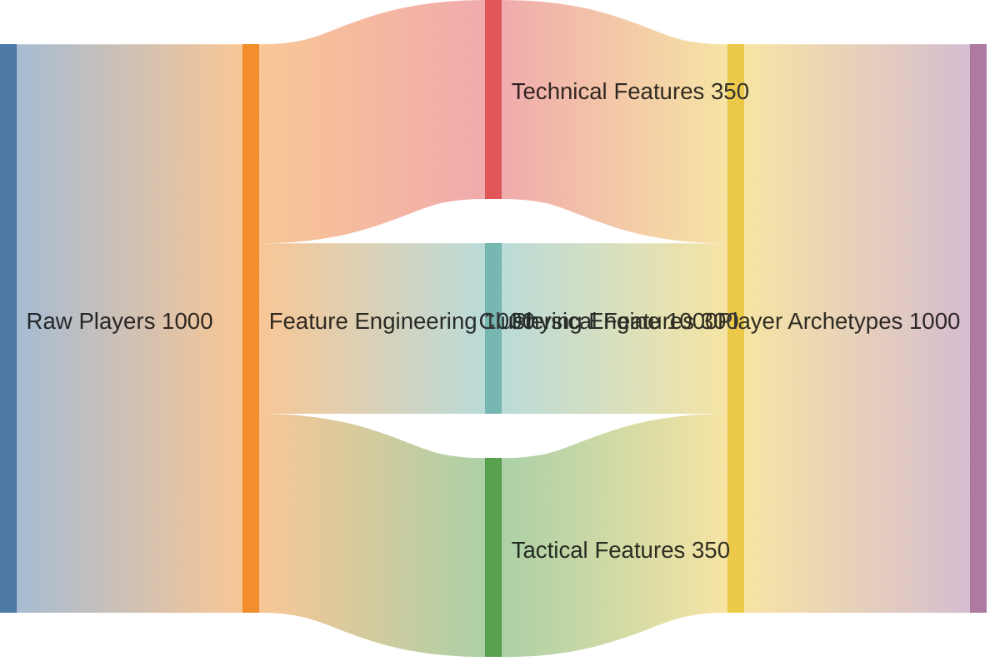
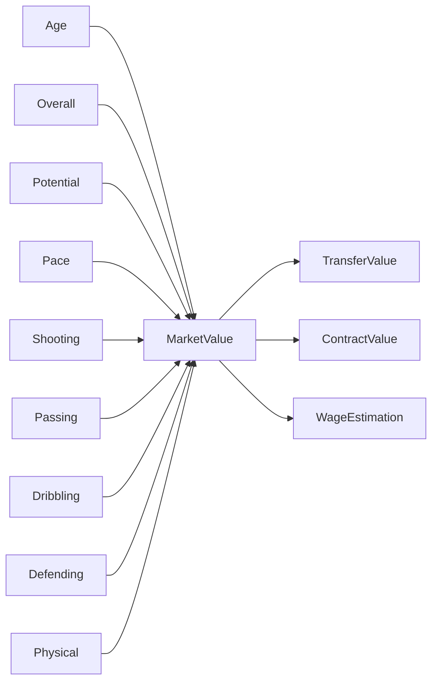
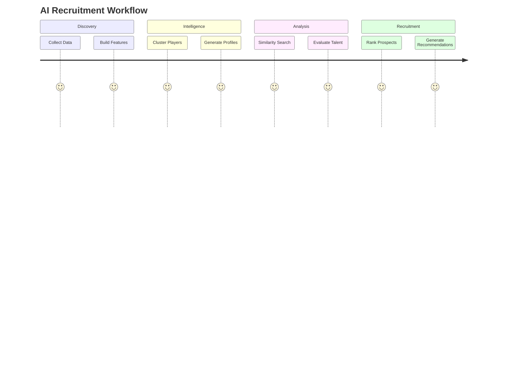
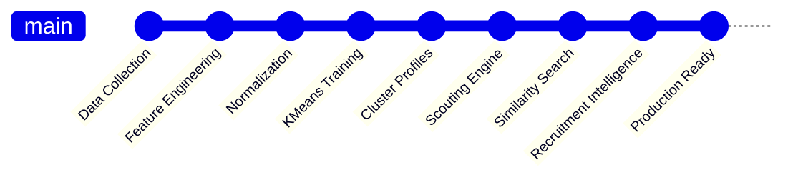
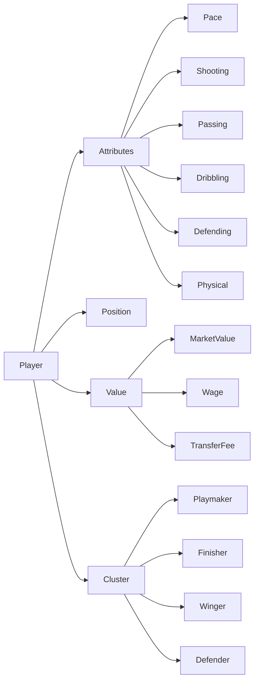

# 🧠 PLAYER CLUSTERING INTELLIGENCE PLATFORM

<div align="center">

# ⚽ FOOTBALL PLAYER GENOME

### AI-Powered Archetype Discovery Engine


</div>

---

# 🌌 PLAYER UNIVERSE



---

# 🏗️ CLUSTERING ECOSYSTEM



---

# ⚽ ARCHETYPE HIERARCHY



---

# 🧬 FOOTBALL DNA ENGINE



---

# 🎯 SCOUTING DECISION MATRIX



---

# 📡 PLAYER EVOLUTION FLOW



---

# 🚀 MARKET VALUE INTELLIGENCE



---

# 🧠 PLAYER GENOME MAP

```text
                    ELITE PLAYER DNA

                              ▲
                              │
                    Technical Ability
                              │

     Playmakers ──────────────┼───────────── Finishers

                              │

     Wingers ─────────────────┼───────────── Target Men

                              │

     Utility Players ─────────┼───────────── Box-to-Box

                              │

                    Defensive Ability

                              ▼

                    Ball Winners
                         &
                      Defenders
```

---

# 🔍 RECRUITMENT PIPELINE



---

# 🏆 CLUSTERING OPERATING SYSTEM



---

# 🌍 PLAYER KNOWLEDGE NETWORK



---

# 📊 AI COMMAND CENTER

```text
┌────────────────────────────────────────────────────────────┐
│               PLAYER CLUSTERING ENGINE                     │
├────────────────────────────────────────────────────────────┤
│                                                            │
│  PLAYERS ANALYZED           1000                           │
│  CLUSTERS DISCOVERED        8                              │
│  SILHOUETTE SCORE           0.0909                         │
│  DAVIES BOULDIN             2.1105                         │
│                                                            │
│  PLAYMAKERS                 ACTIVE                         │
│  FINISHERS                  ACTIVE                         │
│  WINGERS                    ACTIVE                         │
│  BALL WINNERS               ACTIVE                         │
│  DEFENDERS                  ACTIVE                         │
│  BOX TO BOX                 ACTIVE                         │
│  UTILITY PLAYERS            ACTIVE                         │
│  TARGET MEN                 ACTIVE                         │
│                                                            │
└────────────────────────────────────────────────────────────┘
```
