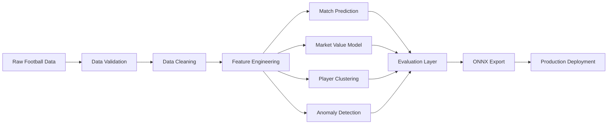
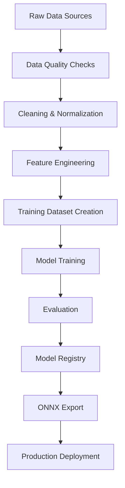
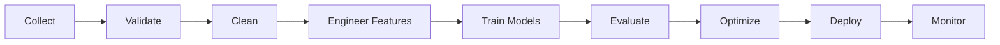
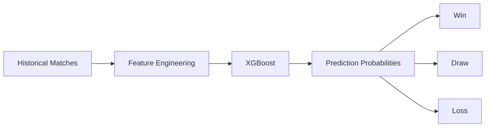

<div align="center">

# ⚽ STATVAULT AI

### Enterprise Football Intelligence Platform

Predict Match Outcomes • Estimate Market Value • Discover Player Similarities • Detect Performance Anomalies

<br>


<br><br>

### 🧠 Transforming Raw Football Data Into Predictive Intelligence

</div>

---

## 🌟 Platform Overview

StatVault AI is a complete Machine Learning ecosystem designed for modern football analytics.

The platform converts millions of football events, player attributes, match statistics, and historical performance records into actionable intelligence through advanced machine learning pipelines.

---

## 🎯 Core Intelligence Modules

| Module | Purpose | Output |
|----------|----------|----------|
| ⚽ Match Prediction | Forecast match outcomes | Win / Draw / Loss |
| 💰 Market Value Estimation | Predict transfer valuation | € Market Value |
| 🧠 Player Similarity Engine | Discover comparable players | Similarity Scores |
| 🚨 Anomaly Detection | Identify abnormal performance | Risk Alerts |
| 📈 Evaluation Suite | Benchmark model quality | Metrics & Reports |
| 🚀 Deployment Engine | Export production models | ONNX Models |

---

# 🏛 Enterprise Architecture



---

# ⚙ End-to-End Data Pipeline



---

# 🔬 Machine Learning Lifecycle



---

# 📂 Repository Structure

```text
statvault-ai/
│
├── data/
│   ├── raw/
│   ├── processed/
│   └── features/
│
├── notebooks/
│
├── models/
│
├── reports/
│
├── outputs/
│
├── src/
│   ├── data/
│   ├── features/
│   ├── models/
│   ├── evaluation/
│   └── deployment/
│
├── build_features.py
├── train_xgboost.py
├── train_market_value.py
├── cluster_players.py
├── detect_anomalies.py
├── evaluate_models.py
└── export_onnx.py
```

---

# 🤖 Model Ecosystem

## ⚽ Match Outcome Prediction

| Property | Value |
|-----------|-----------|
| Algorithm | XGBoost |
| Learning Type | Multi-Class Classification |
| Classes | Home Win / Draw / Away Win |
| Primary Metric | Accuracy |
| Production Goal | > 60% |

---

## 💰 Market Value Prediction

| Property | Value |
|-----------|-----------|
| Algorithm | XGBoost Regressor |
| Target | Market Value (€) |
| Primary Metric | R² Score |
| Production Goal | > 0.80 |

---

## 🧠 Player Segmentation

| Property | Value |
|-----------|-----------|
| Algorithm | K-Means |
| Objective | Player Archetype Discovery |
| Output | Cluster Labels |

---

## 🚨 Performance Anomaly Detection

| Property | Value |
|-----------|-----------|
| Algorithm | Isolation Forest |
| Objective | Outlier Detection |
| Output | Anomaly Scores |

---

# 📊 Prediction Intelligence Flow



---

# 📈 Performance Dashboard

| KPI | Target |
|---------|---------|
| Match Prediction Accuracy | >60% |
| Market Value R² | >0.80 |
| Silhouette Score | >0.50 |
| Anomaly Precision | >75% |
| Inference Time | <100ms |
| Model Export Success | 100% |

---

# 🚀 Quick Start

```bash
# Clone Repository

git clone https://github.com/yourusername/statvault-ai.git

# Enter Project

cd statvault-ai

# Install Dependencies

pip install -r requirements.txt

# Build Features

python build_features.py

# Train Models

python train_xgboost.py

python train_market_value.py

# Evaluate

python evaluate_models.py

# Export

python export_onnx.py
```

---

# 🛣 Development Roadmap

| Phase | Status |
|---------|---------|
| Dataset Collection | ✅ Complete |
| Data Validation | ✅ Complete |
| EDA | ✅ Complete |
| Feature Engineering | ✅ Complete |
| Match Prediction | 🚧 In Progress |
| Market Value Prediction | 🚧 In Progress |
| Player Clustering | 🚧 In Progress |
| Anomaly Detection | 🚧 In Progress |
| ONNX Export | ⏳ Planned |
| Deployment Layer | ⏳ Planned |

---

# 📌 Technology Stack

| Layer | Technologies |
|---------|---------|
| Language | Python |
| ML Framework | Scikit-Learn |
| Gradient Boosting | XGBoost |
| Database | PostgreSQL |
| Deployment | ONNX |
| Visualization | Matplotlib |
| Data Processing | Pandas, NumPy |

---

# 🎯 Vision

> Build the most comprehensive open-source football intelligence platform capable of transforming raw football data into predictive insights for analysts, scouts, researchers, and clubs.

---

# 📜 License

MIT License

---

<div align="center">

## ⚽ STATVAULT AI

### Data → Intelligence → Prediction → Decisions

Built with Machine Learning, Data Engineering, and Football Analytics.

</div>
