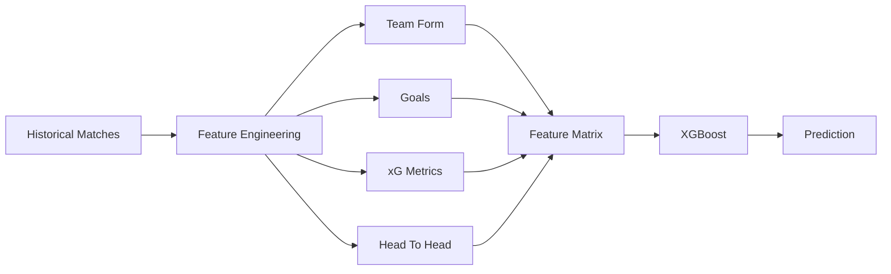
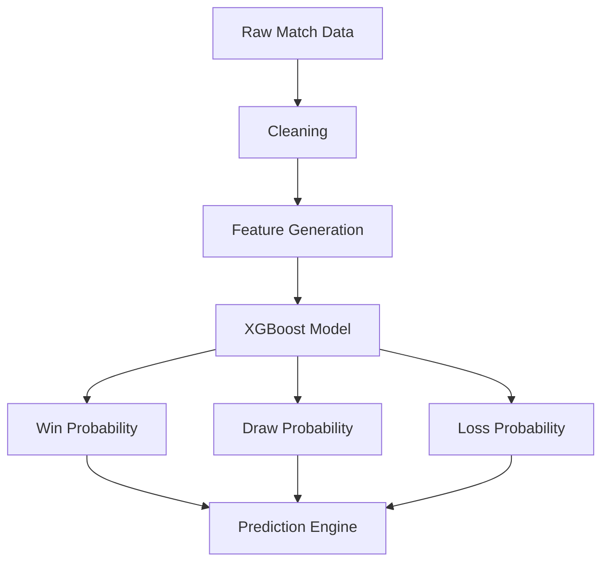
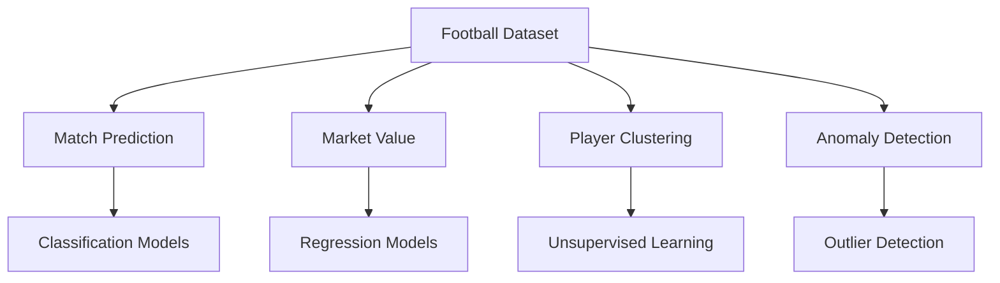
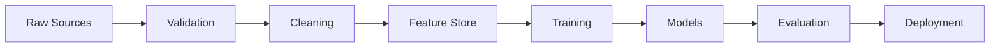
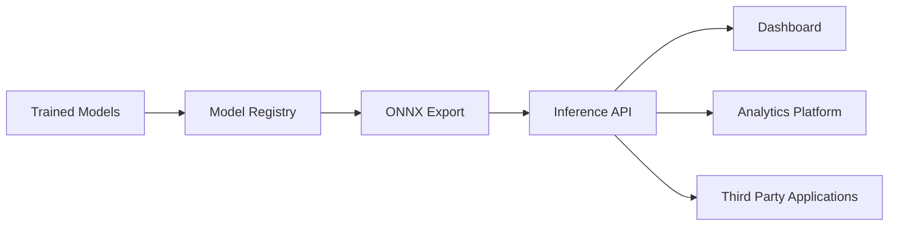
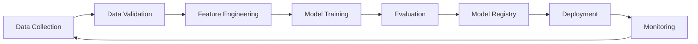
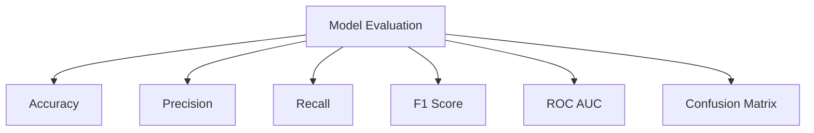
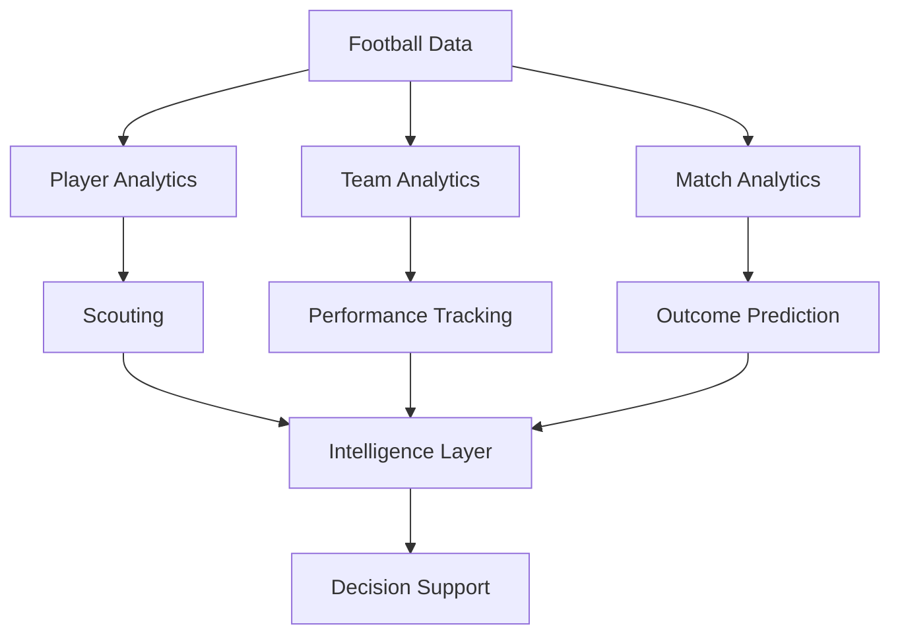
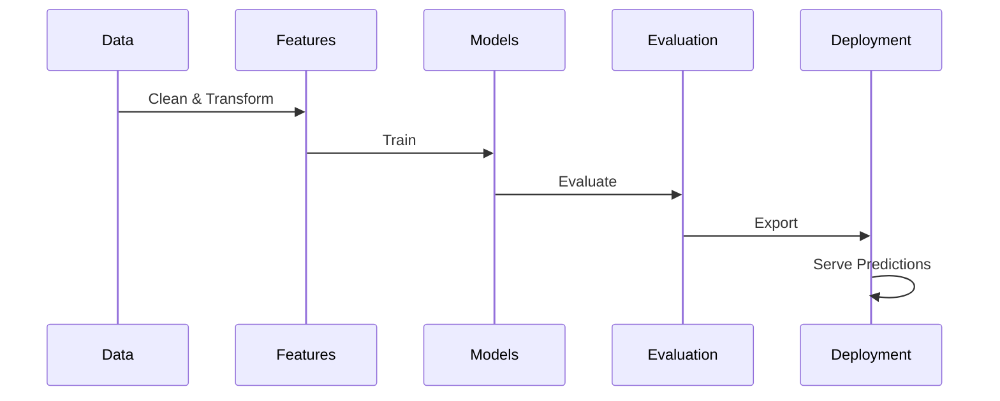

# 🧠 Intelligence Engine

---

# ⚽ Match Prediction Pipeline

---

# 🧬 Model Ecosystem

---

# 📊 Data Lineage

---

# 🚀 Production Deployment Architecture

---

# 🔄 MLOps Lifecycle

---

# 📈 Performance Intelligence Dashboard

---

# 🏟 Football Intelligence Platform

---

# ⚡ System Flow

