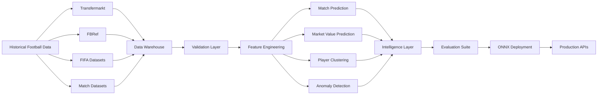
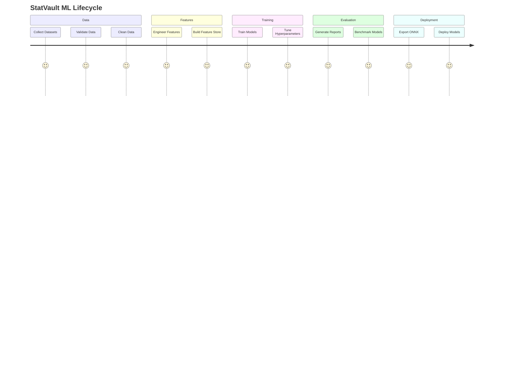
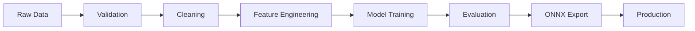
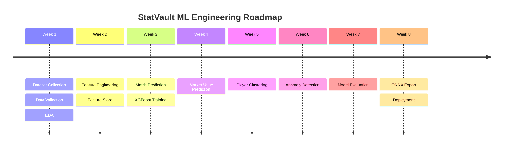

# ⚽ StatVault AI

<div align="center">

### Enterprise Football Intelligence Platform

**Predict Match Outcomes • Discover Talent • Detect Anomalies • Estimate Market Value**

<br>

<p>


</p>

<br>

### Data → Features → Models → Intelligence

---

### 🚀 Building the Next Generation Football Analytics Engine

StatVault AI is a production-oriented Machine Learning platform that transforms raw football datasets into predictive intelligence for analysts, scouts, clubs, and researchers.

</div>

---

# 🌟 Platform Overview

StatVault combines:

* ⚽ Match Outcome Prediction
* 💰 Player Market Value Estimation
* 🧠 Player Similarity Discovery
* 🚨 Performance Anomaly Detection
* 📈 Model Evaluation & Benchmarking
* 🚀 ONNX Production Deployment

into a unified football intelligence ecosystem.

---

# 🎥 Demo

<p align="center">

</p>

---

# 🏛 Enterprise Architecture



---

# 🧠 Intelligence Modules

| Module                 | Objective                   | Output            |
| ---------------------- | --------------------------- | ----------------- |
| ⚽ Match Prediction     | Predict match outcomes      | Win / Draw / Loss |
| 💰 Market Value Engine | Estimate transfer value     | Market Value (€)  |
| 🧠 Scout Engine        | Similar player discovery    | Player Archetypes |
| 🚨 Anomaly Engine      | Detect abnormal performance | Risk Scores       |
| 📈 Evaluation Suite    | Benchmark models            | Metrics Reports   |
| 🚀 ONNX Runtime        | Production inference        | ONNX Models       |

---

# 🔄 End-to-End Machine Learning Lifecycle



---

# ⚙ Data Pipeline



---

# 📊 Development Roadmap



---

# 🤖 Model Zoo

| Model              | Framework    | Purpose                 |
| ------------------ | ------------ | ----------------------- |
| XGBoost Classifier | XGBoost      | Match Prediction        |
| XGBoost Regressor  | XGBoost      | Market Value Prediction |
| KMeans             | Scikit-Learn | Player Clustering       |
| Isolation Forest   | Scikit-Learn | Anomaly Detection       |

---

# 🎯 KPI Targets

| Metric                      | Target  |
| --------------------------- | ------- |
| Match Prediction Accuracy   | > 60%   |
| Market Value R²             | > 0.80  |
| Clustering Silhouette Score | > 0.50  |
| Anomaly Precision           | > 75%   |
| Inference Latency           | < 100ms |
| API Response Time           | < 300ms |

---

# 📁 Repository Structure

```text
statvault-ai
│
├── data/
├── notebooks/
├── models/
├── outputs/
├── reports/
│
├── build_features.py
├── train_xgboost.py
├── train_market_value.py
├── cluster_players.py
├── detect_anomalies.py
├── evaluate_models.py
└── export_onnx.py
```
