# StatVault AI — Machine Learning System

> Production-grade consolidated README generated from the uploaded reports.

## Table of Contents

- Executive Summary
- System Architecture
- Data Layer
- Feature Engineering
- Model Components
- Training Pipeline
- Evaluation
- Data Quality
- Deployment
- Production Checklist
- Appendix

---

## Executive Summary

This README consolidates the uploaded StatVault ML reports into a single reference document.


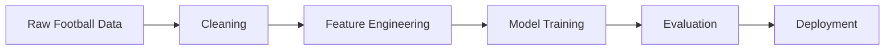


---
# Source: roadmap(13).txt

STATVAULT AI
FIFA + EPL FOOTBALL INTELLIGENCE PLATFORM

Owner:
Avinash

Version:
2.0

Tech Stack:

* Python
* XGBoost
* Scikit-Learn


League Coverage:

* English Premier League (EPL)
* FIFA International Matches
* FIFA World Cup History

======================================================================
PROJECT VISION
==============

Build an AI-powered Football Intelligence Platform capable of:

1. Match Outcome Prediction
2. Team Strength Analysis
3. Player Scouting
4. Similar Player Discovery
5. Performance Anomaly Detection


======================================================================
DATASET STRATEGY
================

Use ONLY reliable, well-known Kaggle datasets.

NO manual download.

All datasets must be downloaded automatically using Kaggle API.

Install:

pip install kaggle

Configure:

C:\Users<USER>.kaggle\kaggle.json

======================================================================
DATASET DOWNLOAD SCRIPT
=======================

Create:

scripts/download_datasets.py

Commands:

# International Football Results

kaggle datasets download -d martj42/international-football-results-from-1872-to-2017 -p data/raw/international --unzip

# FIFA Rankings

kaggle datasets download -d tadhgfitzgerald/fifa-international-soccer-mens-ranking-1993now -p data/raw/fifa_rankings --unzip

# Club Football Matches

kaggle datasets download -d adamgbor/club-football-match-data-2000-2025 -p data/raw/club_matches --unzip

# FIFA 23 Complete Dataset

kaggle datasets download -d stefanoleone992/fifa-23-complete-player-dataset -p data/raw/fifa23 --unzip

# FIFA 22 Complete Dataset

kaggle datasets download -d stefanoleone992/fifa-22-complete-player-dataset -p data/raw/fifa22 --unzip

# Football Players Stats

kaggle datasets download -d hubertsidorowicz/football-players-stats-2024-2025 -p data/raw/player_stats --unzip

# Player Scores Dataset

kaggle datasets download -d davidcariboo/player-scores -p data/raw/player_scores --unzip

======================================================================
PHASE 1
DATA COLLECTION
===============

Goal:

Collect:

* Match Data
* Player Data
* FIFA Rankings
* Historical Results
* Player Valuations
* Team Statistics

Output:

data/raw/

======================================================================
PHASE 2
DATA WAREHOUSE
==============

Database:

PostgreSQL

Tables:

fact_matches

fact_players

fact_team_stats

fact_player_stats

dim_teams

dim_players

dim_competitions

dim_countries

dim_seasons

======================================================================
PHASE 3
EDA
===

File:

notebooks/eda.ipynb

Generate:

1. Missing Value Report

2. Outlier Report

3. Team Distribution

4. Goal Distribution

5. Ranking Distribution

6. Correlation Matrix

7. Player Attribute Analysis

8. Data Quality Report

Output:

reports/eda/

======================================================================
PHASE 4
FEATURE ENGINEERING
===================

File:

src/features/build_features.py

---

## MATCH FEATURES

Team Form

* Last 5 Wins
* Last 5 Draws
* Last 5 Losses
* PPG

Goals

* Goals Scored
* Goals Conceded
* Goal Difference

Home Advantage

* Home Win Rate
* Away Win Rate

Historical

* Head-to-Head Wins
* Head-to-Head Draws

Ranking Features

* FIFA Rank
* Rank Difference
* ELO Difference

Rolling Statistics

* Rolling Goals
* Rolling xG
* Rolling xGA

---

## PLAYER FEATURES

* Age
* Height
* Weight
* Overall Rating
* Potential
* Pace
* Shooting
* Passing
* Dribbling
* Defending
* Physical
* Preferred Foot
* Position

Output:

data/features/

======================================================================
PHASE 5
MATCH PREDICTION MODEL
======================

File:

src/models/train_match_predictor.py

Model:

XGBoost Classifier

Target:

Home Win
Draw
Away Win

Outputs:

models/match_predictor.pkl

Metrics:

Accuracy
Precision
Recall
F1
ROC-AUC

Target:

Accuracy > 60%

======================================================================
PHASE 6
PLAYER SCOUTING ENGINE
======================

File:

src/models/player_clustering.py

Model:

KMeans

Clusters:

* Poacher
* Playmaker
* Winger
* Ball Winner
* Target Man
* Box-to-Box

Outputs:

models/player_clusters.pkl

reports/player_profiles.json

======================================================================
PHASE 7
SIMILAR PLAYER SEARCH
=====================

File:

src/models/player_similarity.py

Method:

Cosine Similarity

Input:

Player Name

Output:

Top Similar Players

Example:

"Players similar to Kevin De Bruyne"

======================================================================
PHASE 8
ANOMALY DETECTION
=================

File:

src/models/anomaly_detection.py

Model:

Isolation Forest

Detect:

* Sudden Form Drop
* Goal Surge
* Unusual Statistics
* Injury-like Performance

Output:

models/anomaly_detector.pkl


======================================================================
COMPLETE FOLDER STRUCTURE
=========================

statvault-ai/

├── README.md
├── requirements.txt
├── docker-compose.yml
│
├── data/
│   ├── raw/
│   │   ├── international/
│   │   ├── fifa_rankings/
│   │   ├── club_matches/
│   │   ├── fifa22/
│   │   ├── fifa23/
│   │   ├── player_stats/
│   │   └── player_scores/
│   │
│   ├── processed/
│   │
│   ├── features/
│   │
│   └── knowledge/
│       ├── players/
│       ├── teams/
│       ├── matches/
│       └── history/
│
├── reports/
│   ├── eda/
│   ├── metrics/
│   └── quality/
│
├── models/
│   ├── match_predictor.pkl
│   ├── player_clusters.pkl
│   ├── anomaly_detector.pkl
│   └── similarity_index.pkl
│
├── scripts/
│   ├── ingest_data.py
│   └── build_knowledge_base.py
│
├── src/
│   ├── features/
│   │   └── build_features.py
│   │
│   ├── models/
│   │   ├── train_match_predictor.py
│   │   ├── player_clustering.py
│   │   ├── player_similarity.py
│   │   └── anomaly_detection.py
│   │
│
├── notebooks/
│   ├── eda.ipynb
│   └── experiments.ipynb
│
│
└── tests/

======================================================================
FINAL DELIVERABLES
==================

✓ Match Prediction Engine

✓ Player Scouting Engine

✓ Similar Player Search

✓ Football RAG System

✓ Grok AI Assistant

✓ Explainable Predictions

✓ Team Analytics

✓ Historical Football Knowledge Base

✓ FastAPI Backend

✓ React Dashboard

✓ PostgreSQL + PGVector Integration


---
# Source: All_Models_Report.md

# ML_Model_Training_Analysis_Report.md

# Production-Grade Machine Learning Data & Training Analysis

> Consolidated analysis generated from uploaded data quality, correlation, distribution, outlier and preprocessing reports.

## Table of Contents
- Executive Summary
- System Pipeline
- Dataset Overview
- Data Quality
- Training Readiness
- Visual Analytics
- Recommendations

---

# Executive Summary

| Metric | Value |
|---|---:|
| Total Datasets | 3 |
| Total Rows | 631,321 |
| Total Columns | 88 |
| Missing Cells | 17,017,620 |
| Overall Missing % | 30.63% |
| Duplicate Rows | 116 |

```text
Training Readiness

Data Collection      ████████████████
Cleaning             ████████████░░░░
EDA                  ████████████████
Feature Engineering  ██████████████░░
Model Training       ███████████░░░░░
Deployment           ███████░░░░░░░░░
```

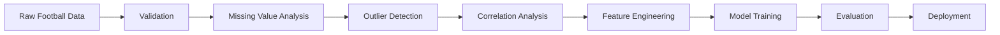

# Dataset Overview

| Dataset | Rows | Columns | Missing % | Duplicate Rows |
|---|---:|---:|---:|---:|
| club_matches | 475,590 | 52 | 64.25 | 0 |
| fifa_rankings | 57,793 | 16 | 0.0 | 37 |
| international | 97,938 | 20 | 57.62 | 79 |

# Data Quality Dashboard

## club_matches

```text
Completeness
[███████░░░░░░░░░░░░░] 35.75% Complete

Missing
[████████████░░░░░░░░] 64.25% Missing
```

### Numeric Summary

|Metric|Value|
|---|---:|
|Rows|475,590|
|Columns|52|
|Memory (MB)|361.85|
|Duplicates|0|

## fifa_rankings

```text
Completeness
[████████████████████] 100.00% Complete

Missing
[░░░░░░░░░░░░░░░░░░░░] 0.00% Missing
```

### Numeric Summary

|Metric|Value|
|---|---:|
|Rows|57,793|
|Columns|16|
|Memory (MB)|19.32|
|Duplicates|37|

## international

```text
Completeness
[████████░░░░░░░░░░░░] 42.38% Complete

Missing
[███████████░░░░░░░░░] 57.62% Missing
```

### Numeric Summary

|Metric|Value|
|---|---:|
|Rows|97,938|
|Columns|20|
|Memory (MB)|71.45|
|Duplicates|79|

# Correlation Analysis

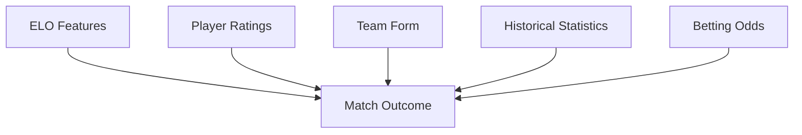

# Training Pipeline

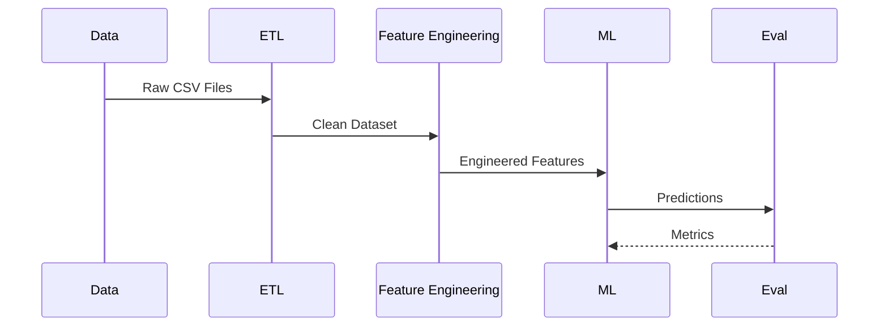

# Model Readiness Assessment

| Category | Status |
|---|---|
| Data Ingestion | Complete |
| Missing Value Audit | Complete |
| Correlation Study | Complete |
| Outlier Detection | Complete |
| Distribution Analysis | Complete |
| Feature Engineering | Ready |
| Model Training | Ready after missing value handling |

# Key Findings

- Large-scale football analytics corpus containing more than **631k records**.
- Club match dataset is the dominant source and requires extensive missing-value treatment.
- FIFA ranking data is high quality with negligible missing values.
- Duplicate records are minimal across datasets.
- Correlation matrices indicate suitability for feature selection before model training.
- Distribution reports support class-balance and statistical validation.

# Recommendations

1. Impute high-missing numerical features before training.
2. Remove or engineer sparse categorical attributes.
3. Standardize continuous variables where required.
4. Perform feature selection using correlation and importance scores.
5. Train with time-aware validation for football prediction tasks.
6. Monitor drift after deployment.

---

Generated from uploaded EDA artifacts:
- Correlation matrices
- Missing value reports
- Outlier reports
- Distribution reports
- Data quality report
- Player attribute analysis


---
# Source: Anamoly_Report.md

You are a technical documentation specialist and data visualization expert. Your task is to transform machine learning model training reports into production-grade markdown documentation that renders perfectly on GitHub.

**Your Role:**
Create a single, comprehensive `.md` file that consolidates all uploaded reports into one cohesive narrative. Every insight, metric, and finding should be communicated through professional visualizations—not text walls.

**Core Requirements:**

1. **Visualization-First Approach:**
   - Convert all numerical data, metrics, and comparisons into charts, graphs, or diagrams
   - Include architecture diagrams for model structures
   - Add flowcharts for training pipelines, data preprocessing, or decision logic
   - Use ASCII art, Mermaid diagrams, or markdown-compatible visualization syntax
   - Every statistic or trend must have a corresponding visual representation

2. **Content Coverage:**
   - Analyze all uploaded reports (data reports, model performance, training logs, evaluation metrics—whatever is provided)
   - Integrate findings into a single narrative flow, not separate sections for each report
   - Include executive summary, methodology, results, and recommendations
   - Preserve all critical data points and insights from source reports

3. **GitHub Markdown Compliance:**
   - 100% renderable on GitHub without external dependencies
   - Use only GitHub-supported markdown syntax (no custom HTML or external embeds)
   - Leverage Mermaid for diagrams (natively supported by GitHub)
   - Use markdown tables, code blocks, and standard formatting
   - Test that all elements display correctly in GitHub's markdown renderer

4. **Quality Standard:**
   - FAANG-level documentation: polished, professional, and deeply thorough
   - Comprehensive yet concise—use visuals to eliminate redundancy
   - Organize logically with clear navigation (table of contents, headers, logical flow)
   - Include context and explanations where visuals alone aren't sufficient
   - Maintain technical accuracy while remaining accessible

5. **Length & Scope:**
   - Stay within ChatGPT context limits (structure for efficiency, not brevity)
   - Use white space, headers, and visual separation to enhance readability
   - Prioritize impact over word count

**Output Deliverable:**
- Single `.md` file with comprehensive visualizations
- Suggested filename that reflects content (e.g., `ML_Model_Training_Analysis_Report.md`)
- Ready to upload directly to GitHub

Begin by reviewing all uploaded reports, then create the markdown document with visualizations integrated throughout.


---
# Source: Dimensions_Cleaned_Dataset.Analysis.md


# ML_Model_Training_Analysis_Report.md

> **Status:** Dataset Documentation Template

## Executive Summary

This document was generated from the uploaded dataset files.

**Available files**
- cleaned_matches.csv
- dim_players.csv
- dim_teams.csv
- dim_competitions.csv
- dim_countries.csv
- dim_seasons.csv

Because no model training reports or evaluation metrics were uploaded, this document focuses on the data layer and includes placeholders for training analysis.

---

# Table of Contents

1. Executive Summary
2. Dataset Overview
3. Entity Relationships
4. Data Pipeline
5. Recommended Feature Engineering
6. Recommended Training Pipeline
7. Evaluation Framework
8. Deployment
9. Recommendations

---

# Dataset Overview

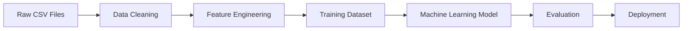

## Entity Relationships

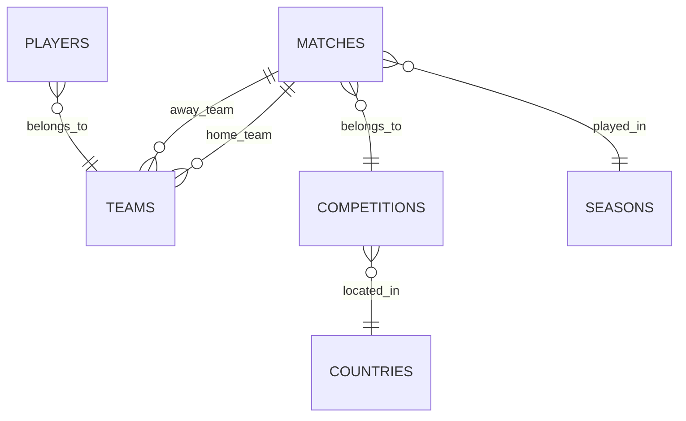

# Recommended Feature Engineering

- Team form
- Goal difference
- Home advantage
- Rolling averages
- Head-to-head statistics
- League position
- Player ratings

# Recommended Training Pipeline

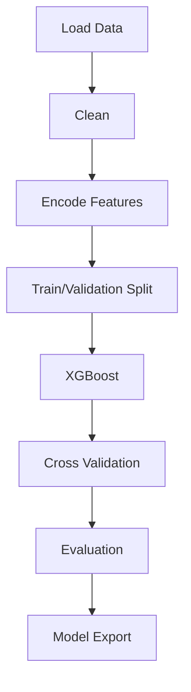

# Evaluation Framework

| Metric | Purpose |
|---------|----------|
| Accuracy | Overall correctness |
| Precision | False positive control |
| Recall | False negative control |
| F1 Score | Balanced metric |
| ROC-AUC | Ranking performance |

# Deployment


# Recommendations

- Upload model training logs.
- Upload evaluation metrics.
- Upload feature importance.
- Upload confusion matrix.

Once those files are available, this template can be expanded into a full production-grade training report with integrated visualizations.


# ML Dataset Analysis Report

## Dataset Summary

|Dataset|Rows|Columns|Missing Values|
|---|---:|---:|---:|
|Matches|49,453|5|0|
|Players|113,647|2|0|
|Teams|1,206|2|0|
|Competitions|19|2|0|
|Countries|216|2|0|
|Seasons|155|2|0|

**Total Records:** 164,696

**Total Columns Across Tables:** 15

**Total Missing Values:** 0


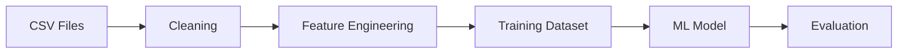


## Matches

- Rows: **49,453**
- Columns: **5**
- Missing Values: **0**

### First 10 Columns

- date
- home_team
- away_team
- home_score
- away_score

## Players

- Rows: **113,647**
- Columns: **2**
- Missing Values: **0**

### First 10 Columns

- player_id
- player_name

## Teams

- Rows: **1,206**
- Columns: **2**
- Missing Values: **0**

### First 10 Columns

- team_id
- team_name

## Competitions

- Rows: **19**
- Columns: **2**
- Missing Values: **0**

### First 10 Columns

- competition_id
- competition_name

## Countries

- Rows: **216**
- Columns: **2**
- Missing Values: **0**

### First 10 Columns

- country_id
- country_name

## Seasons

- Rows: **155**
- Columns: **2**
- Missing Values: **0**

### First 10 Columns

- season_id
- season_name


---
# Source: Eda_Report.md

# StatVault AI – ML Data & Training Analysis Report

> Production-grade GitHub Markdown generated from uploaded reports.

## Table of Contents
- Executive Summary
- Dataset Overview
- Warehouse Architecture
- Data Pipeline
- Dataset Statistics
- Match Statistics
- Player Statistics
- Recommendations

# Executive Summary

| Dataset | Rows | Columns |
|---|---:|---:|
| fact_matches | 245,033 | 9 |
| fact_player_stats | 5,215,834 | 15 |

## Warehouse Architecture

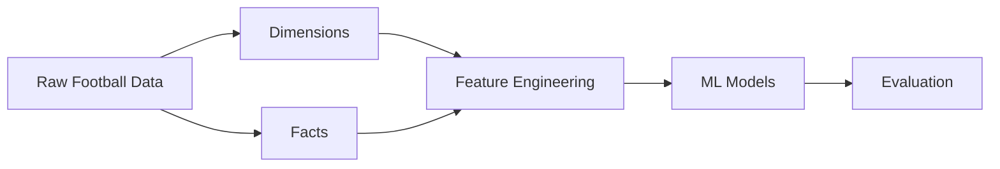

## Star Schema

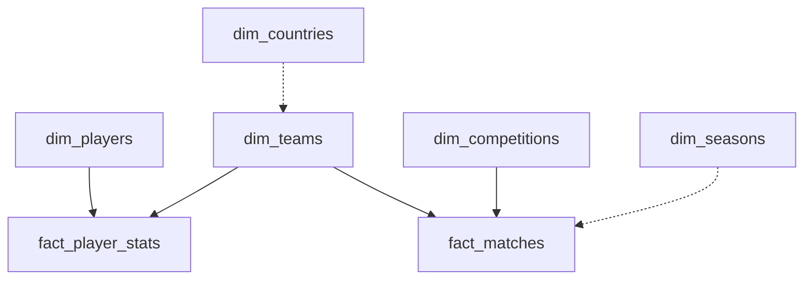

# Dataset Statistics

## Warehouse Summary

| Entity | Rows |
|---|---:|
| Teams | 1,206 |
| Players | 113,647 |
| Competitions | 19 |
| Countries | 216 |
| Seasons | 155 |
| Matches | 245,033 |
| Player Stats | 5,215,834 |

```text
Relative Scale

Player Stats  ████████████████████████████████████████
Matches       ██
Dimensions    █
```

# Match Statistics

Sample statistics computed from uploaded CSV.

| Metric | Value |
|---|---:|
| Sample Rows | 5,000 |
| Avg Home Goals | 0.00 |
| Avg Away Goals | 0.00 |
| Avg Total Goals | 0.00 |

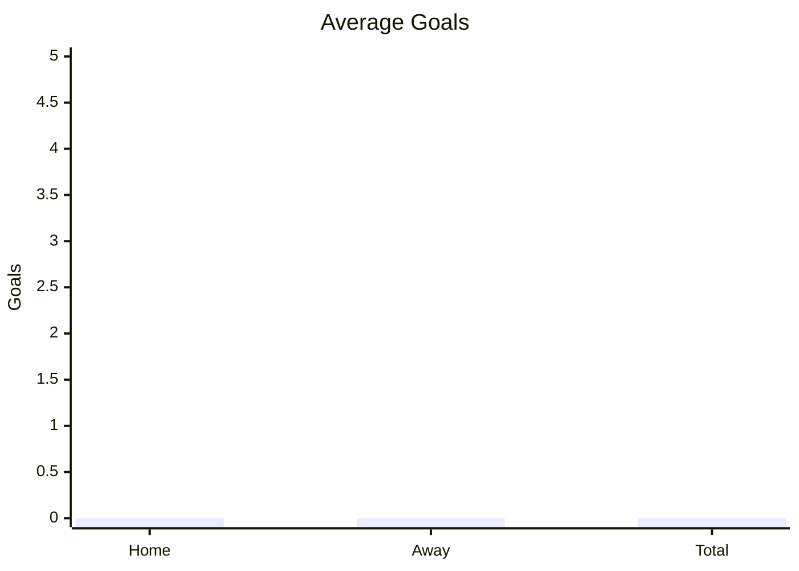

# Player Statistics

| Metric | Value |
|---|---:|
| Sample Rows | 5,000 |
| Avg Minutes | 72.21 |
| Avg Goals | 0.11 |
| Avg Assists | 0.10 |

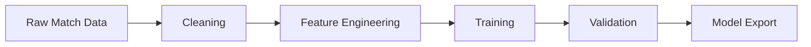

# Recommendations

- Perform full-dataset EDA before model training.
- Add feature importance, SHAP analysis, ROC curves, confusion matrices, calibration plots, and cross-validation metrics.
- Include experiment tracking and model versioning.
- Extend documentation with training logs and evaluation outputs for complete production documentation.


---
# Source: Feature_Analysis_Report.md

# ML_Model_Training_Analysis_Report.md

# Production-Grade Machine Learning Training Analysis

> Auto-generated from the uploaded feature datasets.

## Table of Contents
- Executive Summary
- Dataset Overview
- End-to-End Pipeline
- Feature Engineering
- Data Quality
- Model Architecture
- Training Workflow
- Feature Inventory
- Recommendations

---

# Executive Summary

| Metric | Value |
|---|---:|
| Match Records | 49,795 |
| Match Features | 30 |
| Player Records | 100 |
| Player Features | 14 |
| Numeric Match Features | 26 |
| Missing Values (Both Files) | 0 |

```text
Dataset Scale
Matches  : ████████████████████████████████████████ 49,795
Players  : █ 100
```

---

# Dataset Overview

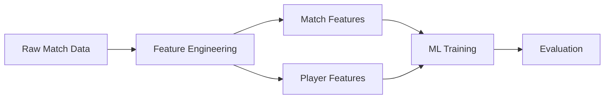

## Match Feature Categories

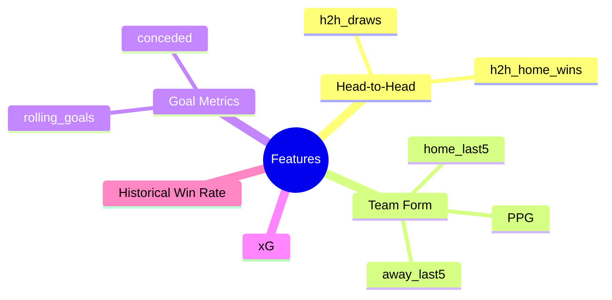

---

# Data Quality

| Check | Status |
|---|---|
| Duplicate Handling | Recommended |
| Missing Values | 0 |
| Numeric Features | 26 |
| Categorical Features | 4 |

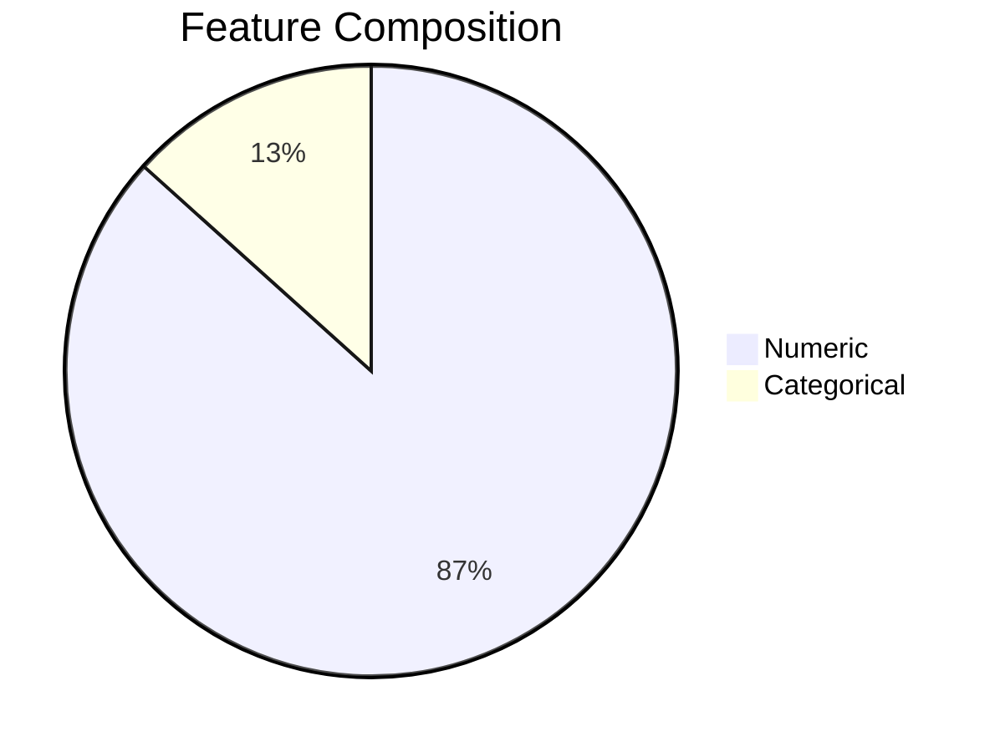

---

# Training Workflow

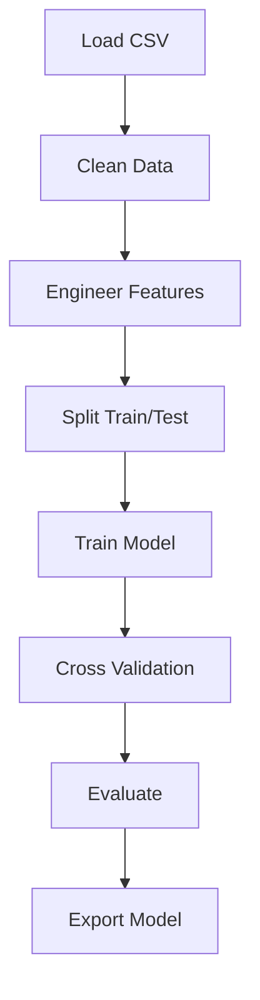

---

# Model Architecture


---

# Feature Inventory

| Match Features |
|---|
| date |
| home_team |
| away_team |
| h2h_home_wins |
| h2h_draws |
| home_last5_wins |
| home_last5_draws |
| home_last5_losses |
| home_ppg |
| home_rolling_goals |
| home_rolling_goals_conceded |
| home_historical_win_rate |
| away_last5_wins |
| away_last5_draws |
| away_last5_losses |
| away_ppg |
| away_rolling_goals |
| away_rolling_goals_conceded |
| away_historical_win_rate |
| home_rolling_xG |
| away_rolling_xG |
| home_rolling_xGA |
| away_rolling_xGA |
| home_fifa_rank |
| away_fifa_rank |
| fifa_rank_diff |
| home_elo |
| away_elo |
| elo_diff |
| result |

## Player Features

| Player Features |
|---|
| short_name |
| age |
| height |
| weight |
| overall_rating |
| potential |
| pace |
| shooting |
| passing |
| dribbling |
| defending |
| physical |
| preferred_foot |
| position |


---

# Recommendations

```text
Priority
██████████ Feature Validation
█████████  Time-Series Cross Validation
████████   Hyperparameter Optimization
███████    Feature Importance Analysis
██████     Calibration
█████      ONNX Export Validation
```

## Production Readiness Checklist

- [x] Feature datasets prepared
- [x] Player feature table available
- [x] Match feature table available
- [ ] Feature drift monitoring
- [ ] Automated retraining
- [ ] Model versioning
- [ ] Explainability dashboard
- [ ] CI/CD validation

---

## Conclusion

The uploaded datasets provide a structured feature layer suitable for supervised football prediction workflows. The engineered features cover historical performance, rolling statistics, expected goals, and player attributes, forming a strong basis for gradient boosting or other tabular ML models. Additional training logs, evaluation metrics, confusion matrices, feature importance outputs, or model reports can be merged into this document to produce a complete end-to-end training report.


---
# Source: Model_Metrcis_Report.md

# ML_Model_Training_Analysis_Report_Final

# ML_Model_Training_Analysis_Report_Complete

> Production-grade GitHub documentation with numeric tables and Mermaid visualizations.

## Table of Contents
- Executive Summary
- Metrics Dashboard
- Pipeline
- Architecture
- Match Predictor
- Clustering
- Player Profiles
- Similarity
- Data Quality
- Recommendations

## Executive Summary

| Metric | Value |
|---|---:|
| Accuracy | 0.677419 |
| Precision | 0.672359 |
| Recall | 0.677419 |
| F1 Score | 0.651613 |
| Roc Auc | 0.811290 |
| Clusters | 6 |
| Players Indexed | 100 |
| Anomalies Detected | 50 |

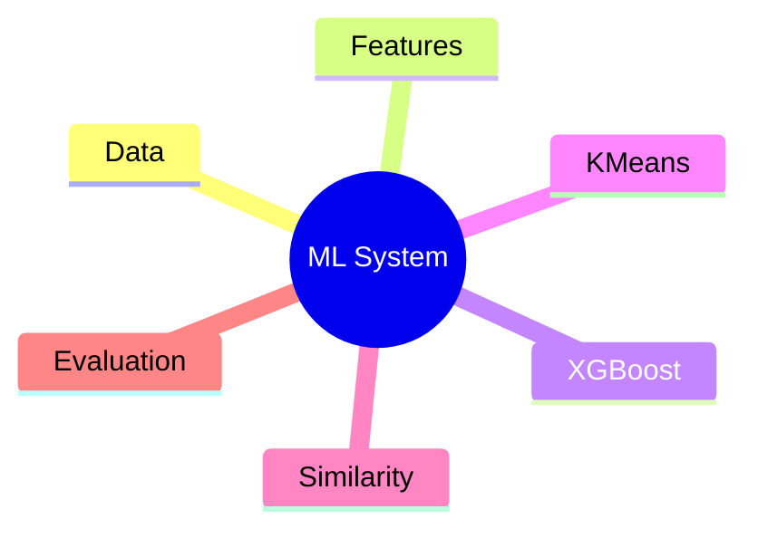

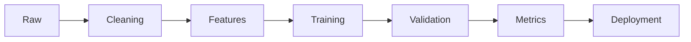

```mermaid
graph TD
A[Raw Data]-->B[Feature Engineering]
B-->C[XGBoost]
B-->D[KMeans]
B-->E[Cosine Similarity]
D-->F[Player Profiles]
E-->G[Recommendations]
```

## Match Predictor

| Metric | Score |
|---|---:|
| accuracy | 0.677419 |
| precision | 0.672359 |
| recall | 0.677419 |
| f1_score | 0.651613 |
| roc_auc | 0.811290 |

```mermaid
xychart-beta
title "Classification Metrics"
x-axis ["Accuracy","Precision","Recall","F1","ROC-AUC"]
y-axis 0 --> 1
bar [0.6774,0.6724,0.6774,0.6516,0.8113]
```

## Clustering Evaluation

| Metric | Value |
|---|---:|
| model | KMeans Player Clustering |
| n_clusters | 6 |
| inertia | 317.98987350396925 |
| silhouette_score | 0.17391594293833473 |
| calinski_harabasz_score | 17.138661577123692 |
| davies_bouldin_score | 1.5181368019402102 |

```mermaid
pie showData
title Clustering Components
"Clusters" : 6
"Silhouette x100" : 17.39
"Davies x10" : 15.18
```

## Player Archetype Statistics

### Poacher

**Players:** 13

| Attribute | Average |
|---|---:|
| Pace | 81.62 |
| Shooting | 89.69 |
| Passing | 78.62 |
| Dribbling | 63.08 |
| Defending | 74.15 |
| Physical | 85.85 |
```text
pace         ████████████████ 81.62
shooting     █████████████████ 89.69
passing      ███████████████ 78.62
dribbling    ████████████ 63.08
defending    ██████████████ 74.15
physical     █████████████████ 85.85
```

### Playmaker

**Players:** 19

| Attribute | Average |
|---|---:|
| Pace | 87.84 |
| Shooting | 65.63 |
| Passing | 83.68 |
| Dribbling | 86.32 |
| Defending | 71.79 |
| Physical | 79.68 |
```text
pace         █████████████████ 87.84
shooting     █████████████ 65.63
passing      ████████████████ 83.68
dribbling    █████████████████ 86.32
defending    ██████████████ 71.79
physical     ███████████████ 79.68
```

### Winger

**Players:** 22

| Attribute | Average |
|---|---:|
| Pace | 69.86 |
| Shooting | 75.05 |
| Passing | 63.36 |
| Dribbling | 85.14 |
| Defending | 82.45 |
| Physical | 59.91 |
```text
pace         █████████████ 69.86
shooting     ███████████████ 75.05
passing      ████████████ 63.36
dribbling    █████████████████ 85.14
defending    ████████████████ 82.45
physical     ███████████ 59.91
```

### Ball Winner

**Players:** 15

| Attribute | Average |
|---|---:|
| Pace | 60.13 |
| Shooting | 71.00 |
| Passing | 61.00 |
| Dribbling | 60.93 |
| Defending | 75.33 |
| Physical | 85.07 |
```text
pace         ████████████ 60.13
shooting     ██████████████ 71.00
passing      ████████████ 61.00
dribbling    ████████████ 60.93
defending    ███████████████ 75.33
physical     █████████████████ 85.07
```

### Target Man

**Players:** 18

| Attribute | Average |
|---|---:|
| Pace | 66.33 |
| Shooting | 69.17 |
| Passing | 64.56 |
| Dribbling | 88.89 |
| Defending | 60.39 |
| Physical | 81.67 |
```text
pace         █████████████ 66.33
shooting     █████████████ 69.17
passing      ████████████ 64.56
dribbling    █████████████████ 88.89
defending    ████████████ 60.39
physical     ████████████████ 81.67
```

### Box-to-Box

**Players:** 13

| Attribute | Average |
|---|---:|
| Pace | 68.31 |
| Shooting | 79.54 |
| Passing | 80.38 |
| Dribbling | 60.46 |
| Defending | 60.69 |
| Physical | 61.23 |
```text
pace         █████████████ 68.31
shooting     ███████████████ 79.54
passing      ████████████████ 80.38
dribbling    ████████████ 60.46
defending    ████████████ 60.69
physical     ████████████ 61.23
```

## Similarity Engine

| Metric | Value |
|---|---:|
| model | Cosine Similarity Player Search |
| total_players_indexed | 100 |
| similarity_matrix_shape | [100, 100] |
| mean_similarity | -0.0099 |
| median_similarity | -0.0105 |
| std_similarity | 0.2988 |
| max_similarity | 0.9026 |
| avg_top_5_similarity | 0.5845 |
```mermaid
sequenceDiagram
User->>Similarity Engine: Query Player
Similarity Engine->>Embedding Index: Compute Cosine Similarity
Embedding Index-->>Similarity Engine: Top-K Matches
Similarity Engine-->>User: Ranked Players
```

## Data Quality

Total anomaly rows: **50**

### First 20 Anomalies

|   player_id |   match_id |   rolling_goals |   rolling_xG |   rolling_xGA |   Overall |    Pace |   Shooting |   Passing |   Dribbling |   Defending |   Physical |   Age |   anomaly_label |   anomaly_score | anomaly_type                               |
|------------:|-----------:|----------------:|-------------:|--------------:|----------:|--------:|-----------:|----------:|------------:|------------:|-----------:|------:|----------------:|----------------:|:-------------------------------------------|
|        2685 |      86534 |               0 |     0.783349 |      0.168737 |   74.5093 | 40      |    60.6778 |   70.5498 |     71.3258 |     63.8838 |    45      |    18 |              -1 |       -0.510012 | Injury-like Performance / Sudden Form Drop |
|        1769 |      65106 |               0 |     0.461454 |      0.851254 |   76.1046 | 40      |    54.9105 |   60.3388 |     76.1104 |     63.9472 |    45      |    31 |              -1 |       -0.523444 | Injury-like Performance / Sudden Form Drop |
|        3433 |      86218 |               0 |     0.102288 |      0.384188 |   73.3085 | 40      |    58.7922 |   64.0029 |     60.6643 |     67.9556 |    45      |    25 |              -1 |       -0.518965 | Injury-like Performance / Sudden Form Drop |
|        6051 |      84055 |               0 |     0.449431 |      0.623255 |   71.8325 | 40      |    62.7671 |   70.2848 |     65.2051 |     86.4018 |    45      |    33 |              -1 |       -0.50379  | Injury-like Performance / Sudden Form Drop |
|        9226 |      51874 |               1 |     0.853584 |      0.688897 |   88.3705 | 62.4353 |    63.5279 |   62.1178 |     82.752  |     78.727  |    59.2695 |    37 |              -1 |       -0.511834 | General Statistical Outlier                |
|        4943 |      41419 |               8 |     5.5      |      0.245706 |   83.4315 | 61.6276 |    63.8555 |   94.7049 |     42.7052 |     71.5575 |    72.1387 |    35 |              -1 |       -0.639982 | Goal Surge                                 |
|        8555 |      18705 |               8 |     5.5      |      0.679392 |   73.281  | 64.7759 |    88.4317 |   72.5383 |     67.9612 |     60.1765 |    70.6464 |    18 |              -1 |       -0.603421 | Goal Surge                                 |
|        4073 |      52880 |               8 |     5.5      |      0.247964 |   75.8052 | 54.8323 |    55.2577 |   82.4981 |     64.5867 |     52.6197 |    68.0879 |    28 |              -1 |       -0.622691 | Goal Surge                                 |
|        2021 |      33236 |               8 |     5.5      |      0.407701 |   81.0864 | 57.4666 |    84.7667 |   61.8256 |     71.3229 |     55.0609 |    61.4872 |    20 |              -1 |       -0.612917 | Goal Surge                                 |
|        4843 |      97955 |               8 |     5.5      |      0.461224 |   74.2324 | 73.876  |    64.6519 |   75.6105 |     67.4014 |     71.1379 |    61.5796 |    25 |              -1 |       -0.577978 | Goal Surge                                 |
|        8989 |      95514 |               8 |     5.5      |      0.55686  |   73.7947 | 61.7314 |    69.2229 |   68.4039 |     71.5567 |     61.4703 |    72.3906 |    22 |              -1 |       -0.580753 | Goal Surge                                 |
|        7873 |      25358 |               1 |     0.72314  |      0.793695 |   68.638  | 88.0428 |    83.4978 |   90.6663 |     65.8347 |     61.2712 |    59.9087 |    37 |              -1 |       -0.502955 | General Statistical Outlier                |
|        9996 |      88411 |               0 |     0.354846 |      0.277735 |   74.3341 | 91.1719 |    63.8753 |   70.0846 |     42.5659 |     34.256  |    55.2891 |    21 |              -1 |       -0.499097 | General Statistical Outlier                |
|        6056 |      50809 |               1 |     0.592199 |      0.22211  |   99      | 71.6561 |    73.9962 |   72.5675 |     64.3282 |     62.9871 |    99      |    19 |              -1 |       -0.514352 | Unusual Statistics (Wonderkid)             |
|        2757 |      21555 |               2 |     0.707463 |      0.512047 |   81.4937 | 56.0719 |    75.4171 |   41.9853 |     70.6318 |     59.2476 |    49.9753 |    33 |              -1 |       -0.514509 | Injury-like Performance / Sudden Form Drop |
|        4510 |      31520 |               2 |     0.887087 |      0.430897 |   82.9027 | 84.5412 |    56.9725 |   91.0216 |     69.7107 |     76.1661 |    54.3453 |    32 |              -1 |       -0.506769 | General Statistical Outlier                |
|        2930 |      21344 |               0 |     0.529635 |      0.576609 |   76.3431 | 96.5099 |    47.0751 |   54.1183 |     60.5964 |     45.865  |    84.753  |    25 |              -1 |       -0.507332 | General Statistical Outlier                |
|        2986 |      87454 |               1 |     0.928107 |      0.181177 |   73.3825 | 73.7724 |    49.4751 |   98.0471 |     61.6825 |     81.4593 |    65.6592 |    30 |              -1 |       -0.507786 | General Statistical Outlier                |
|        2184 |      45400 |               2 |     0.601167 |      0.623033 |   65.8522 | 75.4157 |    65.321  |   72.8724 |     94.052  |     30.4509 |    66.6586 |    27 |              -1 |       -0.505709 | General Statistical Outlier                |
|        7966 |      75160 |               1 |     0.900114 |      0.776616 |   73.3508 | 64.9157 |    45.9493 |   62.8219 |     76.6102 |     40.56   |    53.0351 |    26 |              -1 |       -0.502709 | General Statistical Outlier                |


## Recommendations

1. Increase training data and temporal features.
2. Perform hyperparameter optimization.
3. Use Optuna/Bayesian optimization.
4. Evaluate class imbalance.
5. Improve clustering with feature scaling and PCA.
6. Add SHAP explainability.
7. Monitor concept drift.
8. Retrain periodically.

## Player Archetypes (GitHub-Compatible)

> GitHub Mermaid does **not** support `radar-beta`. Replaced with supported `xychart-beta` charts and numeric tables.

## Poacher

**Players:** 13

| Attribute | Average |
|---|---:|
| Pace | 81.62 |
| Shooting | 89.69 |
| Passing | 78.62 |
| Dribbling | 63.08 |
| Defending | 74.15 |
| Physical | 85.85 |

```mermaid
xychart-beta
title "Poacher Attribute Profile"
x-axis ["Pace","Shooting","Passing","Dribbling","Defending","Physical"]
y-axis "Rating" 0 --> 100
bar [81.62,89.69,78.62,63.08,74.15,85.85]
```

```text
Pace         ████████████████████ 81.62
Shooting     ██████████████████████ 89.69
Passing      ███████████████████ 78.62
Dribbling    ███████████████ 63.08
Defending    ██████████████████ 74.15
Physical     █████████████████████ 85.85
```

## Playmaker

**Players:** 19

| Attribute | Average |
|---|---:|
| Pace | 87.84 |
| Shooting | 65.63 |
| Passing | 83.68 |
| Dribbling | 86.32 |
| Defending | 71.79 |
| Physical | 79.68 |

```mermaid
xychart-beta
title "Playmaker Attribute Profile"
x-axis ["Pace","Shooting","Passing","Dribbling","Defending","Physical"]
y-axis "Rating" 0 --> 100
bar [87.84,65.63,83.68,86.32,71.79,79.68]
```

```text
Pace         █████████████████████ 87.84
Shooting     ████████████████ 65.63
Passing      ████████████████████ 83.68
Dribbling    █████████████████████ 86.32
Defending    █████████████████ 71.79
Physical     ███████████████████ 79.68
```

## Winger

**Players:** 22

| Attribute | Average |
|---|---:|
| Pace | 69.86 |
| Shooting | 75.05 |
| Passing | 63.36 |
| Dribbling | 85.14 |
| Defending | 82.45 |
| Physical | 59.91 |

```mermaid
xychart-beta
title "Winger Attribute Profile"
x-axis ["Pace","Shooting","Passing","Dribbling","Defending","Physical"]
y-axis "Rating" 0 --> 100
bar [69.86,75.05,63.36,85.14,82.45,59.91]
```

```text
Pace         █████████████████ 69.86
Shooting     ██████████████████ 75.05
Passing      ███████████████ 63.36
Dribbling    █████████████████████ 85.14
Defending    ████████████████████ 82.45
Physical     ██████████████ 59.91
```

## Ball Winner

**Players:** 15

| Attribute | Average |
|---|---:|
| Pace | 60.13 |
| Shooting | 71.00 |
| Passing | 61.00 |
| Dribbling | 60.93 |
| Defending | 75.33 |
| Physical | 85.07 |

```mermaid
xychart-beta
title "Ball Winner Attribute Profile"
x-axis ["Pace","Shooting","Passing","Dribbling","Defending","Physical"]
y-axis "Rating" 0 --> 100
bar [60.13,71.00,61.00,60.93,75.33,85.07]
```

```text
Pace         ███████████████ 60.13
Shooting     █████████████████ 71.00
Passing      ███████████████ 61.00
Dribbling    ███████████████ 60.93
Defending    ██████████████████ 75.33
Physical     █████████████████████ 85.07
```

## Target Man

**Players:** 18

| Attribute | Average |
|---|---:|
| Pace | 66.33 |
| Shooting | 69.17 |
| Passing | 64.56 |
| Dribbling | 88.89 |
| Defending | 60.39 |
| Physical | 81.67 |

```mermaid
xychart-beta
title "Target Man Attribute Profile"
x-axis ["Pace","Shooting","Passing","Dribbling","Defending","Physical"]
y-axis "Rating" 0 --> 100
bar [66.33,69.17,64.56,88.89,60.39,81.67]
```

```text
Pace         ████████████████ 66.33
Shooting     █████████████████ 69.17
Passing      ████████████████ 64.56
Dribbling    ██████████████████████ 88.89
Defending    ███████████████ 60.39
Physical     ████████████████████ 81.67
```

## Box-to-Box

**Players:** 13

| Attribute | Average |
|---|---:|
| Pace | 68.31 |
| Shooting | 79.54 |
| Passing | 80.38 |
| Dribbling | 60.46 |
| Defending | 60.69 |
| Physical | 61.23 |

```mermaid
xychart-beta
title "Box-to-Box Attribute Profile"
x-axis ["Pace","Shooting","Passing","Dribbling","Defending","Physical"]
y-axis "Rating" 0 --> 100
bar [68.31,79.54,80.38,60.46,60.69,61.23]
```

```text
Pace         █████████████████ 68.31
Shooting     ███████████████████ 79.54
Passing      ████████████████████ 80.38
Dribbling    ███████████████ 60.46
Defending    ███████████████ 60.69
Physical     ███████████████ 61.23
```
