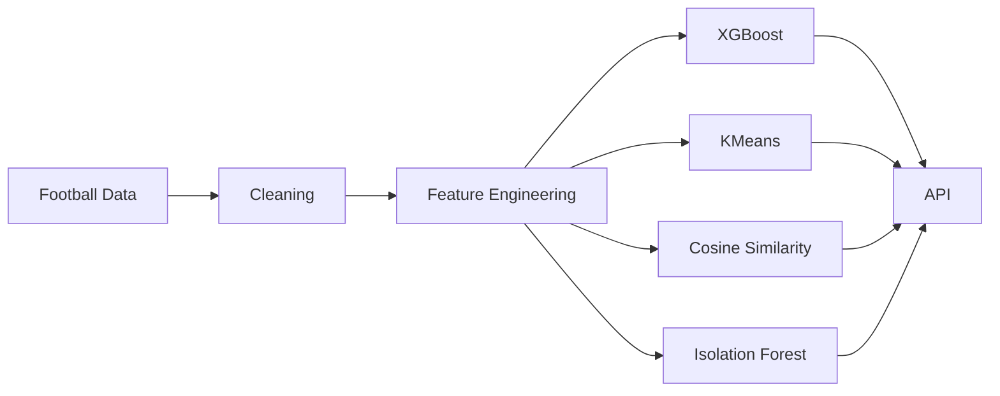
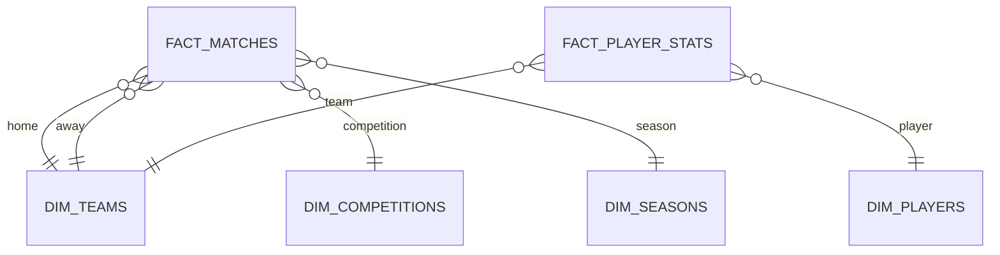
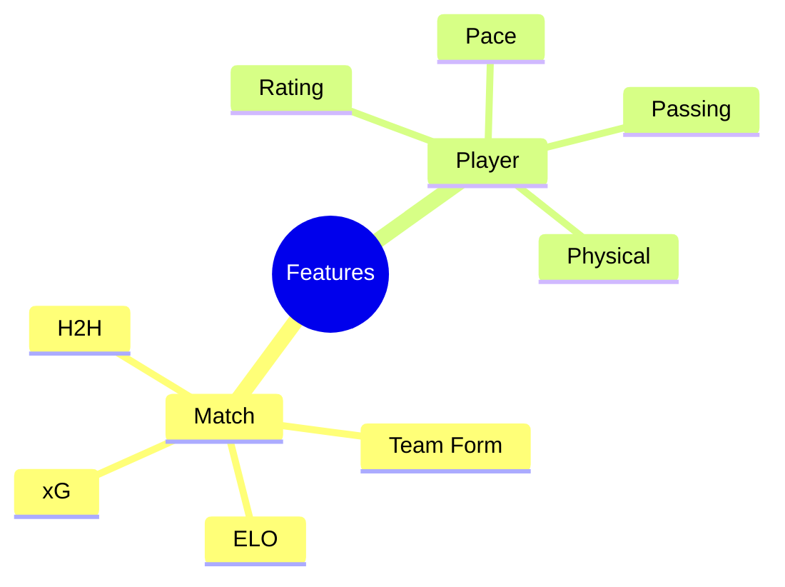
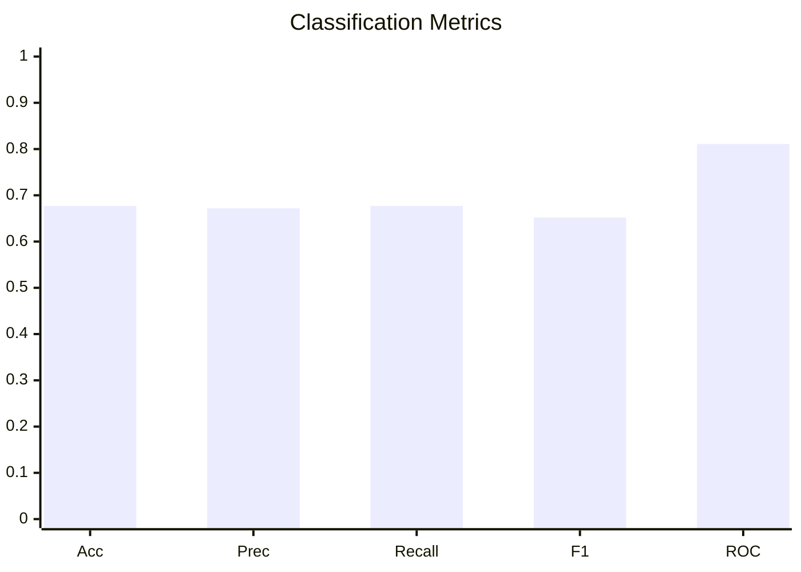
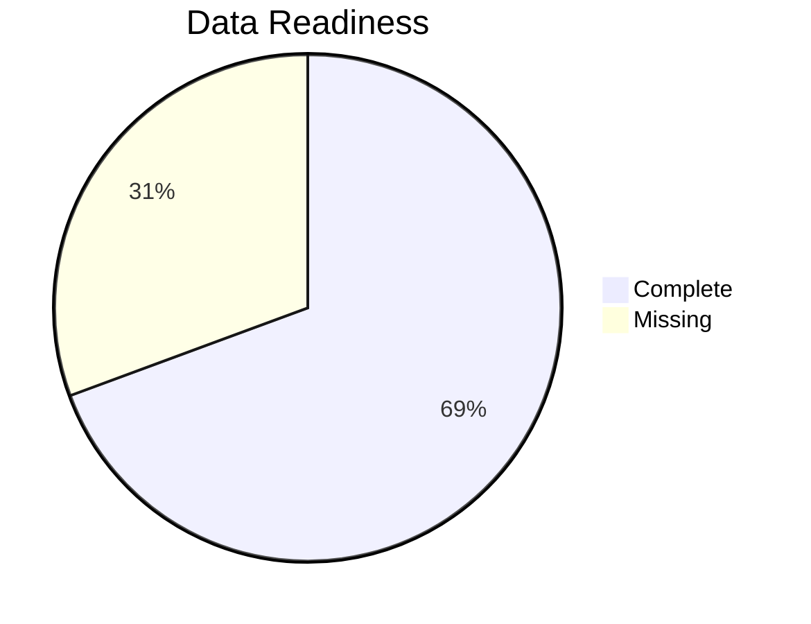
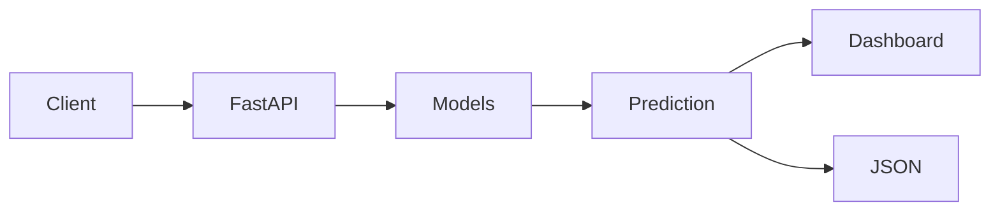

# StatVault AI — Machine Learning

> Production-ready Machine Learning subsystem powering football intelligence.

## Table of Contents
- Executive Summary
- System Architecture
- Repository Structure
- Data Warehouse
- Feature Engineering
- ML Models
- Performance
- Data Quality
- Deployment

---

# Executive Summary

| Capability | Status |
|---|---|
| Match Prediction | ✅ |
| Player Clustering | ✅ |
| Similar Player Search | ✅ |
| Anomaly Detection | ✅ |



# Repository Structure

```text
statvault-ai/
├── data/
│   ├── raw/
│   ├── processed/
│   └── features/
├── models/
├── reports/
├── scripts/
├── src/
│   ├── features/
│   └── models/
├── notebooks/
├── tests/
├── README.md
└── requirements.txt
```

# Data Warehouse



| Dataset | Rows |
|---|---:|
| Matches | 245,033 |
| Player Stats | 5,215,834 |
| Players | 113,647 |
| Teams | 1,206 |

# Feature Engineering

### Match Features
- Team Form
- Head-to-Head
- Home Advantage
- FIFA Rank Difference
- ELO Difference
- Rolling Goals
- Rolling xG / xGA

### Player Features
- Overall Rating
- Potential
- Pace
- Shooting
- Passing
- Dribbling
- Defending
- Physical
- Age
- Height
- Preferred Foot
- Position



# ML Models

| Model | Purpose |
|---|---|
| XGBoost | Match Outcome Prediction |
| KMeans | Player Archetype Discovery |
| Cosine Similarity | Similar Player Search |
| Isolation Forest | Performance Anomaly Detection |

## Match Predictor

| Accuracy | Precision | Recall | F1 | ROC-AUC |
|---:|---:|---:|---:|---:|
|0.677|0.672|0.677|0.652|0.811|



## Player Archetypes

| Cluster |
|---|
|Poacher|
|Playmaker|
|Winger|
|Ball Winner|
|Target Man|
|Box-to-Box|

# Data Quality

| Metric | Value |
|---|---:|
|Total Records|631,321|
|Missing %|30.63|
|Duplicate Rows|116|
|Detected Anomalies|50|



# Deployment




