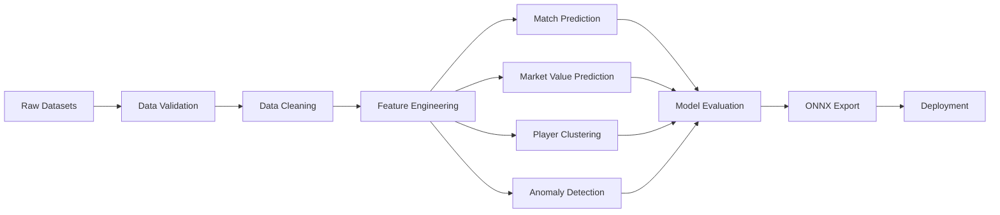
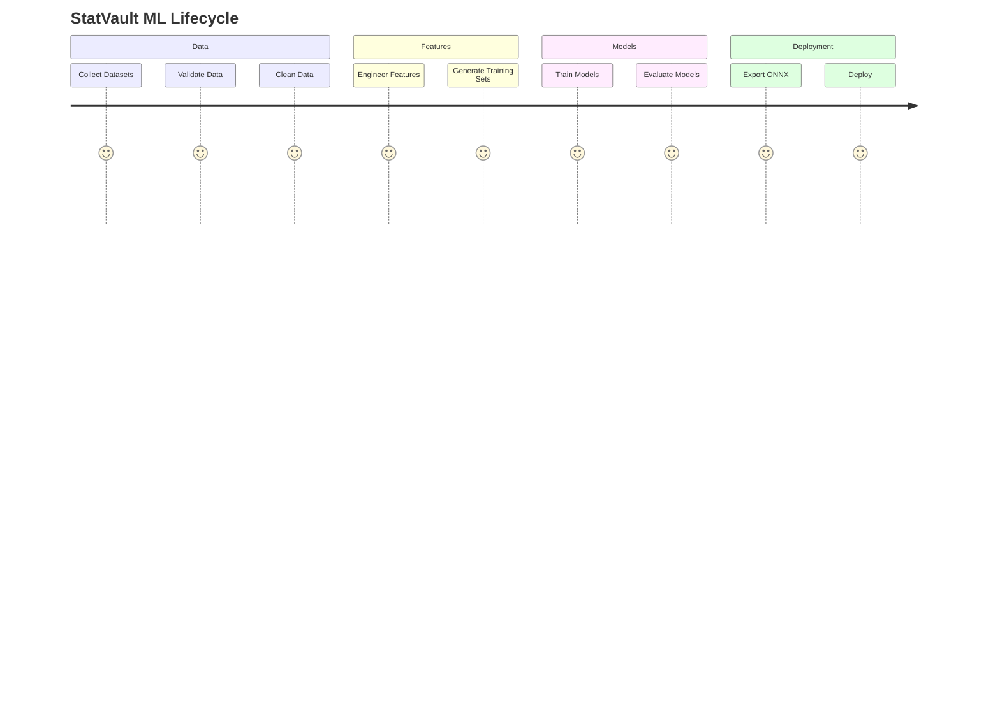
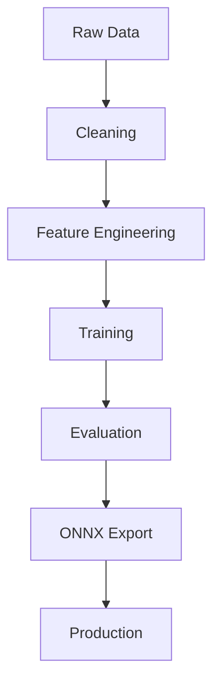

<<<<<<< HEAD
<!-- ================= HERO ================= -->

<div align="center">

# ⚽ StatVault AI

### Football Intelligence Platform

Predict Match Outcomes • Scout Players • Detect Anomalies • Estimate Market Value

<p align="center">


</p>

</div>

---

## 🎥 Demo

<p align="center">


</p>

---

## 📊 Platform Capabilities

| Capability | Description |
|------------|-------------|
| ⚽ Match Prediction | Predict Home Win / Draw / Away Win |
| 💰 Market Value | Estimate player transfer value |
| 🧠 Similarity Search | Find players with similar profiles |
| 🚨 Anomaly Detection | Detect unusual player performance |
| 📈 Evaluation Suite | Full metrics & reports |
| 🚀 ONNX Deployment | Production-ready exports |

---

## 🏛 Architecture



---

## 🧬 End-to-End ML Lifecycle



---

## 📁 Repository Structure

```text
statvault-ml
│
├── data
├── notebooks
├── models
├── reports
├── outputs
│
├── build_features.py
├── train_xgboost.py
├── train_market_value.py
├── cluster_players.py
├── detect_anomalies.py
├── evaluate_models.py
└── export_onnx.py
```

---

## ⚙ Data Pipeline



---

## 🤖 Models

### Match Prediction

| Property | Value |
|-----------|---------|
| Algorithm | XGBoost |
| Type | Multi-Class Classification |
| Classes | Win / Draw / Loss |
| Target Accuracy | > 60% |

---

### Market Value Prediction

| Property | Value |
|-----------|---------|
| Algorithm | XGBoost Regressor |
| Target | Market Value (€) |
| Metric | R² |

---

### Clustering

| Property | Value |
|-----------|---------|
| Algorithm | KMeans |
| Output | Player Archetypes |

---

### Anomaly Detection

| Property | Value |
|-----------|---------|
| Algorithm | Isolation Forest |
| Output | Anomaly Score |

---

## 📈 Example Dashboard

<div align="center">


</div>

---

## 🎯 KPI Targets

| Metric | Target |
|---------|---------|
| Match Accuracy | >60% |
| Market Value R² | >0.80 |
| Silhouette Score | >0.50 |
| Anomaly Precision | >75% |
| Inference Time | <100ms |

---

## 🚀 Quick Start

```bash
git clone repo-url

cd statvault-ml

pip install -r requirements.txt

python build_features.py

python train_xgboost.py

python evaluate_models.py
```

---

## 🗺 Roadmap

- [x] Dataset Collection
- [x] EDA
- [x] Feature Engineering
- [ ] Match Prediction
- [ ] Market Value Prediction
- [ ] Clustering
- [ ] Anomaly Detection
- [ ] ONNX Export
- [ ] Deployment

---

## 📜 License

MIT License

---

<div align="center">

### Built for Football Intelligence

⚽ Data → Features → Models → Insights

</div>
=======
# StatVault
>>>>>>> main
