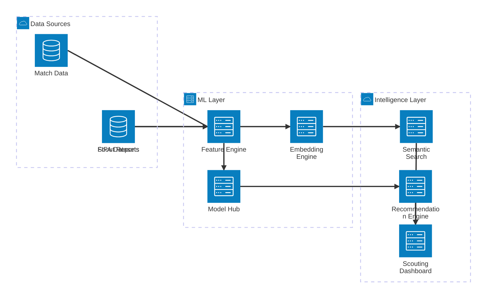
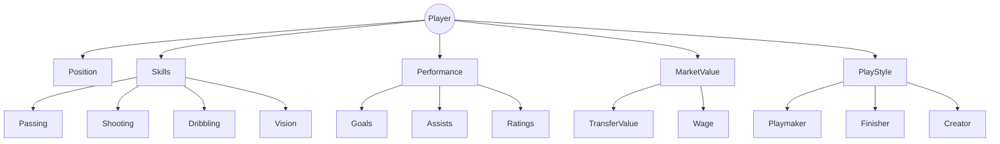
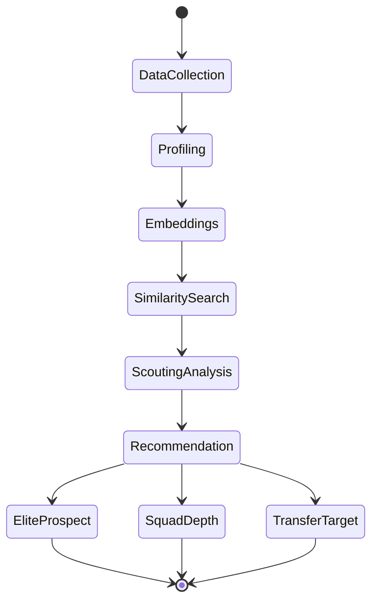
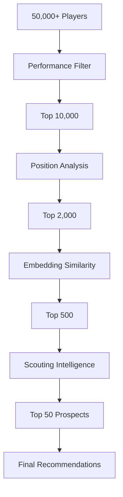
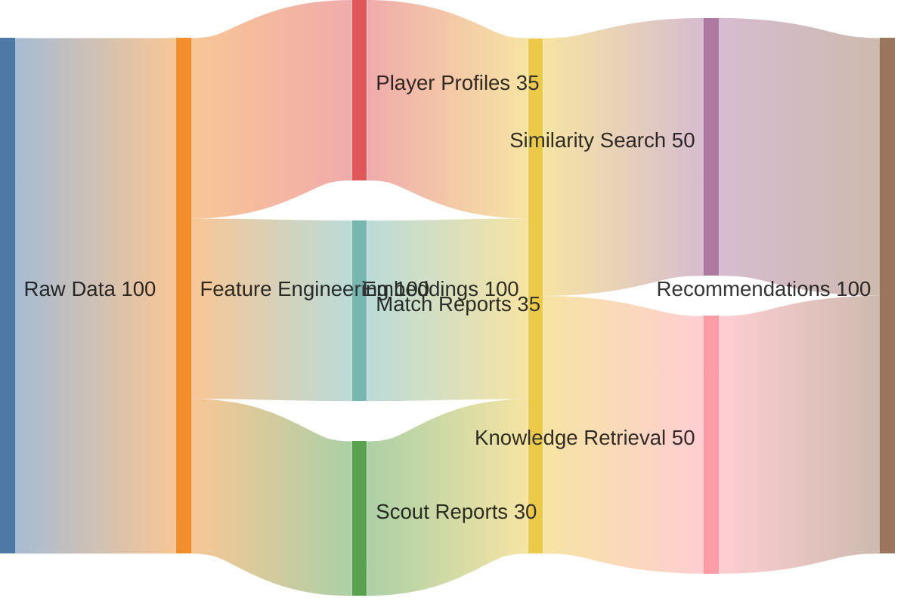
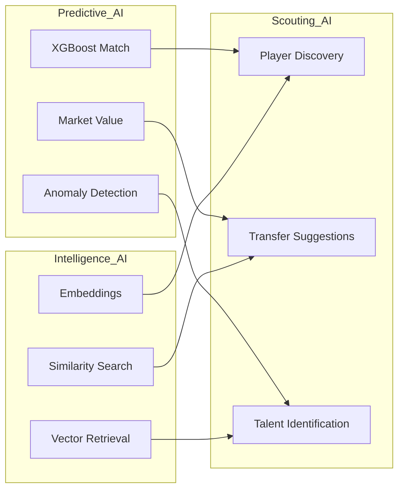
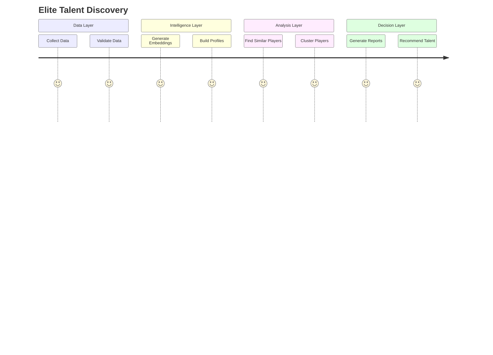

# 🌌 FOOTBALL INTELLIGENCE UNIVERSE



---

# 🧠 PLAYER DISCOVERY KNOWLEDGE GRAPH



---

# ⚽ SCOUTING OPERATING SYSTEM



---

# 🎯 PLAYER EVALUATION FUNNEL



---

# 📡 INTELLIGENCE FLOW MAP



---

# 🚀 MODEL ECOSYSTEM



---

# 🏆 TALENT IDENTIFICATION PIPELINE



---

# 🌍 GLOBAL FOOTBALL KNOWLEDGE NETWORK

```mermaid
mindmap

root((Football Intelligence))

    Players
        Profiles
        Skills
        Ratings
        Market Value

    Teams
        Form
        Elo
        Performance

    Matches
        Results
        Narratives
        Insights

    Intelligence
        Embeddings
        Search
        Recommendations

    Analytics
        Clustering
        Prediction
        Detection

    Deployment
        ONNX
        APIs
        Dashboards
```

---

# 🔥 SYSTEM MATURITY MODEL

```text
LEVEL 5  ██████████████████████████████  Autonomous Scouting

LEVEL 4  ████████████████████████████░  Semantic Intelligence

LEVEL 3  ████████████████████████░░░░  Embedding Search

LEVEL 2  ███████████████████░░░░░░░░░  Predictive Analytics

LEVEL 1  ████████████░░░░░░░░░░░░░░░░  Raw Data
```

---

# 📊 EXECUTIVE COMMAND CENTER

```text
┌───────────────────────────────────────────────────────┐
│                 STATVAULT AI CORE                     │
├───────────────────────────────────────────────────────┤
│                                                       │
│  DATASETS              3                              │
│  PLAYER PROFILES       ✓                              │
│  MATCH REPORTS         ✓                              │
│  SCOUT REPORTS         ✓                              │
│                                                       │
│  EMBEDDING ENGINE      ACTIVE                         │
│  VECTOR SEARCH         ACTIVE                         │
│  RECOMMENDATIONS       ACTIVE                         │
│                                                       │
│  SCOUTING STATUS       OPERATIONAL                    │
│                                                       │
└───────────────────────────────────────────────────────┘
```
