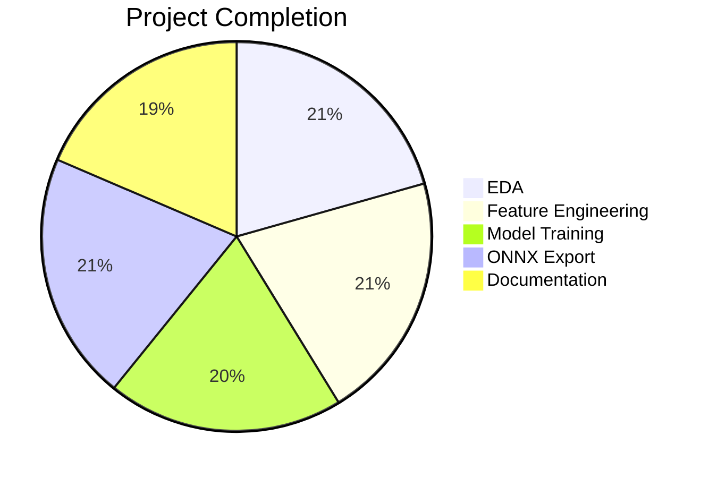
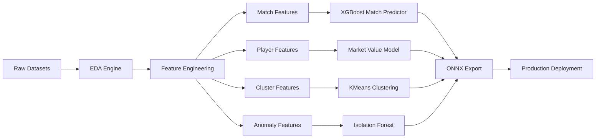
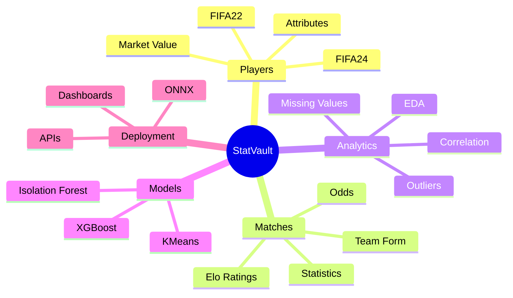
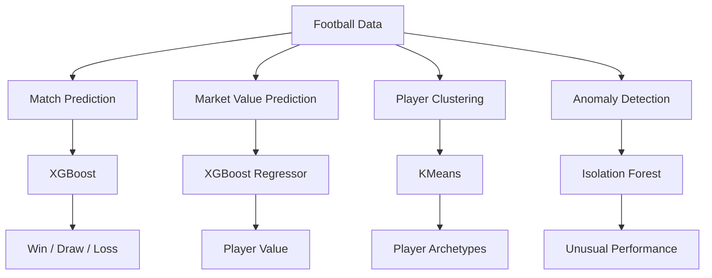
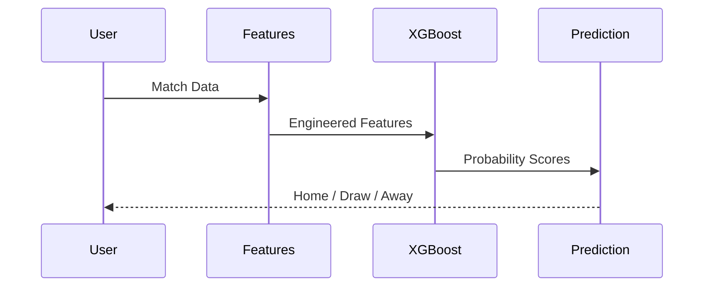
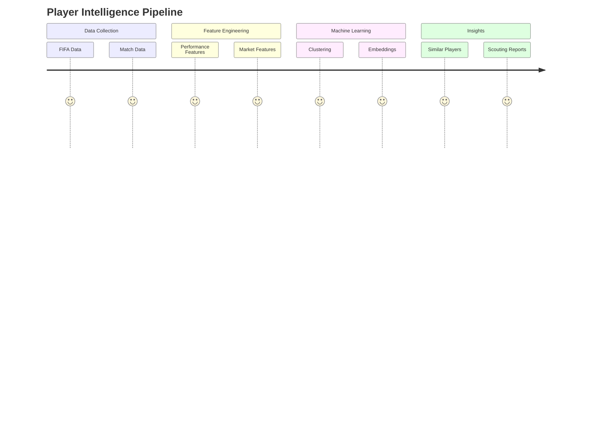
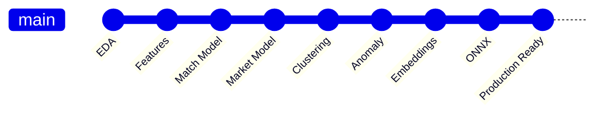

# 📊 STATVAULT ML — EXECUTIVE DASHBOARD

---

# 🎯 SYSTEM HEALTH



---

# 🏗️ PIPELINE ARCHITECTURE



---

# 📦 DATA ECOSYSTEM



---

# 🚀 ML MODEL LANDSCAPE



---

# 📈 DATA QUALITY MATRIX

| Dataset        | Records | Features | Quality                 |
| -------------- | ------- | -------- | ----------------------- |
| FIFA22 Players | 19,239  | 110      | 🟢 Excellent            |
| Matches        | 230,557 | 48       | 🟡 Moderate Missingness |
| Player Scores  | 47K+    | 26       | 🟢 Excellent            |

---

# 🔥 FEATURE IMPORTANCE PYRAMID

```text
                    Release Clause
                 ──────────────────

                      Wage EUR
                 ──────────────

                 Overall Rating
              ───────────────────

                    Potential
              ─────────────────

                   Reputation
            ─────────────────────
```

---

# ⚽ MATCH PREDICTION FLOW



---

# 🧠 PLAYER SCOUTING ENGINE



---

# 🏆 PROJECT STATUS


